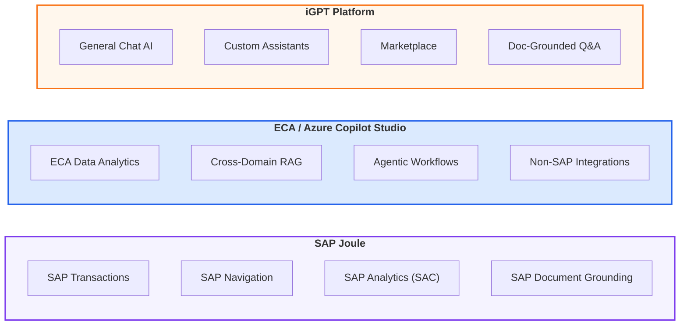
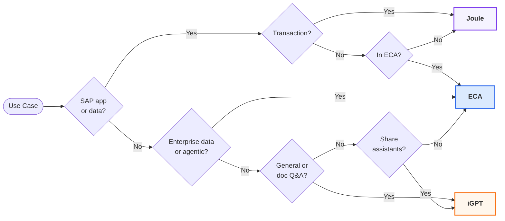
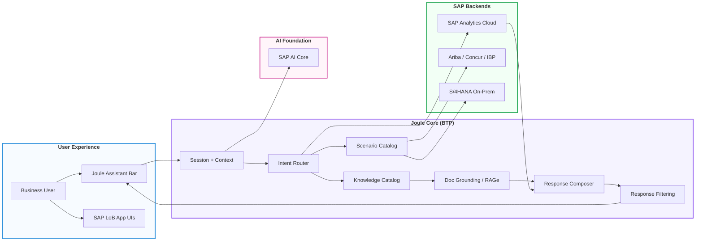
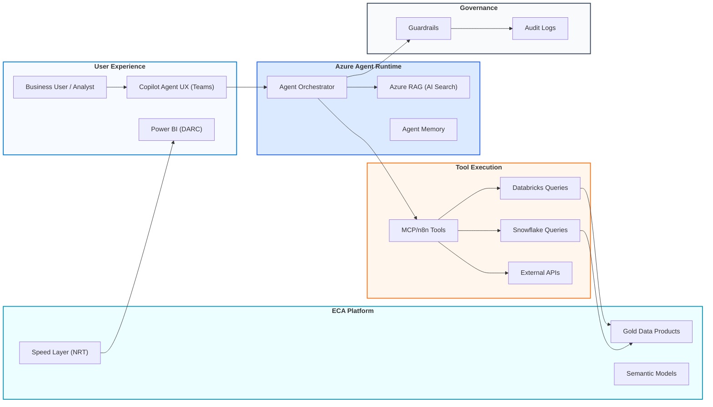
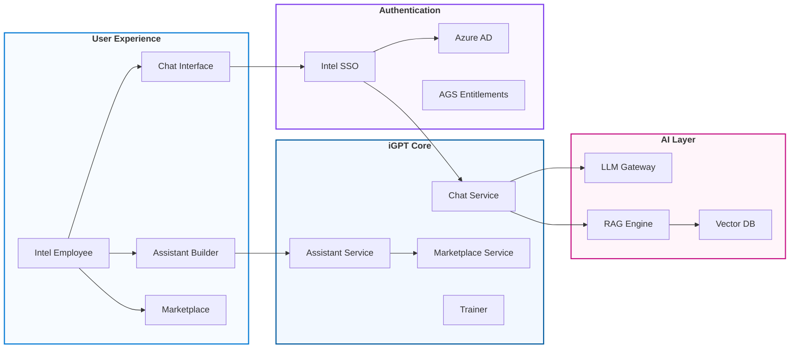
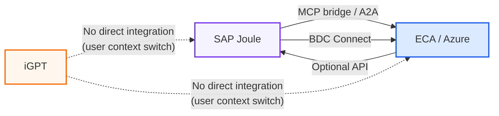
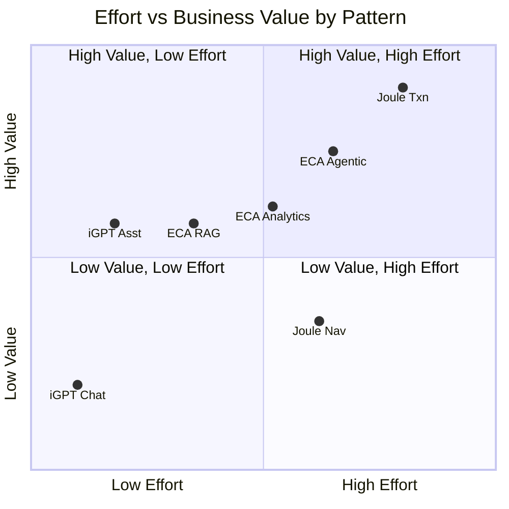

<!-- ============================= -->
<!--        TITLE PAGE START       -->
<!-- ============================= -->

  <strong>INTEL CORPORATION</strong>

  

<h1 align="center" style="margin: 0.3em 0 0.1em;"><strong>AI Architecture Selection Guide</strong></h1>
<h3 align="center" style="margin: 0.1em 0;">Choosing the Right AI Platform for Your Use Case</h3>
<h4 align="center" style="margin: 0.1em 0 0.6em;">SAP Joule &nbsp;|&nbsp; ECA / Azure Copilot Studio &nbsp;|&nbsp; iGPT</h4>

  <strong>Version:</strong> 1.2 
  <strong>Date:</strong> March 2026 
  <strong>Prepared by:</strong> Sajiv Francis 
  <strong>Classification:</strong> Internal Use

  <em>This document contains confidential information proprietary to Intel Corporation.</em>

<!-- ============================= -->
<!--         TITLE PAGE END        -->
<!-- ============================= -->

---

# Table of Contents

1. [Purpose & Audience](#1-purpose--audience)
2. [Three Architecture Patterns Overview](#2-three-architecture-patterns-overview)
3. [Quick Selection Guide](#3-quick-selection-guide)
4. [Decision Framework](#4-decision-framework)
5. [Detailed Use Case Routing](#5-detailed-use-case-routing)
6. [Architecture Pattern Deep Dives](#6-architecture-pattern-deep-dives)
   - [SAP Joule](#61-sap-joule)
   - [ECA / Azure Copilot Studio](#62-eca--azure-copilot-studio)
   - [iGPT Platform](#63-igpt-platform)
7. [Hybrid & Multi-Pattern Scenarios](#7-hybrid--multi-pattern-scenarios)
8. [Governance & Compliance by Pattern](#8-governance--compliance-by-pattern)
9. [Technology Maturity & Readiness](#9-technology-maturity--readiness)
10. [Cost, Effort & Time to Value](#10-cost-effort--time-to-value)
11. [Data Sensitivity & Classification](#11-data-sensitivity--classification)
12. [Scalability & Evolution](#12-scalability--evolution)
13. [Getting Started](#13-getting-started)
14. [FAQ](#14-faq)
15. [Reference Architecture Documents](#15-reference-architecture-documents)

# 1. Purpose & Audience

## Purpose

This guide helps Intel employees, business analysts, solution architects, and IT teams **select the correct AI architecture pattern** for their use case. Intel's AI enablement strategy is delivered through three complementary architecture patterns — each purpose-built for a distinct class of use cases. Choosing the right pattern ensures optimal performance, governance compliance, and time to value.

## Audience

| Role | How to Use This Guide |
|------|----------------------|
| **Business User** | Start with Section 3 (Quick Selection Guide) to find your pattern |
| **Solution Architect** | Use Section 4 (Decision Framework) and Section 5 (Detailed Routing) for architecture decisions |
| **IT / Developer** | Review Section 6 (Deep Dives) for technical details and integration patterns |
| **Program Manager** | Reference Section 8 (Governance) for compliance requirements |

<a href="#table-of-contents">⬆ Table of Contents</a>

# 2. Architecture Patterns Overview

**Intel's three distinct but complementary AI architecture patterns**:

## Summary Table

| Dimension | SAP Joule | ECA / Azure Copilot Studio | iGPT |
|-----------|-----------|---------------------------|------|
| **What It Does** | AI copilot for SAP applications | AI for enterprise data analytics & cross-domain workflows | General-purpose conversational AI for all Intel employees |
| **Best For** | SAP transactions, SAP navigation, SAP analytics | Enterprise reporting, agentic AI, non-SAP integration | Chat, custom assistants, document Q&A, marketplace sharing |
| **Entry Point** | Joule Assistant bar in SAP apps | Copilot Agent in Teams / MS365 | igpt.intel.com/chat |
| **Build Complexity** | Joule Studio (SAP Build on BTP) | Copilot Studio (Microsoft) | No-code Assistant Builder |
| **Who Builds** | SAP developers / admins | Azure / ECA developers | Any Intel employee |
| **Data Sources** | SAP backends (live transactions) | ECA products (Snowflake/Databricks) | Uploaded files (PDF/DOCX/TXT) |

<a href="#table-of-contents">⬆ Table of Contents</a>

# 3. Quick Selection Guide

**Answer one question to find your architecture pattern:**

| If your use case involves... | Use This Pattern |
|------------------------------|-----------------|
| **Approving, creating, or modifying SAP transactions** (POs, invoices, journal entries, cost centers) | **SAP Joule** |
| **Navigating SAP applications** or finding specific SAP screens | **SAP Joule** |
| **Asking questions about SAP data or SAP-hosted policies** | **SAP Joule** |
| **Getting analytical insights from SAP Analytics Cloud** | **SAP Joule** |
| **Querying enterprise data** from Snowflake, Databricks, or Power BI data products | **ECA / Azure Copilot Studio** |
| **Building agentic workflows** that span multiple systems with decision logic | **ECA / Azure Copilot Studio** |
| **Integrating with non-SAP systems** (ServiceNow, Teams, external APIs) | **ECA / Azure Copilot Studio** |
| **Enterprise document RAG** across policies, SOPs, and knowledge bases | **ECA / Azure Copilot Studio** |
| **General-purpose AI chat** (content generation, brainstorming, summarization) | **iGPT** |
| **Creating a custom AI assistant** for your team with no coding | **iGPT** |
| **Sharing an AI assistant** with other Intel employees | **iGPT** |
| **Asking questions about specific documents** you upload (PDF, DOCX) | **iGPT** |

> **Tip:** If your use case spans multiple patterns (e.g., SAP transaction + ECA analytics), see **Section 7 – Hybrid Scenarios**.

<a href="#table-of-contents">⬆ Table of Contents</a>

# 4. Decision Framework

## Decision Tree

Use this flowchart when the Quick Selection Guide doesn't clearly resolve your use case:

<a href="#table-of-contents">⬆ Table of Contents</a>

## Selection Criteria Matrix

When multiple patterns could work, use these weighted criteria to make the final decision:

| Criteria | SAP Joule | ECA / Azure Copilot Studio | iGPT | Weight |
|----------|:---------:|:--------------------------:|:----:|--------|
| SAP transaction access required | ★★★★★ | ☆☆☆☆☆ | ☆☆☆☆☆ | Critical |
| ECA data product access required | ☆☆☆☆☆ | ★★★★★ | ☆☆☆☆☆ | Critical |
| Self-service / no-code needed | ★★☆☆☆ | ★★★☆☆ | ★★★★★ | High |
| Multi-system integration | ★★☆☆☆ | ★★★★★ | ☆☆☆☆☆ | High |
| Document upload & RAG | ★★★☆☆ | ★★★★★ | ★★★★☆ | Medium |
| Marketplace / sharing | ☆☆☆☆☆ | ★★☆☆☆ | ★★★★★ | Medium |
| Agentic / multi-step workflow | ★★★☆☆ | ★★★★★ | ☆☆☆☆☆ | Medium |
| General chat / brainstorming | ☆☆☆☆☆ | ★★☆☆☆ | ★★★★★ | Low |

**Scoring:** ★ = Capability strength (5 = optimal, 0 = not applicable)

<a href="#table-of-contents">⬆ Table of Contents</a>

# 5. Detailed Use Case Routing

## Use Case Catalog

### SAP Joule Use Cases

| # | Use Case | Joule Pattern | Example | Prerequisites |
|---|----------|---------------|---------|---------------|
| J1 | Purchase Order Approval | Transactional | "Approve PO 4500012345" | Ariba + IAS/IPS + Work Zone |
| J2 | Journal Entry Creation | Transactional | "Create JE for cost center 1234" | S/4HANA (CFIN) + Cloud Connector |
| J3 | Invoice Processing | Transactional | "Post vendor invoice 9000001" | S/4HANA + BTP Destinations |
| J4 | Travel Expense Approval | Transactional | "Approve expense report for John" | Concur + IAS/IPS |
| J5 | Inventory Inquiry | Transactional | "Check stock for material 100234" | IBP + IAS/IPS + Work Zone |
| J6 | SAP Screen Navigation | Navigational | "Take me to cost center reporting" | Work Zone Navigation Service |
| J7 | SAP Help / Policy Q&A | Informational | "What is the company car policy?" | Knowledge Catalog + RAGe |
| J8 | Revenue Analytics | Analytical | "Show Q1 revenue by region" | SAC + Just Ask Backend |
| J9 | Budget Variance Analysis | Analytical | "Compare actual vs budget for Q4" | SAC + Work Zone |
| J10 | Fieldglass Workforce Query | Transactional | "Show active contractors for project X" | Fieldglass + IAS/IPS |

### ECA / Azure Copilot Studio Use Cases

| # | Use Case | ECA Pattern | Example | Prerequisites |
|---|----------|-------------|---------|---------------|
| E1 | Finance Reporting Q&A | Analytical | "What is the GL balance for BU 4000?" | Snowflake Views + MCP |
| E2 | Cross-Domain KPI Analysis | Analytical | "Compare inventory turns across factories" | ECA Gold Data Products |
| E3 | Enterprise Policy RAG | Generative (RAG) | "Summarize the data governance policy" | Azure AI Search + Document Index |
| E4 | AP Aging Exception Handler | Agentic | "Investigate overdue AP items > 90 days" | MCP tools + Approval Gates |
| E5 | Data Quality Remediation | Agentic | "Find and flag duplicate vendor records" | Snowflake + Databricks |
| E6 | ServiceNow Integration | Non-SAP | "Create incident for pipeline failure" | n8n + ServiceNow Connector |
| E7 | Teams Notification Bot | Non-SAP | "Alert team when KPI threshold breached" | MCP + Teams Webhook |
| E8 | ML Feature Pipeline | Analytical | "Retrieve training data for demand model" | Databricks Gold + ML Runtime |
| E9 | Real-Time Dashboard Feed | Analytical | "Stream NRT inventory to ops dashboard" | Snowflake Speed Layer |
| E10 | Multi-Source Report Builder | Agentic | "Build weekly finance report from 3 sources" | MCP + Multiple ECA Products |

### iGPT Use Cases

| # | Use Case | iGPT Pattern | Example | Prerequisites |
|---|----------|-------------|---------|---------------|
| I1 | General Q&A / Chat | Conversational | "Explain the difference between GAAP and IFRS" | igpt.intel.com account |
| I2 | Content Generation | Conversational | "Draft an executive summary for my project" | igpt.intel.com account |
| I3 | Code Assistance | Conversational | "Help me write a Python ETL script" | igpt.intel.com + model selection |
| I4 | Department FAQ Bot | Assistive | "Build a Finance FAQ assistant" | Assistant Builder + system prompt |
| I5 | Onboarding Helper | Assistive | "Create a new-hire onboarding assistant" | Assistant Builder + uploaded docs |
| I6 | Technical Doc Q&A | Knowledge-Augmented | "Upload design spec and ask questions" | File upload (PDF/DOCX/TXT) |
| I7 | Marketplace Discovery | Collaborative | "Find an assistant for procurement tips" | Marketplace browse/search |
| I8 | Team Knowledge Base | Assistive + RAG | "Build assistant grounded on team wiki exports" | Pipeline ingestion config |
| I9 | Translation / Summarization | Conversational | "Translate this paragraph to Mandarin" | igpt.intel.com + model selection |
| I10 | Meeting Notes Assistant | Assistive | "Create an assistant that formats meeting notes" | Assistant Builder + prompt template |

<a href="#table-of-contents">⬆ Table of Contents</a>

# 6. Architecture Pattern Deep Dives

## 6.1 SAP Joule

### Overview
SAP Joule is an AI-powered copilot embedded in SAP applications. It provides natural-language interaction with SAP backend systems for transactions, navigation, analytics, and SAP-specific knowledge.

### Architecture Summary

### Key Components

| Component | Purpose |
|-----------|---------|
| **SAP Build Work Zone** | Entry point / launchpad / navigation service |
| **SAP AI Core** | Generative AI Hub with Dialog Management LLM |
| **Scenario Catalog** | Metadata registry of Joule scenarios, functions, and skills |
| **Knowledge Catalog** | SAP-owned and customer-owned content for RAGe grounding |
| **Joule Studio** | Development environment for custom agents and skills |
| **SAP Cloud Identity Services** | IAS (SSO) + IPS (SCIM provisioning) |

### Supported SAP Products

| Product | Joule Assistant | SAP Agents | Custom Agents | Work Zone Required |
|---------|:--------------:|:----------:|:-------------:|:-----------------:|
| S/4HANA Cloud (J4C) | Yes | Yes | No¹ | Yes |
| SAP Analytics Cloud | Yes | Yes | Yes | Yes |
| Ariba | Yes | Yes | Yes | Yes |
| Concur | Yes | Yes | Yes | No |
| IBP | Yes | Yes | Yes | Yes |
| Fieldglass | Yes | Yes | Yes | Yes |
| Signavio | Yes | Yes | Yes | Yes |
| APM | Yes | Yes | Yes | No |
| PAPM | Yes | Yes | Yes | No |
| BN4L | No | No | Yes² | No |
| S/4HANA On-Prem | No | No | Yes | No |

**Notes:** ¹J4C is SAP-managed; use Side-by-Side extensions on BTP. ²BN4L requires custom development only.

<a href="#table-of-contents">⬆ Table of Contents</a>

## 6.2 ECA / Azure Copilot Studio

### Overview
The ECA / Azure Copilot Studio pattern handles enterprise data analytics, cross-domain reasoning, agentic workflows, and non-SAP integrations. It operates on curated ECA data products (Snowflake views, Databricks Gold) and Azure-native AI services.

### Architecture Summary

### Key Components

| Component | Purpose |
|-----------|---------|
| **Copilot Studio** | Agent development platform (Microsoft) |
| **Azure OpenAI** | LLM runtime (GPT-4, Claude, enterprise-approved models) |
| **Azure AI Search** | Vector + hybrid search for RAG grounding |
| **MCP/n8n** | Tool execution and workflow orchestration |
| **ECA Data Products** | Finance, master data, supply chain, KPI products |
| **Microsoft Entra ID** | Identity and access management |

### ECA Data Tools Available

| Tool | Data Source | Latency | Use Case |
|------|------------|---------|----------|
| Snowflake Views Query | Gold views (batch) | Seconds | Standard analytics |
| Speed Layer Query | NRT/RT data | Sub-second | Real-time KPIs |
| Databricks Query | Gold/Silver | Seconds | ML features, complex analytics |
| Metrics/KPI Tool | KPI Store | Milliseconds | Standard metric definitions |
| Data Catalog Tool | Unity Catalog | Milliseconds | Field meaning, lineage |

<a href="#table-of-contents">⬆ Table of Contents</a>

## 6.3 iGPT Platform

### Overview
iGPT is Intel's internal enterprise Generative AI platform providing conversational AI, custom assistant creation, and a marketplace ecosystem for sharing AI solutions across the organisation. It is the self-service option requiring no coding or infrastructure setup.

### Architecture Summary

### Key Capabilities

| Capability | Description |
|------------|-------------|
| **Chat Interface** | Multi-turn conversations with GPT-4, GPT-3.5, and other enterprise LLMs |
| **Assistant Builder** | 5-tab no-code wizard: Setup → Add Data → Trainer → Thumbnail → Sharing |
| **Marketplace** | Browse, search, bookmark, and run assistants published by other Intel teams |
| **RAG Engine** | Document-grounded responses from uploaded PDF, DOCX, TXT files |
| **Model Selection** | Per-session choice of GPT-4, GPT-3.5, or other enterprise-approved models |
| **Temperature Control** | Adjust creativity/determinism per assistant or session |

### Sharing Model

| Mode | Visibility | Who Can Run | Requirements |
|------|-----------|-------------|-------------|
| **Private** (default) | Owner only | Owner only | None |
| **Public** | All Intel employees | Anyone | Compliance checkbox |
| **Secure Groups** | Azure AD groups | Group members | AGS entitlements + compliance |

> **InfoSecurity Restriction:** Assistants with attached files can only be published as Private.

<a href="#table-of-contents">⬆ Table of Contents</a>

# 7. Hybrid & Multi-Pattern Scenarios

Some use cases require **more than one architecture pattern**. These hybrid scenarios are supported through governed integration points.

## Common Hybrid Scenarios

| Scenario | Pattern Combination | How It Works |
|----------|-------------------|--------------|
| **SAP Transaction + ECA Analytics** | Joule + ECA/Azure | User approves a PO in Joule, then asks Copilot Studio for spend analytics from ECA data products |
| **ECA Report + SAP Drill-Down** | ECA/Azure + Joule | User views a dashboard anomaly in Power BI, then uses Joule to investigate the underlying SAP transaction |
| **iGPT Assistant with ECA Data** | iGPT + ECA/Azure | User builds an iGPT assistant, but for structured data queries, redirects to Copilot Agent (no direct iGPT→ECA integration today) |
| **SAP Policy + General Knowledge** | Joule + iGPT | SAP-specific policies answered by Joule (RAGe); general company policies answered by iGPT (uploaded docs) |

## Integration Architecture Between Patterns

**Current State:**
- **Joule ↔ ECA/Azure**: Governed interoperability via MCP tools, A2A protocol, and BDC Connect
- **iGPT**: Standalone platform — users switch context between iGPT and other patterns
- **Future Roadmap**: MCP/API integration to enable iGPT assistants as tools within ECA/Azure workflows

<a href="#table-of-contents">⬆ Table of Contents</a>

# 8. Governance & Compliance:

## Governance Comparison

| Governance Domain | SAP Joule | ECA / Azure Copilot Studio | iGPT |
|-------------------|-----------|---------------------------|------|
| **Identity Provider** | SAP Cloud Identity Services (IAS/IPS) | Microsoft Entra ID | Intel SSO / Azure AD |
| **Access Control** | BTP RBAC + LoB RBAC + S/4 RBAC | RBAC + ABAC | Private/Public/Secure Groups (AGS) |
| **Data Classification** | SAP-managed per LoB product | ABAC enforcement + column masking | Private-by-default; file-attached = Private only |
| **Approval Gates** | Human-in-the-loop for high-risk actions | Configurable HITL | Compliance checkbox for Public/Secure sharing |
| **Audit Trail** | SAP AI Launchpad + enterprise telemetry | Application Insights + MCP logs | Platform audit logs |
| **Responsible AI** | SAP Response Filtering + ethics policy | Azure AI Content Safety + guardrails | InfoSecurity policy enforcement |
| **Data Residency** | SAP BTP (region-specific) | Azure (region-specific) | Azure (Intel-managed) |

## Security Controls by Pattern

| Control | SAP Joule | ECA / Azure | iGPT |
|---------|-----------|-------------|------|
| SSO Authentication | ✅ IAS (SAML2/OIDC) | ✅ Entra ID | ✅ Intel SSO |
| Group-Based Access | ✅ BTP Role Collections | ✅ Entra Groups | ✅ AGS Entitlements |
| Content Filtering | ✅ Response Filtering | ✅ Azure AI Safety | ⬜ Platform policy |
| PII Detection | ✅ SAP managed | ✅ Presidio + rules | ⬜ Limited |
| Action Approvals | ✅ HITL gates | ✅ HITL gates | ⬜ N/A |
| Audit Logging | ✅ Comprehensive | ✅ Comprehensive | ✅ Basic |

**Legend:** ✅ = Fully implemented | ⬜ = Limited or not applicable

<a href="#table-of-contents">⬆ Table of Contents</a>

# 9. Technology Maturity & Readiness

Understanding each pattern's maturity helps set realistic expectations for timelines, risk, and support availability.

## Maturity Assessment

| Dimension | SAP Joule | ECA / Azure Copilot Studio | iGPT |
|-----------|-----------|---------------------------|------|
| **Platform Maturity** | GA (rolling SAP releases) | GA (Azure enterprise) | GA (Intel internal) |
| **Intel Deployment Status** | Phase 1–2 (Foundation & Core) | Production (ECA data products live) | Production (igpt.intel.com live) |
| **Vendor Support Model** | SAP Enterprise Support | Microsoft Enterprise Agreement | Intel internal IT |
| **Release Cadence** | SAP quarterly innovation cycles | Azure monthly updates | Platform team sprints |
| **API/Protocol Standards** | Skills (SAP), MCP (emerging) | MCP, A2A, REST | REST (internal) |
| **Ecosystem Breadth** | SAP partner ecosystem | Azure / Microsoft ecosystem | Self-contained |

## Readiness Checklist

| Prerequisite | SAP Joule | ECA / Azure | iGPT |
|-------------|-----------|-------------|------|
| Identity provider configured | IAS/IPS required | Entra ID required | Intel SSO (pre-configured) |
| Infrastructure provisioned | BTP + AI Core + Work Zone | Azure subscription + AI services | None (SaaS) |
| Data products available | SAP LoB data (live) | ECA Gold/Speed products | User-uploaded files |
| Developer tooling available | Joule Studio on BTP | Copilot Studio | No-code (browser) |
| Governance approvals needed | L2 architecture review | L2 architecture review | None for general use |
| Estimated setup time | 4–8 weeks (Phase 1) | 2–4 weeks (agent development) | Minutes (self-service) |

<a href="#table-of-contents">⬆ Table of Contents</a>

# 10. Cost, Effort & Time to Value

## Comparative Cost & Effort Profile

| Factor | SAP Joule | ECA / Azure Copilot Studio | iGPT |
|--------|-----------|---------------------------|------|
| **Licensing** | SAP BTP credits + AI Core | Azure consumption + Copilot Studio | No additional cost (Intel-provided) |
| **Infrastructure** | BTP subaccount, AI Core, Work Zone | Azure AI services, Snowflake/Databricks | None (managed SaaS) |
| **Development Effort** | Medium–High (Joule Studio, Skills) | Medium (Copilot Studio, MCP tools) | Low (no-code wizard) |
| **Required Skills** | SAP BTP, ABAP Cloud, Joule Studio | Azure, Power Platform, MCP/n8n | None (any employee) |
| **Time to First Value** | 6–12 weeks | 3–6 weeks | Minutes |
| **Ongoing Maintenance** | SAP lifecycle management | Azure DevOps / Copilot Studio | Minimal (assistant updates) |

## Effort-to-Value Matrix

## Total Cost of Ownership Considerations

| TCO Component | SAP Joule | ECA / Azure | iGPT |
|---------------|-----------|-------------|------|
| Year 1 setup & config | High | Medium | Low |
| Annual platform licensing | Included in SAP EA | Azure consumption-based | Included in Intel IT |
| Ongoing development | Medium (SAP releases) | Medium (tool updates) | Low (assistant tweaks) |
| Support & operations | SAP support contract | Azure + internal ops | Internal IT |
| Training & enablement | SAP-specific training | Azure/Power Platform | Self-service (minimal) |

<a href="#table-of-contents">⬆ Table of Contents</a>

# 11. Data Sensitivity & Classification

Different data sensitivity levels influence which pattern is appropriate.

## Data Sensitivity Routing

| Data Sensitivity Level | Recommended Pattern | Rationale |
|------------------------|--------------------|-----------|
| **SAP Transactional Data** (POs, invoices, HR records) | **SAP Joule** | LoB-level RBAC enforced at the SAP application layer; data never leaves SAP boundaries |
| **Enterprise Reporting Data** (finance, supply chain KPIs) | **ECA / Azure** | Governed ECA data products with ABAC, column masking, and audit trail |
| **Classified / IP-Sensitive** | **ECA / Azure** (with ABAC) | Fine-grained attribute-based access control with data classification enforcement |
| **General Business Knowledge** (policies, SOPs, guides) | **ECA / Azure** (RAG) or **iGPT** (uploaded) | ECA for enterprise-indexed docs; iGPT for ad-hoc personal document Q&A |
| **Non-Sensitive / Public** | **iGPT** | Lowest barrier; private-by-default with compliance gate for sharing |
| **Personal / Exploratory** | **iGPT** | Private assistant with uploaded files; no data shared with other systems |

## Data Residency by Pattern

| Pattern | Data Processing Location | Data Storage | Cross-Border Considerations |
|---------|-------------------------|-------------|----------------------------|
| **SAP Joule** | SAP BTP (region-specific) | SAP Cloud LoB backends | SAP data residency contracts |
| **ECA / Azure** | Azure (region-specific) | ADLS / Snowflake / Databricks | Azure data residency policies |
| **iGPT** | Azure (Intel-managed) | iGPT platform storage | Uploaded files stored in Intel-managed Azure |

## Data Flow Governance

| Control | SAP Joule | ECA / Azure | iGPT |
|---------|-----------|-------------|------|
| Data leaves platform boundary? | No (SAP-contained) | No (ECA-contained) | No (iGPT-contained) |
| Cross-pattern data sharing | Via BDC Connect / MCP | Via MCP / A2A | None (isolated) |
| User data upload | N/A | Admin-managed indexes | User self-service |
| Data retention policy | SAP-managed | Azure retention rules | Platform-managed |
| Right to delete | SAP data governance | Azure compliance tools | User can delete assistants/files |

<a href="#table-of-contents">⬆ Table of Contents</a>

# 12. Scalability & Evolution

## Scalability Comparison

| Dimension | SAP Joule | ECA / Azure Copilot Studio | iGPT |
|-----------|-----------|---------------------------|------|
| **User Scale** | Thousands (SAP licensed users) | Thousands (enterprise data consumers) | All Intel employees (~100K+) |
| **Concurrent Sessions** | SAP AI Core capacity | Azure auto-scale | Platform-managed |
| **Data Volume** | SAP LoB data volumes | Petabyte-scale (Snowflake/Databricks) | Per-assistant file limits |
| **Agent/Assistant Scale** | Hundreds (managed by SAP admins) | Hundreds (governed via Copilot Studio) | Thousands (self-service marketplace) |
| **Geographic Distribution** | Multi-region (SAP BTP) | Multi-region (Azure) | Single deployment (Intel-managed) |

## Evolution Roadmap Alignment

| Capability (Future) | SAP Joule | ECA / Azure | iGPT | Timeline |
|--------------------|-----------|-------------|------|----------|
| MCP cross-runtime integration | Planned | Available | Planned | H2 2026 |
| A2A agent-to-agent protocol | Planned | Available | Not planned | H2 2026 |
| Multi-modal AI (vision, audio) | SAP roadmap | Azure AI roadmap | Dependent on LLM Gateway | 2027+ |
| Enhanced RAG (graph-based) | SAP roadmap | Azure AI Search evolution | Platform evolution | 2027+ |
| iGPT → ECA tool integration | N/A | Consume iGPT as tool | Publish as MCP tool | H2 2026 |

## Growth Path by Pattern

| Starting Pattern | Natural Growth Path | Trigger for Expansion |
|-----------------|--------------------|-----------------------|
| **iGPT** (chat/assistants) | → ECA/Azure (when structured data needed) | Use case requires governed enterprise data |
| **iGPT** (document Q&A) | → ECA/Azure (when enterprise-scale RAG needed) | Document corpus exceeds self-service limits |
| **ECA/Azure** (analytics) | → Joule (when SAP transaction action needed) | Insight triggers need for SAP system action |
| **SAP Joule** (transactions) | → ECA/Azure (when cross-domain analytics needed) | SAP data in ECA enables broader analysis |
| **Any pattern** | → Hybrid (multi-pattern) | Complex use case spans system boundaries |

<a href="#table-of-contents">⬆ Table of Contents</a>

# 13. Getting Started

## Quick Start by Pattern

### SAP Joule
1. **Confirm prerequisites**: IAS/IPS configured, Work Zone deployed, AI Core provisioned
2. **Check Joule Capability Matrix**: Verify your SAP product supports Joule (see SAP Joule Architecture Overview)
3. **Contact SAP BTP admin**: Request Joule access via BTP Role Collections
4. **Access Joule**: Use the Joule Assistant bar within supported SAP applications
5. **For custom agents**: Request Joule Studio access and follow the development standards

### ECA / Azure Copilot Studio
1. **Verify data availability**: Confirm your data products exist in ECA (Snowflake Gold / Speed Layer)
2. **Request access**: Contact the AI/ML team for Copilot Studio access
3. **Select tools**: Identify required MCP tools from the Tool Registry
4. **Build agent/workflow**: Use Copilot Studio to assemble your agent with MCP tools
5. **Governance review**: Complete L2 architecture deliverables for production deployment

### iGPT
1. **Navigate to igpt.intel.com/chat**: Sign in with your Intel SSO credentials
2. **Start chatting**: Use the Chat Interface for general AI assistance
3. **Build an assistant** (optional): Use the 5-tab Assistant Builder (Setup → Add Data → Trainer → Thumbnail → Sharing)
4. **Upload documents** (optional): Add PDF/DOCX/TXT files for RAG-grounded responses
5. **Share** (optional): Publish to Marketplace as Public or Secure Group (compliance checkbox required)

## Escalation Path

| Question | Contact |
|----------|---------|
| Which pattern should I use? | Enterprise Architecture team |
| SAP Joule access or configuration | SAP BTP Admin team |
| ECA/Azure data products or tools | Data Platform / AI-ML team |
| iGPT account or assistant issues | iGPT platform support (igpt.intel.com) |

<a href="#table-of-contents">⬆ Table of Contents</a>

# 14. FAQ

**Q: Can I use more than one pattern for a single project?**  
A: Yes. Hybrid scenarios are supported. See Section 7. Joule and ECA/Azure interoperate via MCP and A2A protocol. iGPT currently requires a user context switch.

**Q: I want to build a chatbot for my team. Which pattern should I use?**  
A: If the chatbot needs SAP transaction access → **SAP Joule** (custom agent). If it queries ECA data → **ECA/Azure Copilot Studio**. If it answers questions from uploaded documents or serves general knowledge → **iGPT** (fastest path, no-code).

**Q: Is iGPT connected to SAP or ECA data?**  
A: Not today. iGPT is a standalone platform. For SAP or ECA data access, use Joule or Copilot Studio respectively.

**Q: Can I move an iGPT assistant to Copilot Studio later?**  
A: Not directly (different platforms and runtimes). However, the system prompt, data sources, and use case logic can be migrated manually. Future MCP integration may enable interoperability.

**Q: What about data sensitivity? Which pattern is most secure?**  
A: All three patterns enforce enterprise identity (SSO). For SAP-sensitive transactions, Joule provides the strongest LoB RBAC integration. For classified enterprise data, ECA/Azure provides ABAC with column masking. iGPT enforces private-by-default with InfoSecurity file restrictions.

**Q: Do I need architect approval to use a pattern?**  
A: iGPT requires no approval for general use. Joule and ECA/Azure deployments should follow the L2 architecture governance process. Contact the Enterprise Architecture team for guidance.

**Q: What if my SAP product isn't listed for Joule?**  
A: Check the SAP Joule Architecture Overview for the full capability matrix. Some SAP products (e.g., SuccessFactors, Datasphere, LeanIX) are Joule-enabled but not yet in Intel scope.

<a href="#table-of-contents">⬆ Table of Contents</a>

# 15. Reference Architecture Documents

| Document | Description | File |
|----------|-------------|------|
| **ECA & AI Enablement Architecture** | ECA data platform (Snowflake/Databricks), Azure AI agent runtime, MCP/n8n tool execution, RAG patterns, agentic workflows, and implementation phases | `ECA Architecture/ECA-AI-Architecture-Overview.md` |
| **SAP Joule Architecture Overview** | Joule Core on BTP, SAP AI Core, identity & access (IAS/IPS), product capability matrix, Joule Skills architecture, phased implementation roadmap | `Joule Architecture/SAP-Joule-AI-Architecture-Overview.md` |
| **iGPT Architecture Overview** | Chat interface, no-code Assistant Builder, Marketplace ecosystem, RAG engine, data management pipeline, security model, sharing/publishing workflow | `iGPT Architecture/iGPT-AI-Architecture-Overview.md` |

<a href="#table-of-contents">⬆ Table of Contents</a>

# Document Control

| Version | Date | Author | Changes |
|---------|------|--------|---------|
| 1.0 | March 2026 | Sajiv Francis | Initial release — Three-pattern selection guide (Joule, ECA/Azure, iGPT) |
| 1.1 | March 2026 | Sajiv Francis | Consolidated cross-pattern content from architecture docs; added Technology Maturity, Cost & Effort, Data Sensitivity, and Scalability sections |
| 1.2 | March 2026 | Sajiv Francis | Updated reference paths to match repository structure; aligned deep-dive content with latest architecture documents; added print CSS and navigation links |

**Classification**: Internal Use  
**Review Cycle**: Quarterly  
**Next Review**: June 2026

<a href="#table-of-contents">⬆ Table of Contents</a>

AI Architecture Selection Guide

End of Document

