<!-- ============================= -->
<!--        TITLE PAGE START       -->
<!-- ============================= -->

<div class="title-page">

<p align="center" style="margin-bottom: 0.2em;">
  <strong>INTEL CORPORATION</strong>
</p>
<p align="center" style="margin-top: 0;">
  
</p>

<h1 align="center" style="margin: 0.3em 0 0.1em;"><strong>Enterprise Cloud Analytics (ECA)</strong></h1>
<h1 align="center" style="margin: 0.1em 0;"><strong>&</strong></h1>
<h1 align="center" style="margin: 0.1em 0;"><strong>AI Enablement Architecture</strong></h1>

<p align="center" style="margin: 0.3em 0;">
  <strong>Version:</strong> 1.0<br>
  <strong>Date:</strong> February 2026<br>
  <strong>Prepared by:</strong> Sajiv Francis, Don Meyers<br>
  <strong>Classification:</strong> Internal Use
</p>

<p align="center" style="font-size: 10pt; color: #666; margin-top: 0.8em;">
  <em>This document contains confidential information proprietary to Intel Corporation.</em>
</p>

</div>

<!-- ============================= -->
<!--         TITLE PAGE END        -->
<!-- ============================= -->

---

# Table of Contents

1. [Executive Summary](#1-executive-summary)
2. [AI Architecture Patterns & Routing Guide](#2-ai-architecture-patterns--routing-guide)
3. [Architecture Overview (L0)](#3-architecture-overview-l0)
4. [Data Platform Architecture (L1-A)](#4-data-platform-architecture-l1-a)
5. [Data Products & Serving (L1-B)](#5-data-products--serving-l1-b)
6. [AI Build Modes Comparison (L1-C)](#6-ai-build-modes-comparison-l1-c)
7. [AI Platform Tool Lifecycle (L1-D)](#7-ai-platform-tool-lifecycle-l1-d)
8. [GenAI RAG Implementation (L2-D)](#8-genai-rag-implementation-l2-d)
9. [Agent Runtime Implementation (L2-E)](#9-agent-runtime-implementation-l2-e)
10. [Platform Stage Lanes](#10-platform-stage-lanes)
11. [TOGAF BDAT Crosswalk](#11-togaf-bdat-crosswalk)
12. [Ownership & Operating Model](#12-ownership--operating-model)
13. [Implementation Phases](#13-implementation-phases)
14. [L2 Architecture Deliverables](#14-l2-architecture-deliverables)
15. [Governance & Operations](#15-governance--operations)
16. [Appendix A: Component Glossary](#appendix-a-component-glossary)

<div style="page-break-after: always;"></div>

# 1. Executive Summary

## Purpose

This document defines the **Enterprise Cloud Analytics (ECA) & AI Enablement Architecture** for Intel's enterprise data and artificial intelligence capabilities. The architecture provides a unified, governed approach to data ingestion, transformation, serving, and AI-powered consumption.

## Scope

The architecture encompasses:

- **Data Platform (ECA)**: End-to-end data flow from SAP source systems through Azure Data Lake Storage (ADLS), Databricks Lakehouse, and Snowflake serving layer
- **AI Platform – Three Architecture Patterns**: Intel's AI enablement is delivered through three complementary architecture patterns, each optimized for specific use case domains:
  - **SAP Joule** – SAP-native AI copilot for transactional, navigational, informational, and analytical interactions within SAP applications (Ariba, Concur, IBP, S/4HANA, etc.)
  - **ECA / Azure Copilot Studio** – Enterprise analytics AI for cross-domain reasoning, agentic workflows, and GenAI/RAG over curated ECA data products (Snowflake, Databricks)
  - **iGPT** – Intel's internal general-purpose Generative AI platform for conversational AI, custom assistant creation, marketplace sharing, and document-grounded knowledge retrieval (igpt.intel.com)
- **Governance**: Comprehensive controls spanning identity, authorization, audit, and compliance across all three patterns

## Key Architectural Principles

| Principle | Description |
|-----------|-------------|
| **Single Source of Truth** | ECA serves as the authoritative enterprise data platform |
| **Medallion Architecture** | Bronze → Silver → Gold data refinement pattern |
| **Dual Landing Patterns** | Standard (batch) and Speed (NRT/RT) data ingestion |
| **AI-Ready Data Products** | Curated, governed data products for BI and AI consumption |
| **Governed AI Execution** | Tool lifecycle with discover, authorize, execute, audit stages |

## Business Outcomes

- **Finance Reporting Excellence**: Power BI (DARC) delivers trusted finance analytics
- **Near Real-Time Insights**: Speed layer enables sub-minute operational visibility
- **AI-Powered Automation**: Agents and GenAI capabilities augment business processes
- **Governed Self-Service**: Controlled access to enterprise data products

<div style="page-break-after: always;"></div>

# 2. AI Architecture Patterns & Routing Guide

Intel's AI enablement strategy is delivered through **three complementary architecture patterns**. Each pattern is purpose-built for a distinct class of use cases with its own runtime, identity model, and governance boundaries. This section provides the decision framework for routing users and use cases to the appropriate architecture.

## Three Architecture Patterns at a Glance

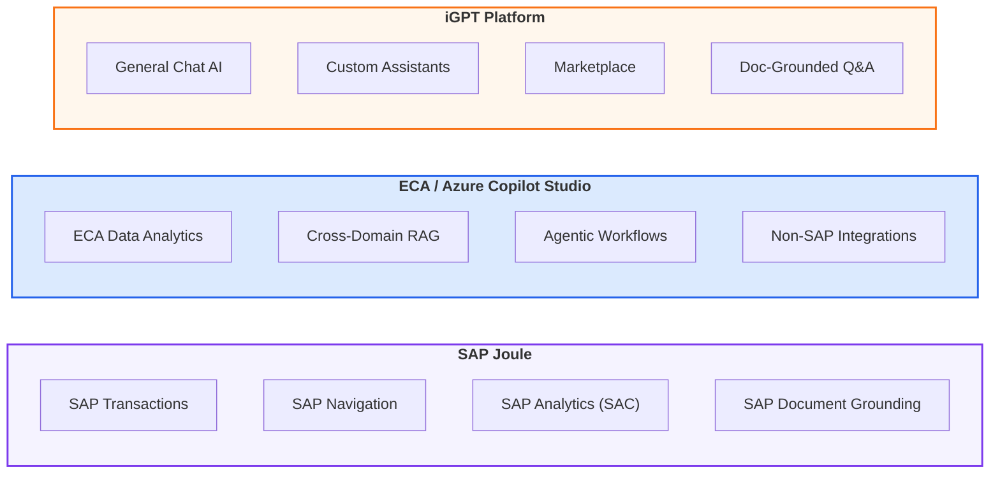

## Architecture Pattern Comparison

| Dimension | SAP Joule | ECA / Azure Copilot Studio | iGPT |
|-----------|-----------|---------------------------|------|
| **Primary Domain** | SAP application intelligence | Enterprise data & non-SAP AI | General-purpose conversational AI |
| **Entry Point** | Joule Assistant (Work Zone / LoB UIs) | Copilot Agent UX (Teams / MS365) | igpt.intel.com/chat |
| **Build Tool** | Joule Studio (SAP Build on BTP) | Copilot Studio (Microsoft) | No-Code Assistant Builder |
| **LLM Provider** | SAP AI Core (Generative AI Hub) | Azure OpenAI | LLM Gateway (GPT-4, GPT-3.5, others) |
| **RAG Mechanism** | SAP Document Grounding / RAGe | Azure AI Search (vector + hybrid) | iGPT RAG Engine (file upload + pipelines) |
| **Identity** | SAP Cloud Identity Services (IAS/IPS) | Microsoft Entra ID | Intel SSO / Azure AD |
| **Governance** | BTP RBAC, LoB RBAC, Response Filtering | RBAC/ABAC, Guardrails, Content Safety | Private-by-default, AGS entitlements |
| **Tool Integration** | Skills (required for SAP), MCP (optional) | MCP/n8n workflows | None (standalone) |
| **Data Sources** | SAP Cloud LoB backends, SAP on-prem (via Cloud Connector) | ECA (Snowflake/Databricks), external APIs | Uploaded documents (PDF/DOCX/TXT), data pipelines |
| **Sharing Model** | Role-based (BTP + LoB RBAC) | Role + attribute-based | Private / Public / Secure Groups (Marketplace) |
| **Key Strength** | Transactional correctness within SAP | Cross-domain analytics & agentic reasoning | Rapid self-service AI for any Intel employee |

## Pattern Selection & Detailed Guidance

For comprehensive use case routing, decision frameworks, capability comparisons, hybrid scenarios, and governance-by-pattern analysis, refer to the **AI Architecture Selection Guide**:

> **📄 AI Architecture Selection Guide** — `AI-Architecture-Selection-Guide.md`

The Selection Guide provides:
- Quick selection table mapping use cases to patterns
- Decision tree flowchart for ambiguous scenarios
- Detailed use case catalog (30+ use cases across all three patterns)
- Hybrid and multi-pattern integration guidance
- Governance and compliance comparison
- Getting started instructions for each pattern

## Architecture Pattern References

| Pattern | Reference Document | Location |
|---------|-------------------|----------|
| **SAP Joule** | SAP Joule Architecture Overview | `Current AI Architecture Options/SAP-Joule-Architecture-Overview.md` |
| **ECA / Azure** | This document (Sections 3–15) | `ECA_AI_Enablement_Architecture_DocumentV1.md` |
| **iGPT** | iGPT Architecture Overview | `Current AI Architecture Options/iGPT-Architecture-Overview.md` |
| **Selection Guide** | AI Architecture Selection Guide | `AI-Architecture-Selection-Guide.md` |

<div style="page-break-after: always;"></div>

# 3. Architecture Overview (L0)

## L0 – End-to-End Overview: ECA & AI Enablement Architecture

This authoritative overview depicts the complete ECA & AI Enablement architecture, illustrating:

- **SAP Sources**: S/4HANA systems (CFIN, IP/Corp, IF) as primary data sources
- **Replication & Ingestion**: SLT replication through SideCar HANA and CIF control plane
- **ECA Platform**: ADLS landing, Databricks transformation, Snowflake serving
- **AI Platform**: Complementary runtimes (Joule Studio for SAP, Copilot Studio for Azure), MCP/n8n tool orchestration
- **Consumption**: Power BI (DARC) for finance reporting, AI agents for automation

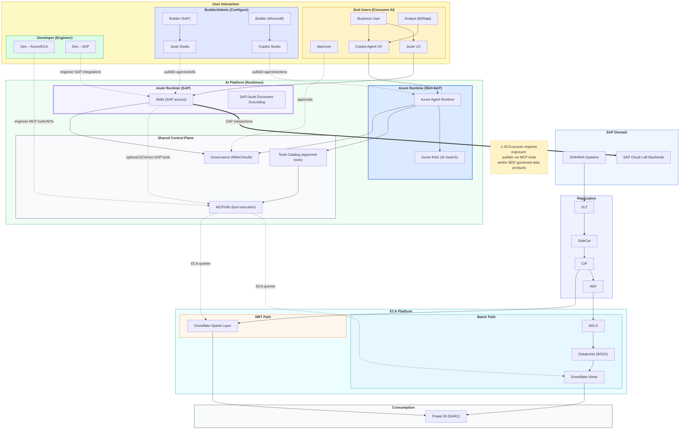
<div style="page-break-after: always;"></div>

## User Interaction Model

**End users consume AI** through Joule UX (SAP-first assistant, embedded in SAP applications) or Copilot Agent UX (ECA/non-SAP-first, accessible via Teams/MS365). **Builder/Admin users configure and publish** agents, skills, and actions via Joule Studio (SAP) or Copilot Studio (Microsoft)—they do not write code but assemble and govern agent capabilities. **Developers (Code) engineer the underlying runtime and tooling layer**, including MCP tools, ECA query services, SAP integration APIs, and custom connectors. ECA-replicated data is **not native to Joule**; Joule agents that require ECA access must invoke governed MCP tools or BDC-shared data products—there is no implicit or direct query path from Joule to Snowflake/Databricks. Both runtimes invoke the **same governed MCP/n8n tool execution layer** under unified governance controls—end users never interact directly with builder or developer tools.

## Runtime Responsibilities and Shared Tool Execution

**Joule Runtime** is SAP-first: it provides transactional correctness and business-rule fidelity by operating directly on SAP Cloud LoB backends via Skills. **Azure Runtime** is ECA/non-SAP-first: it excels at analytics, cross-domain reasoning, and multi-step agentic workflows over curated enterprise data. Both runtimes may invoke the **same governed tool execution layer (MCP/n8n)** for actions and queries. Joule's access to ECA data is **optional and requires explicit exposure**—ECA data products must be published as MCP tools and/or shared via BDC-governed data products before Joule agents can consume them. This ensures ECA data is never implicitly visible to Joule; all access is governed, auditable, and intentional. **SAP/Joule and Azure maintain separate grounding stacks (SAP-managed grounding vs Azure RAG retrieval); cross-runtime access occurs via governed tool calls, not shared storage.**

## Recommended Runtime Model: Complementary Joule + Azure AI

This architecture adopts a **complementary runtime model** where Joule Studio (SAP) and Copilot Studio (Azure) each handle their optimal workloads:

- **Joule Studio is the system of interaction for SAP-native intelligence**, optimized for:
  - SAP Cloud LoB application backends (direct transactional access)
  - SAP transactions, postings, and embedded AI features
  - SAP business semantics, authorization context, and security

- **Copilot Studio is the system of intelligence for enterprise analytics and non-SAP AI**, optimized for:
  - ECA data products (Snowflake views, Databricks Gold)
  - GenAI / RAG over curated, cross-domain enterprise data
  - Agentic workflows across non-SAP systems and external APIs

- **Data replicated from S/4HANA into ECA** becomes analytically optimized, cross-domain enterprise data—intentionally handled by Copilot Studio, not Joule Studio.

- **This separation improves:**
  - Accuracy of SAP transactional AI (operates on live SAP context)
  - Quality of analytical and reasoning-heavy AI (operates on curated data)
  - Governance clarity, scalability, and cost control

- **The two runtimes interoperate** through governed interfaces (ECA tools via MCP, BDC-shared data products)—not direct database access.

## Key Architecture Characteristics

| Characteristic | Description |
|----------------|-------------|
| **Modularity** | Each lane operates independently with defined interfaces |
| **Scalability** | Databricks and Snowflake provide elastic compute |
| **Governance** | Centralized policy enforcement via guardrails and audit |
| **Flexibility** | Dual landing patterns support batch and real-time use cases |

<div style="page-break-after: always;"></div>

# 4. Data Platform Architecture (L1-A)

## L1-A – Data Platform Flow: ECA Boundary + CIF Landing Patterns

This detailed view illustrates the source-to-target data flow with explicit ECA boundary definition. The Core Ingestion Framework (CIF) supports two landing patterns:

### Standard Landing Pattern
- **Path**: ADF → ADLS → Databricks (B/S/G) → Snowflake Views
- **Latency**: Batch (minutes to hours)
- **Use Case**: Historical reporting, analytics, ML training

### Speed Landing Pattern
- **Path**: SideCar → CIF → Snowflake Speed Layer (bypasses ADLS/ADF/DBX)
- **Latency**: Near real-time (sub-minute)
- **Use Case**: Operational dashboards, real-time monitoring, agent tools

```mermaid
flowchart LR
  %% =========================
  %% L1-A: DATA PLATFORM FLOW WITH ECA
  %% CIF supports:
  %%  - Standard landing: ADF -> ADLS -> Databricks -> Snowflake Views
  %%  - Speed landing: Sidecar -> CIF -> Snowflake Speed Layer (bypass ADLS/ADF/DBX)
  %% =========================

  subgraph S["<b>Sources (SAP)</b>"]
    direction TB
    CFIN["S/4HANA (CFIN)"]
    IPC["S/4HANA (IP/Corp)"]
    IFX["S/4HANA (IF)"]
  end

  subgraph R["<b>Replication & Sidecar</b>"]
    direction TB
    SLT["SLT Replication"]
    SC["SideCar HANA"]
  end

  subgraph I["<b>CIF (Ingestion)</b>"]
    direction TB
    CIF["CIF Control Plane"]
    ADF["ADF Pipelines"]
    CIF --> ADF
  end

  subgraph ECA["<b>ECA Platform</b>"]
    direction LR

    subgraph LA["<b>ADLS</b>"]
      direction TB
      ADLS["ADLS Landing (Raw)"]
    end

    subgraph DB["<b>Databricks</b>"]
      direction TB
      BR["Bronze"]
      SI["Silver (zones)"]
      GO["Gold (data products)"]
      BR --> SI --> GO
    end

    subgraph SN["<b>Snowflake</b>"]
      direction TB
      SF["Views (from Gold)"]
      SPD["Speed Layer (NRT/RT)"]
    end

    ADLS --> BR
    GO --> SF
  end

  subgraph C["<b>Consumption</b>"]
    direction TB
    DARC["Power BI (DARC)"]
  end

  %% Standard path
  CFIN --> SLT
  IPC --> SLT
  IFX --> SLT
  SLT --> SC --> CIF --> ADF --> ADLS
  SF --> DARC

  %% Speed landing path (corrected)
  SC --> CIF --> SPD --> DARC

  %% Styling
  style S fill:#EFF6FF,stroke:#2563EB,stroke-width:1px
  style R fill:#EEF2FF,stroke:#4F46E5,stroke-width:1px
  style I fill:#F5F3FF,stroke:#7C3AED,stroke-width:1px
  style ECA fill:#ECFEFF,stroke:#0891B2,stroke-width:1px
  style C fill:#F8FAFC,stroke:#334155,stroke-width:1px

  style LA fill:#E6F7FF,stroke:#0891B2,stroke-width:1px
  style DB fill:#EAFBF2,stroke:#16A34A,stroke-width:1px
  style SN fill:#FFF7ED,stroke:#F97316,stroke-width:1px
```

## ECA Boundary Definition

The **Enterprise Cloud Analytics (ECA)** platform boundary encompasses:

| Component | Technology | Purpose |
|-----------|------------|---------|
| **Landing Zone** | Azure Data Lake Storage (ADLS) | Raw data landing from ADF pipelines |
| **Lakehouse** | Databricks | Medallion transformation (Bronze/Silver/Gold) |
| **Serving Layer** | Snowflake | Enterprise views and speed layer |

## Landing Pattern Comparison

| Attribute | Standard Landing | Speed Landing |
|-----------|------------------|---------------|
| **Entry Point** | ADF Pipelines | CIF Direct |
| **Storage** | ADLS → Databricks → Snowflake | Snowflake Speed Layer |
| **Transformation** | Full medallion (B/S/G) | Minimal (schema mapping) |
| **Latency** | Minutes to hours | Sub-minute |
| **Data Freshness** | T+1 to T+0 (batch) | Near real-time |
| **Use Cases** | Reporting, analytics, ML | Operational, monitoring |

<div style="page-break-after: always;"></div>

# 5. Data Products & Serving (L1-B)

## L1-B – Data Products & Serving: AI-Ready Outputs

This view emphasizes **enterprise data products** as first-class artifacts and illustrates how both BI and AI consumers access governed data through standardized serving interfaces.

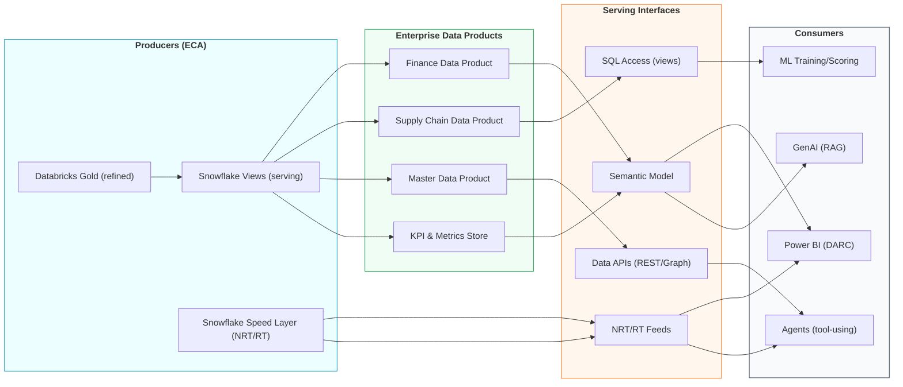

## Enterprise Data Products Catalog

| Data Product | Description | Source | Primary Consumer |
|--------------|-------------|--------|------------------|
| **Finance Data Product** | GL, AP, AR, cost center hierarchies | CFIN | Power BI (DARC) |
| **Master Data Product** | Vendor, customer, material masters | IP/Corp | Agents, APIs |
| **Supply Chain Data Product** | Inventory, orders, logistics | IF | ML Training |
| **KPI & Metrics Store** | Standard definitions, calculations | All | GenAI (RAG), DARC |

## Serving Interface Specifications

| Interface | Protocol | Latency | Access Pattern |
|-----------|----------|---------|----------------|
| **Semantic Model** | Power BI DirectQuery | Seconds | Interactive BI |
| **SQL Access** | Snowflake SQL | Seconds | Ad-hoc queries |
| **Data APIs** | REST/GraphQL | Milliseconds | Application integration |
| **NRT/RT Feeds** | Snowflake Streams | Sub-minute | Real-time dashboards |

## ECA AI Integration (Exact Components)

To operationalize AI capabilities on ECA data products, the following components are required:

### AI-Ready Data Product Contracts

Each data product must include:
- **Metadata**: Owner, data classification, freshness SLA, allowed columns, row filters
- **Cost Guardrails**: Query limits, compute budgets, rate policies
- **Semantic References**: Links to KPI definitions, business glossary terms

### Supporting Stores and Models

| Component | Purpose | Integration Point |
|-----------|---------|-------------------|
| **KPI & Metrics Store** | Standard metric definitions | Agent-friendly retrieval via semantic search |
| **Semantic Model** | Measures, hierarchies, relationships | Natural language to SQL translation |
| **Business Glossary** | Term definitions, synonyms | Context enrichment for RAG grounding |

### Governed ECA Data Tools

| Tool | Data Source | Use Case |
|------|-------------|----------|
| **Snowflake Views Query Tool** | Gold views (batch) | Standard analytics queries, reporting |
| **Snowflake Speed Layer Query Tool** | NRT/RT data | Operational dashboards, real-time KPIs |
| **Databricks Query Tool** | Gold (primary), Silver (analytics) | ML feature retrieval, complex analytics |
| **Metrics/KPI Tool** | KPI Store | Semantic retrieval of standard definitions |
| **Data Catalog/Lineage Tool** | Unity Catalog / Snowflake Metadata | Field meaning, provenance, data lineage |

### Data-to-Text Context Builder

For RAG grounding, structured query results must be transformed:
- Convert tabular results to compact context blocks
- Include provenance IDs for citation/card generation
- Apply row limits and truncation rules
- Format: `{source: "view_name", query_id: "uuid", rows: [...], provenance: "..."}`

### AI Tool Controls

| Control | Purpose | Default |
|---------|---------|--------|
| **Query Allowlists** | Restrict schemas/views/columns | By role |
| **Max Rows** | Limit result set size | 1000 |
| **Timeout (sec)** | Prevent long-running queries | 30 |
| **Warehouse Policies** | Compute tier assignment | X-Small for AI |
| **Rate Limiting** | Requests per minute | 60/min |
| **ABAC Enforcement** | Attribute-based row filtering | Enabled |
| **Security Trimming** | Column masking by classification | Enabled |

## Consumer Access Matrix

This matrix defines **which AI/BI consumers can access which data products** and at what level. It serves as a governance blueprint that drives both RBAC (role-based) and ABAC (attribute-based) access control configurations.

| Consumer | Finance | Master Data | Supply Chain | KPI Store |
|----------|---------|-------------|--------------|-----------|
| Power BI (DARC) | ✅ Primary | ✅ Reference | ✅ Reference | ✅ Primary |
| ML Training | ⬜ Limited | ✅ Features | ✅ Primary | ⬜ Limited |
| GenAI (RAG) | ✅ Context | ✅ Context | ⬜ Limited | ✅ Primary |
| Agents | ✅ Query | ✅ Primary | ✅ Query | ✅ Query |

### Access Level Definitions

| Symbol | Level | Description | Governance Implication |
|--------|-------|-------------|------------------------|
| ✅ Primary | Full access | Consumer's main data source; optimized for their use case | Full RBAC grant; no row/column restrictions |
| ✅ Reference | Lookup access | Can join/reference for enrichment, not primary dataset | Read-only RBAC; may have column restrictions |
| ✅ Context | Grounding | Used to enrich AI responses with business context | Read-only; ABAC filters sensitive rows |
| ✅ Query | On-demand | Can query as needed for specific tasks | Query-level RBAC; rate limits apply |
| ✅ Features | ML input | Used as input features for machine learning models | Read-only; anonymization may apply |
| ⬜ Limited | Restricted | Constrained due to data sensitivity or compliance | ABAC row filtering; column masking; audit required |

### How This Matrix Drives Access Control

- **RBAC (Role-Based)**: Consumer type (Power BI, ML, GenAI, Agents) determines the role and base permissions
- **ABAC (Attribute-Based)**: Data classification, user attributes, and context determine row-level filtering and column masking
- **Combined enforcement**: A consumer must have both the correct role (RBAC) AND satisfy attribute conditions (ABAC) to access data

<div style="page-break-after: always;"></div>

# 6. AI Build Modes Comparison (L1-C)

## L1-C – AI Build Modes: GenAI vs Agentic AI vs AI Agents

This comparison illustrates the spectrum of AI capabilities, from task-specific generative AI through increasingly autonomous agentic patterns.

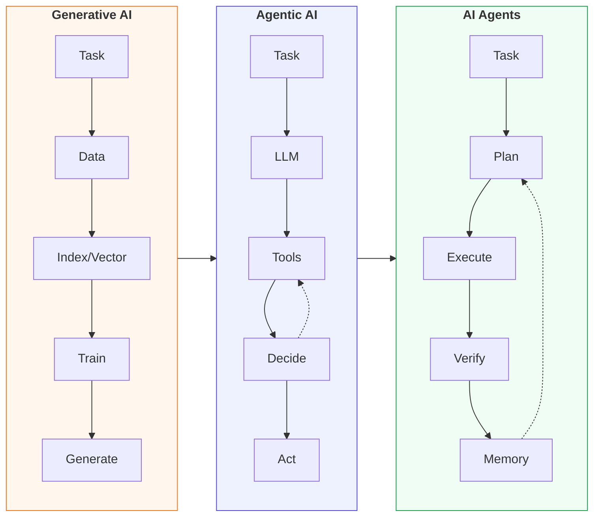

## AI Mode Comparison Matrix

| Characteristic | Generative AI | Agentic AI | AI Agents |
|----------------|---------------|------------|-----------|
| **Primary Pattern** | Retrieve + Generate | Plan + Execute + Iterate | Multi-step + Memory + Adapt |
| **Autonomy Level** | Low (task-specific) | Medium (self-directing) | High (goal-oriented) |
| **Memory** | None (stateless) | Short-term (session) | Long-term (persistent) |
| **Tool Usage** | Limited (retrieval) | Extensive (API calls) | Comprehensive (actions) |
| **Learning** | Pre-trained + RAG | In-context learning | Adaptive over time |
| **Human Oversight** | Output review | Checkpoint approval | Action approval gates |

## Use Case Alignment

| Use Case | Recommended Mode | Rationale |
|----------|------------------|-----------|
| Policy Q&A chatbot | Generative AI (RAG) | Retrieve documents, generate answers |
| Data analysis assistant | Agentic AI | Query data, iterate on insights |
| Automated workflow executor | AI Agents | Multi-step processes with approvals |
| Report generation | Generative AI | Template-based generation |
| Exception handling | AI Agents | Decision-making with memory |
| Code assistance | Agentic AI | Tool integration, iterative refinement |

## Governance Requirements by Mode

| Control | Generative AI | Agentic AI | AI Agents |
|---------|---------------|------------|-----------|
| **Input Validation** | ✅ Required | ✅ Required | ✅ Required |
| **Output Filtering** | ✅ Required | ✅ Required | ✅ Required |
| **Action Approval** | ⬜ N/A | ✅ Recommended | ✅ Required |
| **Audit Trail** | ✅ Required | ✅ Required | ✅ Required |
| **Memory Governance** | ⬜ N/A | ⬜ Optional | ✅ Required |

**Legend**: ✅ Required = Must implement | ✅ Recommended = Strongly advised | ⬜ Optional = Implement if needed | ⬜ N/A = Not applicable to this mode

<div style="page-break-after: always;"></div>

# 7. AI Platform Tool Lifecycle (L1-D)

## L1-D – AI Platform Tool Lifecycle: Discover → Authorize → Execute → Audit

This diagram shows the end-to-end tool lifecycle used by both Joule Studio (SAP) and Copilot Studio (Azure). The complementary model routes requests to the appropriate runtime based on the target system.

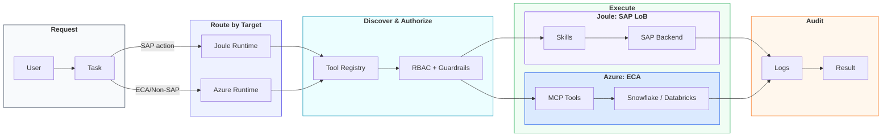

## Runtime Routing: When to Use Joule vs Copilot Studio vs iGPT

The architecture routes AI requests to the appropriate runtime based on the target system and interaction pattern. Refer to **Section 2 – AI Architecture Patterns & Routing Guide** for the full decision framework.

| Target | Runtime | Access Method |
|--------|---------|---------------|
| SAP transactions (read/write) | Joule Studio | Skills (required) |
| SAP embedded features | Joule Studio | Skills (required) |
| SAP analytics (SAC) | Joule Studio | SAC Just Ask |
| ECA data (Snowflake/Databricks) | Copilot Studio | MCP tools |
| Non-SAP APIs | Copilot Studio | MCP/n8n workflows |
| BDC data products | Joule or Copilot Studio | BDC Connect |
| General conversational AI | iGPT | igpt.intel.com/chat |
| Custom assistant creation (no-code) | iGPT | Assistant Builder + Marketplace |
| Document-grounded Q&A (uploaded files) | iGPT | RAG Engine (file upload) |

**Key principles:**
- Joule Skills are required only for SAP-native access. ECA data—even though it originates from SAP—is accessed via Copilot Studio using governed MCP tools.
- iGPT is the self-service option for Intel employees who need general-purpose AI without SAP or ECA integration requirements.
- Use cases requiring both SAP transactions and ECA analytics should leverage the **Joule + ECA hybrid** pattern (Joule for the transaction, MCP bridge for analytics).

## Tool Lifecycle Stages

All AI tool calls—whether through Joule Studio or Copilot Studio—follow a governed lifecycle:

| Stage | Purpose | Key Controls |
|-------|---------|-------------|
| **Discover** | Find relevant tools for the task | Tool registry, capability matching |
| **Authorize** | Verify access rights | RBAC/ABAC, guardrails, approval gates |
| **Execute** | Invoke the tool | Joule Skills (SAP) or MCP (ECA/non-SAP) |
| **Audit** | Record outcomes | Logs, traces, evidence retention |

<div style="page-break-after: always;"></div>

# 8. GenAI RAG Implementation (L2-D)

## L2-D – GenAI RAG Flow Using ECA Data Products

This implementation-level view details the Retrieval-Augmented Generation (RAG) pattern, grounding LLM responses with enterprise data products and documents. **Importantly, SAP/Joule and Azure runtime maintain separate retrieval mechanisms by default.**

```mermaid
flowchart LR
  %% =========================
  %% L2-D: GENAI RAG FLOW
  %% SAP/Joule and Azure have SEPARATE retrieval by default
  %% Cross-runtime access is via governed tool calls (optional)
  %% =========================

  subgraph INPUTS["<b>Content Sources</b>"]
    direction TB
    SAPDOC["SAP Documents (BTP)"]
    ENTDOC["Enterprise Documents (policies/SOPs)"]
    ECADP["ECA Data Products (Gold + Views)"]
    BDCDP["BDC-shared Data Products"]
  end

  subgraph JOULE_RAG["<b>SAP/Joule Grounding</b>"]
    direction TB
    SAPCH["SAP Chunking"] --> SAPEMB["SAP Embeddings"]
    SAPEMB --> SAPVEC["SAP Vector Store"]
    SAPVEC --> SAPCTX["SAP Context"]
  end

  subgraph AZURE_RAG["<b>Azure RAG</b>"]
    direction TB
    AZCH["Chunk/Normalize"] --> AZEMB["Azure Embeddings"]
    AZEMB --> AZVEC["Azure AI Search"]
    AZVEC --> AZCTX["Azure Context"]
  end

  subgraph CTXBuild["<b>ECA Context Builder</b>"]
    direction TB
    MCP["MCP/n8n Tools"]
    CB["Data-to-Text (provenance)"]
    MCP --> CB
  end

  subgraph RUNTIMES["<b>LLM Orchestration</b>"]
    direction LR
    subgraph JRT["<b>Joule Runtime</b>"]
      JPB["Joule Prompt Builder"] --> JLLM["SAP LLM"]
    end
    subgraph AZRT["<b>Azure Runtime</b>"]
      APB["Azure Prompt Builder"] --> ALLM["Azure OpenAI"]
    end
  end

  subgraph GOV["<b>Governance</b>"]
    GR["Guardrails"] 
    AU["Audit"]
  end

  %% SAP/Joule path
  SAPDOC --> SAPCH
  SAPCTX --> JPB

  %% Azure path
  ENTDOC --> AZCH
  AZCTX --> APB

  %% ECA structured data via MCP (both runtimes can access)
  ECADP --> MCP
  BDCDP --> MCP
  CB --> APB
  CB -. "optional tool call" .-> JPB

  %% Cross-runtime optional bridges
  JLLM -. "optional: call Azure MCP tools" .-> MCP
  ALLM -. "optional: call SAP APIs" .-> SAPCTX

  %% Governance
  JLLM --> GR --> AU
  ALLM --> GR --> AU

  style INPUTS fill:#ECFEFF,stroke:#0891B2,stroke-width:1px
  style JOULE_RAG fill:#F5F3FF,stroke:#7C3AED,stroke-width:2px
  style AZURE_RAG fill:#DBEAFE,stroke:#2563EB,stroke-width:2px
  style CTXBuild fill:#FDF4FF,stroke:#A855F7,stroke-width:1px
  style RUNTIMES fill:#F0FDF4,stroke:#16A34A,stroke-width:1px
  style JRT fill:#F5F3FF,stroke:#7C3AED,stroke-width:1px
  style AZRT fill:#DBEAFE,stroke:#2563EB,stroke-width:1px
  style GOV fill:#F8FAFC,stroke:#334155,stroke-width:1px
```

## RAG Retrieval Separation: SAP/Joule vs Azure

The complementary runtime model extends to RAG retrieval—**SAP/Joule and Azure maintain separate document grounding mechanisms by default**:

- **SAP/Joule uses SAP-managed document grounding**: SAP BTP provides its own RAG infrastructure (chunking, embeddings, vector store) optimized for SAP content, business semantics, and authorization context.
- **Azure runtime uses Azure-native retrieval**: Azure AI Search and vector stores index enterprise documents, ECA data products, and non-SAP content for Azure-based agents.
- **Indexes are separate by default**: Even when source documents overlap, each runtime maintains its own embeddings and retrieval index—there is no implicit shared vector store.
- **ECA structured data is accessed via MCP tools**: Both runtimes can invoke governed MCP tools to query Snowflake views, Speed Layer, and Databricks Gold products for real-time structured context.
- **Cross-runtime retrieval is optional and governed**: Joule can call Azure-side MCP tools for ECA facts; Azure can call SAP APIs when SAP context is needed—but these are explicit, auditable tool calls, not automatic sharing.
- **BDC-shared data products bridge both**: When data products are published via BDC Connect, both runtimes can access them through their respective governed interfaces.
- **This separation improves**: Security (no cross-runtime data leakage), governance (clear audit trails), and optimization (each runtime's RAG tuned for its content type).

## RAG Pipeline Components

### Input Sources
| Source Type | Examples | Refresh Frequency |
|-------------|----------|-------------------|
| Enterprise Data Products | Finance metrics, master data, KPIs | Daily (batch) |
| Enterprise Documents | Policies, SOPs, runbooks, guides | On change |
| Structured Data | Snowflake views, API responses | Real-time |

### Retrieval & Grounding Pipeline
| Stage | Process | Technology |
|-------|---------|------------|
| **Chunking** | Split documents into semantic units | LangChain, custom splitters |
| **Embedding** | Convert chunks to vector representations | Azure OpenAI, enterprise models |
| **Indexing** | Store embeddings with metadata | Azure AI Search, Pinecone |
| **Retrieval** | Semantic search for relevant context | Vector similarity, hybrid search |

### LLM Orchestration
| Component | Function | Configuration |
|-----------|----------|---------------|
| Prompt Builder | Assemble task + context + constraints | Template library |
| LLM Runtime | Generate response | GPT-4, Claude, enterprise-approved |
| Response Composer | Format output with citations | Cards, tables, references |

### Governance Controls
| Control | Implementation | Purpose |
|---------|----------------|---------|
| Guardrails | Azure AI Content Safety | Filter harmful content |
| PII Detection | Presidio, custom rules | Protect sensitive data |
| Citation Tracking | Source attribution | Traceability, trust |
| Audit Logging | Application Insights | Compliance, debugging |

## RAG Quality Metrics

| Metric | Target | Measurement |
|--------|--------|-------------|
| Retrieval Precision | > 85% | Relevant chunks / retrieved chunks |
| Answer Accuracy | > 90% | Correct answers / total answers |
| Citation Accuracy | > 95% | Valid citations / total citations |
| Response Latency | < 3 sec | P95 end-to-end time |

<div style="page-break-after: always;"></div>

# 9. Agent Runtime Implementation (L2-E)

## L2-E – Agent Runtime: Complementary Model

This diagram shows the agent runtime architecture in the complementary model, where Joule handles SAP transactions and Azure handles ECA analytics.

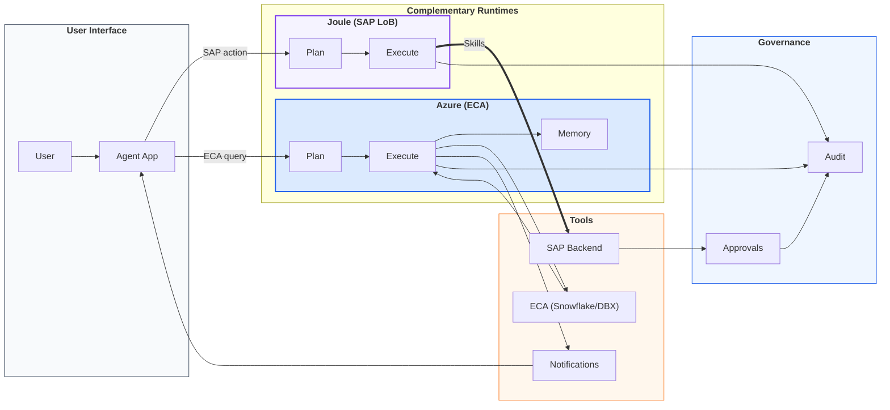

## Agent Runtime Components

### Planner
| Function | Description | Implementation |
|----------|-------------|----------------|
| Goal Decomposition | Break complex tasks into steps | LLM reasoning, ReAct pattern |
| Tool Selection | Match steps to available tools | Tool registry lookup |
| Dependency Ordering | Sequence steps appropriately | DAG construction |
| Error Recovery | Handle failures, re-plan | Retry logic, fallbacks |

### Executor
| Function | Description | Implementation |
|----------|-------------|----------------|
| Tool Invocation | Call selected tools with parameters | API calls, MCP protocol |
| Result Processing | Parse and validate tool outputs | Schema validation |
| State Management | Track execution progress | Session state, checkpoints |
| Error Handling | Manage tool failures | Circuit breakers, retries |

### Memory
| Type | Scope | Storage | Retention |
|------|-------|---------|-----------|
| Short-term | Session | In-memory | Session duration |
| Long-term | User/Agent | Database | Configurable |
| Episodic | Task history | Vector store | Policy-defined |

## Tool Categories

### Data Tools (Read)
| Tool | Source | Access Pattern | Latency |
|------|--------|----------------|---------|
| Snowflake Views | Curated data products | SQL query | Seconds |
| Speed Layer | NRT/RT data | Streaming query | Sub-second |
| Databricks | Bronze/Silver/Gold | Spark SQL | Seconds |

### Action Tools (Write)
| Tool | Target | Risk Level | Approval Required |
|------|--------|------------|-------------------|
| SAP APIs | Transaction posting | High | Yes (HITL) |
| Notifications | Teams/Email | Low | No |
| Ticketing | ServiceNow | Medium | Configurable |

**Risk Level Definitions**: High = Financial/compliance impact, requires HITL | Medium = Operational impact, approval configurable | Low = Minimal impact, auto-approved

## Governance Framework

| Control | Scope | Enforcement |
|---------|-------|-------------|
| **RBAC/ABAC** | All tool access | Pre-execution check |
| **Approval Gate** | High-risk actions | Human approval required |
| **Rate Limiting** | API calls | Token bucket |
| **Audit Logging** | All operations | Post-execution capture |

<div style="page-break-after: always;"></div>

# 10. Platform Stage Lanes

## Platform Stage Lanes – Simplified View

This simplified lane view provides an executive-friendly overview of the data platform stages, ideal for stakeholder presentations and governance discussions.

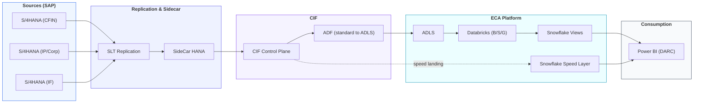

## Stage Summary

| Stage | Components | Responsibility | SLA |
|-------|------------|----------------|-----|
| **Sources** | S/4HANA (CFIN, IP/Corp, IF) | SAP App Team | 99.9% availability |
| **Replication** | SLT, SideCar HANA | Integration Team | < 5 min replication lag |
| **Ingestion** | CIF, ADF Pipelines | Data Engineering | 99.5% pipeline success |
| **ECA** | ADLS, Databricks, Snowflake | Data Platform Team | 99.9% availability |
| **Consumption** | Power BI (DARC) | BI Team | < 10 sec query response |

<div style="page-break-after: always;"></div>

# 11. TOGAF BDAT Crosswalk

## TOGAF BDAT Crosswalk – Conceptual Mapping

This conceptual mapping aligns the ECA & AI Enablement architecture to TOGAF Business, Data, Application, and Technology (BDAT) domains, supporting enterprise architecture governance.

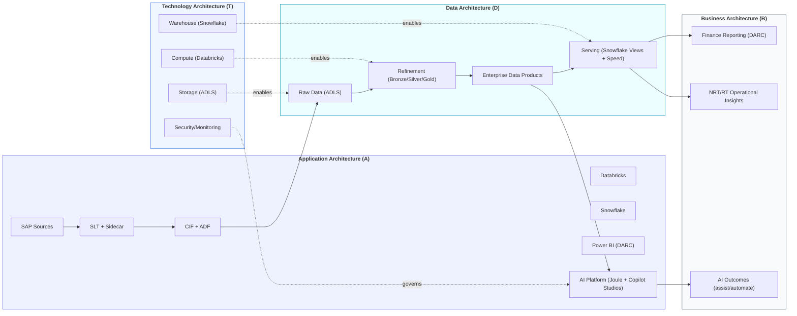

## BDAT Domain Mapping

### Business Architecture (B)
| Capability | Description | Value Delivered |
|------------|-------------|-----------------|
| Finance Reporting | Power BI dashboards via DARC | Trusted financial insights |
| NRT/RT Insights | Operational monitoring | Real-time decision support |
| AI Outcomes | Agent-assisted processes | Automation, efficiency |

### Data Architecture (D)
| Layer | Purpose | Quality Standard |
|-------|---------|------------------|
| Raw Data (ADLS) | Landing zone | Schema-on-read |
| Bronze | Initial ingestion | Data quality checks |
| Silver | Cleansed, conformed | Business rules applied |
| Gold | Curated products | Certified, documented |
| Serving | Enterprise access | SLA-backed availability |

### Application Architecture (A)
| Application | Role | Integration Pattern |
|-------------|------|---------------------|
| SAP Sources | System of record | CDC replication |
| SLT + Sidecar | Replication engine | Near real-time |
| CIF + ADF | Ingestion control | Batch/streaming |
| Databricks | Transformation | Medallion pipeline |
| Snowflake | Serving layer | SQL/API access |
| Power BI | Visualization | DirectQuery |
| AI Platform | Intelligence layer | Tool/API integration |

### Technology Architecture (T)
| Technology | Purpose | Vendor |
|------------|---------|--------|
| ADLS | Object storage | Microsoft Azure |
| Databricks | Lakehouse compute | Databricks |
| Snowflake | Cloud warehouse | Snowflake |
| Azure Monitor | Observability | Microsoft Azure |
| Entra ID | Identity | Microsoft Azure |

<div style="page-break-after: always;"></div>

# 12. Ownership & Operating Model

## Ownership / Operating Model Lanes

This view maps platform components to responsible teams, supporting RACI discussions and operational governance.

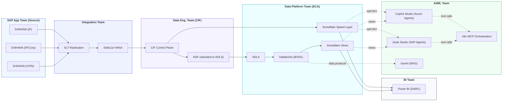

## RACI Matrix

| Component | SAP App | Integration | Data Eng | Data Platform | BI Team | AI/ML |
|-----------|---------|-------------|----------|---------------|---------|-------|
| S/4HANA Systems | **R/A** | C | I | I | I | I |
| SLT Replication | C | **R/A** | C | I | I | I |
| SideCar HANA | C | **R/A** | C | I | I | I |
| CIF Control Plane | I | C | **R/A** | C | I | I |
| ADF Pipelines | I | I | **R/A** | C | I | I |
| ADLS | I | I | C | **R/A** | I | I |
| Databricks | I | I | C | **R/A** | I | C |
| Snowflake Views | I | I | C | **R/A** | C | C |
| Speed Layer | I | I | C | **R/A** | C | C |
| Power BI (DARC) | I | I | I | C | **R/A** | I |
| Joule Studio | I | I | I | C | I | **R/A** |
| Copilot Studio | I | I | I | C | I | **R/A** |
| n8n MCP | I | I | I | C | I | **R/A** |
| GenAI (RAG) | I | I | I | C | I | **R/A** |

**RACI Legend**:
| Code | Role | Definition |
|------|------|------------|
| **R/A** | Responsible & Accountable | Owns delivery and final decision authority |
| **C** | Consulted | Provides input before decisions are made |
| **I** | Informed | Notified after decisions are made |

## Support Model

| Tier | Scope | Team | SLA |
|------|-------|------|-----|
| L1 | User issues, access requests | Service Desk | 4 hours |
| L2 | Data quality, pipeline failures | Data Engineering | 8 hours |
| L3 | Platform issues, performance | Data Platform | 24 hours |
| L4 | Architecture, design decisions | Enterprise Architecture | 5 days |

<div style="page-break-after: always;"></div>

# 13. Implementation Phases

## Phase 1: Data Platform Foundation
**Purpose**: Establish core ECA data infrastructure

| Deliverable | Description | Status |
|-------------|-------------|--------|
| ADLS Landing Zones | Raw data storage structure | ✅ Complete |
| Databricks Workspace | B/S/G layer configuration | ✅ Complete |
| Snowflake Views | Enterprise serving layer | ✅ Complete |
| CIF Standard Landing | ADF pipeline integration | ✅ Complete |
| DARC Connectivity | Power BI dataset configuration | ✅ Complete |

**Status Legend**: ✅ Complete = Delivered and operational | 🔄 In Progress = Active development | 📋 Planned = Scheduled for future phase

**L2 Deliverables**: Infrastructure architecture, data model design

## Phase 2: Speed Layer Enablement
**Purpose**: Enable near-real-time data access

| Deliverable | Description | Status |
|-------------|-------------|--------|
| Snowflake Speed Layer | NRT/RT data landing | ✅ Complete |
| CIF Speed Landing | Direct CIF → Snowflake path | ✅ Complete |
| NRT Dashboard Integration | DARC real-time refresh | 🔄 In Progress |
| Speed Layer Governance | Access controls, monitoring | 🔄 In Progress |

**L2 Deliverables**: NRT architecture, latency requirements

## Phase 3: Enterprise Data Products
**Purpose**: Create reusable, governed data products

| Deliverable | Description | Status |
|-------------|-------------|--------|
| Finance Data Product | GL, AP, AR, cost centers | ✅ Complete |
| Master Data Product | Vendor, customer, material | 🔄 In Progress |
| Supply Chain Data Product | Inventory, orders, logistics | 📋 Planned |
| KPI & Metrics Store | Standard definitions | 📋 Planned |
| Semantic Layer | Measures, hierarchies | 📋 Planned |

**L2 Deliverables**: Data product catalog, semantic layer design

## Phase 4: AI Platform Foundation
**Purpose**: Enable AI/ML consumption of data products

| Deliverable | Description | Status |
|-------------|-------------|--------|
| LLM Runtime | Enterprise-approved model hosting | 🔄 In Progress |
| Tool Registry | Catalog of available tools | 📋 Planned |
| Guardrails Framework | Content safety, policy enforcement | 📋 Planned |
| Vector Store | RAG grounding storage | 📋 Planned |
| Observability | Tracing, metrics, logging | 📋 Planned |

**L2 Deliverables**: AI platform architecture, security controls

## Phase 5: Agent Studio Enablement
**Purpose**: Enable custom agent development on both platforms

| Deliverable | Description | Status |
|-------------|-------------|--------|
| Joule Studio Deployment | SAP agent development platform | 📋 Planned |
| Copilot Studio Deployment | Azure agent development platform | 📋 Planned |
| Skills Library | ECA data tools integration | 📋 Planned |
| n8n MCP Server | Workflow orchestration | 📋 Planned |
| Approval Gates | HITL for high-risk actions | 📋 Planned |
| Agent Templates | Pre-built agent patterns | 📋 Planned |

**L2 Deliverables**: Agent architecture, tool lifecycle design

## Phase 6: Governance & Operations
**Purpose**: Establish ongoing operational excellence

| Deliverable | Description | Status |
|-------------|-------------|--------|
| Audit Framework | Comprehensive logging, evidence | 📋 Planned |
| RBAC/ABAC Controls | Cross-platform access management | 📋 Planned |
| SLA Monitoring | Alerting, dashboards | 📋 Planned |
| Operating Model | RACI, support procedures | 📋 Planned |
| Runbooks | Operational procedures | 📋 Planned |

**L2 Deliverables**: Governance framework, operating model

## Implementation Timeline

```
Phase 1 [==========] Complete - Data Platform Foundation
Phase 2 [========  ] 80% - Speed Layer Enablement
Phase 3 [====      ] 40% - Enterprise Data Products
Phase 4 [==        ] 20% - AI Platform Foundation
Phase 5 [          ] 0% - Agent Studio Enablement
Phase 6 [          ] 0% - Governance & Operations
```

<div style="page-break-after: always;"></div>

# 14. L2 Architecture Deliverables

## 14.1 Data Architecture

### ADLS Structure
```
/raw/
  ├── cfin/           # CFIN source data
  ├── ipcorp/         # IP/Corp source data
  └── if/             # IF source data
/bronze/
  ├── tables/         # Raw table replicas
  └── metadata/       # Schema, lineage
/silver/
  ├── finance/        # Finance domain
  ├── masterdata/     # Master data domain
  └── supplychain/    # Supply chain domain
/gold/
  ├── dataproducts/   # Certified products
  └── kpi/            # Metrics store
```

### Databricks Medallion Layers

| Layer | Purpose | Quality Rules | Retention |
|-------|---------|---------------|-----------|
| Bronze | Raw ingestion | Schema validation | 90 days |
| Silver | Cleansed, conformed | Business rules, dedup | 1 year |
| Gold | Certified products | Data quality scores | 7 years |

### Snowflake Organization

| Schema | Purpose | Access Pattern |
|--------|---------|----------------|
| `views` | Enterprise serving | DirectQuery, SQL |
| `speed` | NRT/RT data | Streaming, real-time |
| `staging` | Temporary processing | Internal only |

## 14.2 Integration Architecture

### Standard Landing Pattern
```
SAP S/4HANA → SLT (CDC) → SideCar HANA → CIF → ADF → ADLS → Databricks → Snowflake
```

**Configuration**:
- SLT: Real-time CDC with 5-minute latency
- ADF: Hourly batch pipelines
- Databricks: Delta Lake with auto-optimize

### Speed Landing Pattern
```
SAP S/4HANA → SLT (CDC) → SideCar HANA → CIF → Snowflake Speed Layer
```

**Configuration**:
- Direct CIF → Snowflake Snowpipe
- Sub-minute latency
- Schema-on-read with validation

<div style="page-break-after: always;"></div>

## 14.3 Security Architecture

### Identity & Access

| Component | Identity Provider | Access Control |
|-----------|-------------------|----------------|
| ADLS | Entra ID | RBAC (Storage Blob) |
| Databricks | Entra ID | Unity Catalog |
| Snowflake | Entra ID (SAML) | Role-based |
| Power BI | Entra ID | Row-level security |
| AI Platform | Entra ID | RBAC + ABAC |

### Data Classification

| Classification | Examples | Controls |
|----------------|----------|----------|
| Public | Published reports | None |
| Internal | Operational data | Authentication |
| Confidential | Financial details | Encryption, audit |
| Restricted | PII, trade secrets | Encryption, approval, audit |

### Network Security

| Zone | Components | Access |
|------|------------|--------|
| DMZ | API Gateway, WAF | Internet |
| Application | Power BI, AI Platform | Corporate |
| Data | ADLS, Databricks, Snowflake | Private endpoints |
| Management | Monitoring, secrets | Admin only |

<div style="page-break-after: always;"></div>

## 14.4 AI Platform Architecture

### LLM Runtime

| Model | Provider | Use Case | Approval |
|-------|----------|----------|----------|
| GPT-4 | Azure OpenAI | General, RAG | ✅ Approved |
| Claude 3 | Anthropic | Complex reasoning | ✅ Approved |
| Llama 3 | Meta (self-hosted) | Sensitive data | 🔄 Evaluation |

**Approval Status**: ✅ Approved = Cleared for production use | 🔄 Evaluation = Under security/compliance review | ⬜ Pending = Not yet reviewed

### Tool Registry

Tools are governed, cataloged interfaces to data and actions. Each tool in the registry includes:
- Identity and description
- Risk level and required approvals
- Access controls and allowed resources
- Rate limits and cost controls

The exact schema is an implementation detail and intentionally out of scope for this architecture document. What matters architecturally is that all tools—whether Joule Skills or MCP workflows—are registered, governed, and auditable.

### Joule Studio Connectivity to External (Non-SAP-Managed) Databricks & Snowflake

Joule Studio agents can leverage customer-managed Databricks and Snowflake platforms via **SAP Business Data Cloud (BDC) Connect**, enabling governed, bidirectional, zero-copy data sharing with semantic preservation.

**Important**: Joule Studio does not typically bypass BDC for grounding; BDC is the unification and governance layer for semantically rich data product sharing. MCP tools can still call external systems for execution, but BDC Connect is the primary mechanism for governed data product sharing and grounding.

#### Databricks Connectivity via BDC Connect

**Mechanism**: BDC Connector for Databricks using Delta Sharing (zero-copy)

**Capabilities**:
- Bidirectional sharing: BDC → Databricks and Databricks → BDC
- Zero-copy data access (no data movement)
- Semantic model preservation across platforms
- Catalog discoverability for AI grounding

**Setup Requirements**:
- Unity Catalog enabled on Databricks workspace
- Delta Sharing enabled and configured
- Admin privileges: CREATE PROVIDER, CREATE RECIPIENT
- Network connectivity between BDC and Databricks
- Credential configuration in BDC Connect service

#### Snowflake Connectivity via BDC Connect

**Mechanism**: BDC Connect service for Snowflake using Snowflake Data Sharing

**Capabilities**:
- Bidirectional zero-copy sharing
- Semantically rich data products with metadata
- Governance policy enforcement
- Catalog discoverability for AI grounding

**Setup Requirements**:
- Snowflake account with Data Sharing enabled
- ACCOUNTADMIN or CREATE SHARE privileges
- Network policy allowing BDC connectivity
- Share configuration in BDC Connect service

#### Limitations & Considerations

| Consideration | Description |
|---------------|-------------|
| **Latency** | Zero-copy sharing adds minimal latency vs. direct JDBC |
| **Governance** | All access subject to BDC governance policies |
| **Schema Evolution** | Schema changes require re-sync with BDC catalog |
| **Cost** | Compute costs incurred at source platform |
| **Security** | Cross-platform credentials managed in BDC |
| **Scope** | Grounding only; MCP handles tool execution |

### Azure AI Runtime Components

The Azure runtime in the complementary model handles ECA analytics and non-SAP AI workloads:

| Component | Purpose |
|-----------|--------|
| **Agent Runtime** | Orchestration, planning, execution |
| **LLM Endpoint** | Enterprise-approved model hosting (Azure OpenAI) |
| **Vector Store** | RAG grounding, semantic search (Azure AI Search) |
| **MCP/n8n** | Tool execution, workflow orchestration |
| **Observability** | Tracing, metrics, audit logging |

The Azure runtime accesses ECA data via governed MCP tools (Snowflake queries, Databricks queries) and does not require Joule Skills for ECA access.

### Agent Governance

| Control | Implementation | Trigger |
|---------|----------------|---------|
| Input validation | Schema check | All requests |
| Output filtering | Content safety | All responses |
| Action approval | HITL workflow | High-risk actions |
| Rate limiting | Token bucket | All API calls |
| Audit logging | Application Insights | All operations |

<div style="page-break-after: always;"></div>

# 15. Governance & Operations

## Governance Framework

### Data Governance

| Domain | Owner | Controls |
|--------|-------|----------|
| Data Quality | Data Platform Team | Quality scores, validation rules |
| Data Lineage | Data Engineering | Automated tracking, documentation |
| Data Catalog | Data Platform Team | Discovery, metadata management |
| Data Access | Security Team | RBAC, classification enforcement |

### AI Governance

| Domain | Owner | Controls |
|--------|-------|----------|
| Model Approval | AI/ML Team | Enterprise model registry |
| Prompt Safety | AI/ML Team | Guardrails, content filtering |
| Action Approval | Business Owners | HITL for high-risk actions |
| Audit & Evidence | Compliance | Comprehensive logging |

## Operational Procedures

### Monitoring & Alerting

| Metric | Threshold | Action |
|--------|-----------|--------|
| Pipeline failure rate | > 5% | Page on-call |
| Query latency P95 | > 10 sec | Investigate |
| LLM error rate | > 1% | Alert AI team |
| Approval backlog | > 50 | Escalate |

### Incident Management

| Severity | Definition | Response Time | Resolution Time |
|----------|------------|---------------|-----------------|
| P1 | Platform outage | 15 min | 4 hours |
| P2 | Major degradation | 1 hour | 8 hours |
| P3 | Minor issue | 4 hours | 24 hours |
| P4 | Enhancement request | 1 week | Sprint planning |

### Change Management

| Change Type | Approval | Lead Time |
|-------------|----------|-----------|
| Standard (pre-approved) | Auto | Immediate |
| Normal | CAB | 5 days |
| Emergency | Emergency CAB | 2 hours |

<div style="page-break-after: always;"></div>

# Appendix A: Component Glossary

| Abbreviation | Full Name | Description |
|--------------|-----------|-------------|
| **ABAC** | Attribute-Based Access Control | Fine-grained access control using attributes |
| **ADF** | Azure Data Factory | ETL/ELT pipeline orchestration service |
| **ADLS** | Azure Data Lake Storage | Scalable object storage for data lakes |
| **AGS** | Access Group Service | Intel's enterprise entitlements service for group-based permissions |
| **B/S/G** | Bronze/Silver/Gold | Medallion architecture data layers |
| **CDC** | Change Data Capture | Technique for tracking data changes |
| **CIF** | Core Ingestion Framework | Controls data landing patterns |
| **DARC** | Data Analytics Reporting Center | Power BI finance reporting solution |
| **ECA** | Enterprise Cloud Analytics | ADLS + Databricks + Snowflake platform |
| **HITL** | Human-in-the-Loop | Approval process requiring human intervention |
| **iGPT** | Intel Generative Pre-trained Transformer | Intel's internal enterprise GenAI platform (igpt.intel.com) for chat, assistants, and marketplace |
| **MCP** | Model Context Protocol | Standard for tool/workflow integration |
| **NRT** | Near Real-Time | Sub-minute data latency |
| **RAG** | Retrieval-Augmented Generation | LLM grounding with enterprise context |
| **RAGe** | Retrieval Augmented Generation (enterprise) | SAP-specific enterprise RAG for Joule document grounding |
| **RBAC** | Role-Based Access Control | Permission management by role |
| **RT** | Real-Time | Sub-second data latency |
| **SLT** | SAP Landscape Transformation | SAP replication service |
| **SoD** | Segregation of Duties | Control preventing conflict of interest |

<div style="page-break-after: always;"></div>

# Document Control

| Version | Date | Author | Changes |
|---------|------|--------|---------|
| 1.0 | February 2026 | Sajiv Francis, Don Meyers | Initial release |
| 1.1 | March 2026 | Sajiv Francis | Added Section 2: AI Architecture Patterns & Routing Guide (Joule, ECA/Azure, iGPT three-pattern model); updated Runtime Routing to include iGPT; expanded glossary |
| 1.2 | March 2026 | Sajiv Francis | Restructured Section 2: moved detailed use case routing, capability patterns, and interoperability content to standalone AI Architecture Selection Guide; retained high-level pattern comparison and references |

**Classification**: Internal Use  
**Review Cycle**: Quarterly  
**Next Review**: June 2026

---

<p align="center" style="font-size: 9pt; color: #666;">
  <strong>ECA & AI Enablement Architecture</strong> | Intel Corporation | February 2026
</p>

*End of Document*

<!-- ============================= -->
<!--     PDF STYLING & HEADERS     -->
<!-- ============================= -->

<!--
PDF EXPORT INSTRUCTIONS:
========================
For VS Code "Markdown PDF" extension, add these settings to your settings.json:
{
  "markdown-pdf.displayHeaderFooter": true,
  "markdown-pdf.headerTemplate": "<div></div>",
  "markdown-pdf.footerTemplate": "<div style='font-size: 9px; width: 100%; padding: 0 20px; display: flex; justify-content: space-between;'><span>Page <span class='pageNumber'></span> of <span class='totalPages'></span></span><span style='color: #0071c5; font-weight: bold;'>ECA & AI Enablement Architecture</span></div>",
  "markdown-pdf.margin.bottom": "1cm"
}

For Pandoc, use:
pandoc input.md -o output.pdf --pdf-engine=xelatex -V footer-center="ECA & AI Enablement Architecture" -V footer-right="Page \thepage"
-->

<style>
@media print {
  @page {
    size: A4;
    margin: 0.75in 0.6in 0.9in 0.6in;
    @bottom-left {
      content: counter(page);
      font-size: 9pt;
      color: #666;
    }
    @bottom-right {
      content: "ECA AI Architecture Overview";
      font-size: 9pt;
      color: #0071c5;
      font-weight: bold;
    }
  }
  @page:first {
    @bottom-left { content: ""; }
    @bottom-right { content: ""; }
  }
  /* Title page: force single-page fit */
  .title-page {
    page-break-inside: avoid;
    page-break-after: always;
    max-height: 100vh;
    overflow: hidden;
  }
  .title-page img {
    max-height: 340px;
    object-fit: contain;
  }
  .title-page h1 { font-size: 20pt; margin: 0.3em 0 0.1em; }
  .title-page h3 { font-size: 12pt; margin: 0.1em 0; }
  .title-page h4 { font-size: 11pt; margin: 0.1em 0 0.5em; }
  .title-page p  { margin: 0.2em 0; }
  body { font-size: 10pt; line-height: 1.4; }
  h1 { font-size: 18pt; page-break-after: avoid; margin-top: 0.5em; }
  h2 { font-size: 14pt; page-break-after: avoid; margin-top: 0.4em; }
  h3 { font-size: 12pt; page-break-after: avoid; margin-top: 0.3em; }
  table { page-break-inside: avoid; font-size: 9pt; width: 100%; }
  figure, .mermaid { page-break-inside: avoid; }
  pre { page-break-inside: avoid; font-size: 8pt; }
  p { margin: 0.3em 0; }
  ul, ol { margin: 0.2em 0; }
}
</style>
