<!-- ============================= -->
<!--        TITLE PAGE START       -->
<!-- ============================= -->

<div class="title-page">

<p align="center" style="margin-bottom: 0.2em;">
  <strong>INTEL CORPORATION</strong>
</p>
<p align="center" style="margin-top: 0;">
  
</p>

<h1 align="center" style="margin: 0.3em 0 0.1em;"><strong>SAP Joule</strong></h1>
<h1 align="center" style="margin: 0.1em 0;"><strong>Architecture Overview</strong></h1>

<p align="center" style="margin: 0.3em 0;">
  <strong>Version:</strong> 1.1<br>
  <strong>Date:</strong> January 2026<br>
  <strong>Prepared by:</strong> Sajiv Francis, Don Meyers<br>
  <strong>Classification:</strong> Internal Use
</p>

<p align="center" style="font-size: 10pt; color: #666; margin-top: 0.8em;">
  <em>This document contains confidential information proprietary to Intel Corporation.</em>
</p>

</div>

<!-- ============================= -->
<!--         TITLE PAGE END        -->
<!-- ============================= -->

---

# Table of Contents

1. [Executive Summary](#1-executive-summary)
2. [Key Capability Patterns](#2-key-capability-patterns)
3. [Characteristics (SAP Design Principles)](#3-characteristics-sap-design-principles)
4. [Architecture Overview](#4-architecture-overview)
5. [Implementation Phases](#5-implementation-phases)
   - [Phase 1 – Foundation & Identity](#phase-1--foundation--identity)
   - [Phase 2 – Joule Assistant Core](#phase-2--joule-Assistant-core-enablement)
   - [Phase 3 – Embedded Agents](#phase-3--embedded-agents-activation)
   - [Phase 4 – Custom Agents](#phase-4--custom-agent-development)
   - [Phase 5 – Governance & Ops](#phase-5--governance--operations)
6. [Joule Capability Matrix](#6-joule-capability-matrix)
7. [Product Capabilities](#7-product-capabilities)
   - [S/4HANA Cloud (J4C)](#s4hana-cloud-j4c--joule-capabilities) · [SAC](#sap-analytics-cloud-sac--joule-capabilities) · [Ariba](#ariba--joule-capabilities) · [Concur](#concur--joule-capabilities) · [IBP](#ibp--joule-capabilities)
   - [Fieldglass](#fieldglass--joule-capabilities) · [Commerce/CX](#commerce-cloud-cx--joule-capabilities) · [Signavio](#signavio--joule-capabilities) · [APM](#apm-asset-performance-management--joule-capabilities) · [PAPM](#papm-profitability--performance-mgmt--joule-capabilities)
   - [BN4L](#bn4l-business-network-for-logistics--joule-capabilities) · [S/4 On-Prem](#s4hana-on-premise--joule-capabilities) · [Build Code/J4D](#sap-build-code--abap-cloud-j4d--joule-capabilities) · [Other Products](#other-cloud-products--joule-capabilities)
   - [Skills Architecture: Studio vs MCP](#skills-architecture-joule-studio-vs-mcp)
8. [Platform Stage Lanes](#8-platform-stage-lanes)
9. [TOGAF BDAT Crosswalk](#9-togaf-bdat-crosswalk)
10. [Ownership & Operating Model](#10-ownership--operating-model)
11. [L2 Architecture Deliverables](#11-l2-architecture-deliverables)
12. [Governance & Operations](#12-governance--operations)
13. [Architectural Flows](#13-architectural-flows)
14. [Related Architecture Patterns](#14-related-architecture-patterns)
- [Appendix A: Component Glossary](#appendix-a-component-glossary)

</div>

<div style="page-break-after: always;"></div>

# 1. Executive Summary

## Purpose

This document defines the **SAP Joule AI Architecture** for Intel's enterprise SAP landscape. SAP Joule is an AI-powered assistant that transforms how users interact with SAP applications through natural language, delivering transactional, navigational, informational, and analytical capabilities across Intel's SAP portfolio.

## Scope

The architecture encompasses three deployment patterns:

- **Joule Assistant Core** – Central conversational interface for information, navigation, and analytics (powered by SAP AI Core and SAC Just Ask)
- **Embedded Agents** – SAP-delivered agents activated within LoB applications (Ariba, Concur, IBP, Fieldglass, Commerce Cloud, Signavio, APM, PAPM, BN4L)
- **Custom Agents** – Developer-built agents via Joule Studio for S/4HANA on-prem and cross-system orchestration (Skills mandatory for Studio orchestration, optional when using MCP/N8N)

**Key Architectural Components:**
- **SAP Build Work Zone** – Primary entry point / launchpad for Joule; navigation service, CDM content sync via IPS, and role-based access
- **SAP AI Core** – Generative AI Hub providing Dialog Management LLM and partner LLM ecosystem for Joule processing
- **SAP AI Launchpad** – AI management and monitoring interface
- **SAP Cloud Identity Services (IAS/IPS)** – Identity Authentication (SSO via SAML2/OIDC) and Identity Provisioning (SCIM-based user/group/role sync); common instance recommended across prod and non-prod
- **Scenario Catalog** – Metadata registry of all available Joule scenarios, functions, and skills across SAP cloud applications
- **Knowledge Catalog** – SAP-owned and customer-owned knowledge base driving Retrieval Augmented Generation for enterprise (RAGe)
- **Document Grounding** – RAGe-powered grounding service for informational queries against enterprise content
- **Response Filtering / Responsible AI** – Enterprise security, data privacy, and responsible AI guardrails applied before response delivery
- **SAP Build Process Automation** – SAP-native workflow and process automation (complements n8n for Intel-specific flows)

**Note:** S/4HANA Cloud (J4C) is a SAP-managed offering where custom agents cannot be built directly; SAP-delivered agents are used instead.

> **Intel-Specific Terminology:** IF = Intel Foundry | IP = Intel Corp / Products | CFIN = Central Finance

> **Other SAP Cloud Products:** SAP SuccessFactors, SAP Datasphere, SAP LeanIX, and SAP DSC are also Joule-enabled SAP cloud solutions depicted in the SAP reference architecture. These are not in current Intel scope but should be considered for future expansion as Joule capabilities mature across the SAP portfolio.

## Key Architectural Principles

| Principle | Description |
|-----------|-------------|
| **Contextual Intelligence** | Role-based, context-aware AI assistance within SAP applications |
| **Native SAP Integration** | Seamless access to SAP backends via Skills, Scenario Catalog, and Knowledge Catalog |
| **Complementary Runtime** | Joule handles SAP-native AI; ECA/Azure handles analytics; iGPT handles general-purpose AI |
| **Governed Execution** | Response filtering, responsible AI guardrails, and human-in-the-loop approval gates |
| **Identity-First Security** | SAP Cloud Identity Services (IAS/IPS) as unified identity foundation |
| **Extensible Agent Model** | Custom agents via Joule Studio with Skills, MCP, and A2A protocol support |

## Business Outcomes

- **Accelerated SAP User Productivity**: Natural language interaction reduces navigation and task completion time
- **Governed AI across SAP Portfolio**: Consistent security, audit, and responsible AI compliance across all LoB applications
- **Extensible Agent Ecosystem**: Custom agents via Joule Studio enable Intel-specific SAP process automation
- **Enterprise Knowledge Access**: RAGe-powered document grounding provides instant access to SAP and enterprise knowledge

<div style="page-break-after: always;"></div>

# 2. Key Capability Patterns

Per the SAP reference architecture, Joule's capabilities are categorised into four interaction patterns that define how users engage with the copilot:

| Pattern | Description |
|---|---|
| **Transactional** | Direct entry point to SAP backend systems. Triggers and influences business processes via natural language and generative AI – e.g., approving purchase orders, creating job positions, or any CRUD-based interaction. All SAP Cloud products are developing content packages for this pattern. |
| **Navigational** | Helps users navigate directly to the relevant SAP application screen. Particularly valuable for users unfamiliar with SAP application navigation. |
| **Informational** | Provides knowledge-based results (e.g., policy questions). Grounded on SAP-owned content (SAP Help Pages) or customer-owned content via the Document Grounding service and RAGe (Retrieval Augmented Generation for enterprise). |
| **Analytical** | Delivers insights and data analysis. Users ask questions about business metrics, trends, and performance indicators; Joule returns relevant insights from SAP Analytics Cloud (Just Ask). |

# 3. Characteristics (SAP Design Principles)

| Characteristic | Description |
|---|---|
| **Revolutionize User Experience** | Contextual assistance, routine task automation, and insight delivery driving better business outcomes. |
| **End-User Interactions** | Single AI copilot accelerating every process across all SAP solutions. |
| **Seamless Integration & Reliable Insights** | Native access to enterprise data with role-based access control ensuring grounded, reliable recommendations. |
| **Customizable & Extensible** | Custom skills and agents via Joule Studio and SAP BTP, tailored to specific business needs. |
| **Security & Compliance** | Stringent security standards protecting sensitive business data throughout the interaction lifecycle. |
| **Human-Centric Governance** | Built-in responsible AI safeguards aligned with SAP AI ethics policy and UNESCO's 10 guiding principles on Ethics of AI. |

<div style="page-break-after: always;"></div>

# 4. Architecture Overview

### *Architecture Overview – Joule Component Architecture Diagram*


```mermaid
%%{init: {
  "theme": "base",
  "themeVariables": {
    "fontFamily": "Segoe UI, Arial",
    "fontSize": "20px",
    "lineColor": "#334155",
    "primaryTextColor": "#0B1F3A"
  },
  "flowchart": {
    "curve": "linear",
    "useMaxWidth": true,
    "nodeSpacing": 40,
    "rankSpacing": 40,
    "wrappingWidth": 180,
    "htmlLabels": true,
    "padding": 30,
    "subGraphTitleMargin": { "top": 20, "bottom": 10 }
  }
}}%%

flowchart TB

%% =========================
%% Lane 0 - Users and UIs
%% =========================
subgraph L0["<b>USERS AND UIs</b>"]
direction TB
subgraph L0_inner[" "]
direction TB
U_BIZ["Business User<br/>(Finance / SC / Procurement)"]
U_IT["IT / Dev / Admin"]
UI_JOULE["UI - Joule Assistant<br/>(Web Client / Action Bar)"]
UI_LOB["UI - SAP Cloud LoB Apps<br/>(Ariba/Concur/IBP/Fieldglass/Commerce)"]
UI_S4["UI - S/4HANA On-Prem<br/>(Fiori / GUI)"]
UI_JSTUDIO["UI - Joule Studio<br/>(SAP Build on BTP)"]
UI_N8N["UI - n8n<br/>(Workflow Designer)"]
end
end

%% =========================
%% Lane 1 - Identity, AuthZ, Governance
%% =========================
subgraph L1["<b>IDENTITY & GOVERNANCE</b>"]
direction TB
subgraph L1_inner[" "]
direction TB
IAS["SAP Cloud Identity Services<br/>IAS (SAML2/OIDC) / IPS (SCIM)"]
IPS["IPS - Identity Provisioning<br/>User + Group + Attribute sync"]
ID_DIR["Identity Directory<br/>Attributes / Groups / Teams"]
EXT_IDP["3rd-Party Identity Provider<br/>(Optional – SAML Trust)"]
BTP_RBAC["BTP Role Collections<br/>(Joule / Joule Studio access)"]
WORKZONE["SAP Build Work Zone<br/>(Entry Point / Launchpad /<br/>Navigation / CDM / Role Sync)"]
LOB_RBAC["LoB RBAC<br/>(Ariba/Concur/IBP/FG/CX/Signavio)"]
S4_RBAC["S/4 RBAC<br/>(CFIN / IP / IF)"]
HIL["Human-in-the-loop<br/>Approvals for high-risk actions"]
AUDIT["Audit / Logs / Telemetry<br/>(evidence + traces)"]
end
end

%% =========================
%% Lane 2 - Joule Assistant core (BTP)
%% =========================
subgraph L2["<b>JOULE ASSISTANT CORE</b>"]
direction TB
subgraph L2_inner[" "]
direction TB
J_SESSION["Joule Session + Context<br/>(App / Roles / History)"]
J_ROUTER["Intent Router<br/>Info | Nav | Txn | Analytics"]
SCEN_CAT["Scenario Catalog<br/>(Scenarios / Functions / Skills metadata)"]
KNOW_CAT["Knowledge Catalog<br/>(SAP-owned + Customer-owned content)"]
J_GROUND["Document Grounding / RAGe<br/>(Retrieval Augmented Generation)"]
J_RESP["Response Composer<br/>(cards / links / confirmations)"]
J_FILTER["Response Filtering<br/>(Security / Privacy / Responsible AI)"]
end
end

%% =========================
%% Lane 2.5 - AI Foundation (BTP)
%% =========================
subgraph L2A["<b>AI FOUNDATION</b>"]
direction TB
subgraph L2A_inner[" "]
direction TB
AI_CORE["SAP AI Core<br/>(Generative AI Hub /<br/>Dialog Mgmt LLM / Partner LLMs)"]
AI_LAUNCH["SAP AI Launchpad<br/>(AI Management / Monitoring)"]
end
end

%% =========================
%% Lane 3 - Embedded Joule agents/features (Cloud LoB)
%% =========================
subgraph L3["<b>EMBEDDED AGENTS</b>"]
direction TB
subgraph L3_inner[" "]
direction TB
EMBED_UI["Embedded Joule in LoB UI"]
EMBED_AGENT["SAP-delivered Agents/Features<br/>(enabled per product)"]
end
end

%% =========================
%% Lane 4 - Custom Joule Agents (Joule Studio on BTP)
%% =========================
subgraph L4["<b>CUSTOM AGENTS</b>"]
direction TB
subgraph L4_inner[" "]
direction TB
C_AGENT["Custom Agent Runtime<br/>(Joule Studio / AI Agent)"]
C_SAP_SKILLS["SAP-delivered Skills"]
C_CUST_SKILLS["Custom Skills"]
C_TOOLS["Tools Library<br/>(Actions / Subagents)"]
C_MCP["MCP Tools Connector<br/>(optional external tools)"]
C_A2A["A2A Protocol Connector<br/>(Agent-to-Agent Interoperability)"]
C_BPA["SAP Build Process Automation<br/>(Workflow / Process)"]
C_DEST["SAP Destination Service<br/>(HTTP + Secrets)"]
C_CONN["SAP Connectivity Service<br/>(BTP Connectivity Proxy)"]
C_CC["SAP Cloud Connector<br/>(On-Prem Agent)"]
C_MULE["MuleSoft iPaaS<br/>(API Gateway / On-Prem Connectivity)"]
end
end

%% =========================
%% Lane 5 - n8n Orchestration (optional)
%% =========================
subgraph L5["<b>N8N ORCHESTRATION</b>"]
direction TB
subgraph L5_inner[" "]
direction TB
N8N_MCP["n8n MCP Server<br/>(expose workflows as tools)"]
N8N_FLOW["n8n Workflows<br/>(retry / fan-out / schedule)"]
N8N_CONN["n8n Connectors<br/>(Teams/Email/Ticketing/ETL/etc.)"]
end
end

%% =========================
%% Lane 6 - SAP Cloud Systems of Record
%% =========================
subgraph L6["<b>SAP CLOUD SYSTEMS</b>"]
direction TB
subgraph L6_inner[" "]
direction TB
SAC["SAP Analytics Cloud<br/>(Just Ask Backend)"]
ARIBA["SAP Ariba"]
CONCUR["SAP Concur"]
IBP["SAP IBP"]
SIGNAVIO["SAP Signavio"]
APM["SAP APM"]
PAPM["SAP PAPM"]
BN4L["SAP BN4L<br/>(Custom Agents Only)"]
FG["SAP Fieldglass"]
COMMERCE["SAP Commerce Cloud / CX"]
J4C["S/4HANA Cloud Public (J4C)"]
J4C_PCE["S/4HANA Cloud Private (PCE)"]
end
end

%% =========================
%% Lane 7 - S/4HANA On-Prem Systems of Record
%% =========================
subgraph L7["<b>S/4HANA ON-PREM</b>"]
direction TB
subgraph L7_inner[" "]
direction TB
S4_CFIN["S/4 On-Prem - CFIN"]
S4_IP["S/4 On-Prem - IP (Corp)"]
S4_IF["S/4 On-Prem - IF"]
end
end

%% =========================
%% Lane 8 - External Agent Ecosystems (A2A)
%% =========================
subgraph L8["<b>EXTERNAL AGENT ECOSYSTEMS (A2A)</b>"]
direction TB
subgraph L8_inner[" "]
direction TB
EXT_CATALOG["External Agent Catalogs<br/>(ORD & A2A Server)"]
AZURE_AI["Azure AI Foundry<br/>(Azure Agents)"]
ECA_AGENTS["Intel ECA Platform<br/>(Databricks / Snowflake /<br/>Azure Copilot Studio Agents)"]
end
end

%% =========================
%% UI Entry Points
%% =========================
U_BIZ --> UI_JOULE --> J_SESSION
U_BIZ --> UI_LOB --> EMBED_UI
U_BIZ --> UI_S4
U_IT --> UI_JSTUDIO --> C_AGENT
U_IT --> UI_N8N --> N8N_FLOW

%% =========================
%% Identity and Provisioning
%% =========================
EXT_IDP -->|SAML Trust| IAS
IAS --> UI_JOULE
IAS --> UI_LOB
IAS --> UI_JSTUDIO

IPS --> ID_DIR
ID_DIR --> BTP_RBAC
ID_DIR --> WORKZONE
WORKZONE --> LOB_RBAC
ID_DIR --> S4_RBAC

BTP_RBAC --> J_SESSION
BTP_RBAC --> C_AGENT

LOB_RBAC --> ARIBA
LOB_RBAC --> CONCUR
LOB_RBAC --> IBP
LOB_RBAC --> SIGNAVIO
LOB_RBAC --> FG
LOB_RBAC --> COMMERCE
LOB_RBAC --> J4C

S4_RBAC --> S4_CFIN
S4_RBAC --> S4_IP
S4_RBAC --> S4_IF

%% =========================
%% AI Foundation connections
%% =========================
J_SESSION --> AI_CORE
C_AGENT --> AI_CORE
AI_CORE --> AI_LAUNCH

%% =========================
%% Joule capability routing
%% =========================
J_SESSION --> J_ROUTER
J_ROUTER --> SCEN_CAT
J_ROUTER --> KNOW_CAT

J_ROUTER -->|Info| KNOW_CAT --> J_GROUND --> J_RESP --> J_FILTER --> UI_JOULE
J_ROUTER -->|Analytics| SAC --> J_RESP
J_ROUTER -->|Nav| WORKZONE --> J_RESP
J_ROUTER -->|Txn| SCEN_CAT

%% =========================
%% Transactional path A - Embedded Cloud LoB
%% =========================
SCEN_CAT -->|Txn_Embedded| EMBED_AGENT
EMBED_UI --> EMBED_AGENT
EMBED_AGENT --> ARIBA
EMBED_AGENT --> CONCUR
EMBED_AGENT --> IBP
EMBED_AGENT --> SIGNAVIO
EMBED_AGENT --> APM
EMBED_AGENT --> FG
EMBED_AGENT --> COMMERCE
EMBED_AGENT --> J4C
EMBED_AGENT --> J4C_PCE
EMBED_AGENT --> HIL --> EMBED_AGENT

%% =========================
%% Transactional path B - Custom for S/4 on-prem and cross-system
%% =========================
SCEN_CAT -->|Txn_Custom| C_AGENT
C_AGENT --> C_SAP_SKILLS
C_AGENT --> C_CUST_SKILLS
C_SAP_SKILLS --> C_TOOLS
C_CUST_SKILLS --> C_TOOLS
C_TOOLS --> C_BPA
C_TOOLS --> C_DEST --> C_CONN --> C_CC
C_CC --> S4_CFIN
C_CC --> S4_IP
C_CC --> S4_IF

%% Alternative on-prem connectivity via MuleSoft iPaaS
C_DEST -->|MuleSoft_Route| C_MULE
C_MULE --> S4_CFIN
C_MULE --> S4_IP
C_MULE --> S4_IF

C_TOOLS --> HIL --> C_TOOLS

%% Optional n8n orchestration via MCP
C_TOOLS -->|Invoke_MCP_Tool| C_MCP --> N8N_MCP --> N8N_FLOW --> N8N_CONN

%% A2A Agent-to-Agent Interoperability
C_TOOLS -->|Invoke_A2A_Agent| C_A2A --> EXT_CATALOG
EXT_CATALOG --> AZURE_AI
EXT_CATALOG --> ECA_AGENTS

%% =========================
%% Audit
%% =========================
J_FILTER --> AUDIT
EMBED_AGENT --> AUDIT
C_TOOLS --> AUDIT
HIL --> AUDIT
AI_LAUNCH --> AUDIT

%% =========================================================
%% Node Color Coding (Azure-style)
%% =========================================================

classDef ui fill:#E8F3FF,stroke:#0078D4,stroke-width:2px,color:#0B1F3A,rx:8,ry:8;
classDef identity fill:#F3E8FF,stroke:#7C3AED,stroke-width:2px,color:#2A1240,rx:8,ry:8;
classDef governance fill:#EEF2F6,stroke:#334155,stroke-width:2px,color:#0F172A,rx:8,ry:8;

classDef joule fill:#DCECFF,stroke:#005A9E,stroke-width:3px,color:#0B1F3A,rx:10,ry:10;

classDef aicore fill:#FFF0F5,stroke:#C71585,stroke-width:2px,color:#4A0033,rx:8,ry:8;

classDef embedded fill:#E6FFFA,stroke:#0F766E,stroke-width:2px,color:#083344,rx:8,ry:8;

classDef custom fill:#ECFEFF,stroke:#0891B2,stroke-width:2px,color:#083344,rx:8,ry:8;

classDef orch fill:#FFF4E5,stroke:#D97706,stroke-width:2px,color:#3A2200,rx:8,ry:8;

classDef cloud fill:#ECFDF3,stroke:#16A34A,stroke-width:2px,color:#052E16,rx:8,ry:8;

classDef onprem fill:#F3F4F6,stroke:#6B7280,stroke-width:2px,color:#111827,rx:8,ry:8;

classDef a2a fill:#FFF3E0,stroke:#E65100,stroke-width:2px,color:#3A1500,rx:8,ry:8;

classDef eca fill:#E0F7FA,stroke:#006064,stroke-width:2px,color:#002F2F,rx:8,ry:8;

class U_BIZ,U_IT,UI_JOULE,UI_LOB,UI_S4,UI_JSTUDIO,UI_N8N ui;

class IAS,IPS,ID_DIR,EXT_IDP,BTP_RBAC,WORKZONE identity;
class LOB_RBAC,S4_RBAC,HIL,AUDIT governance;

class J_SESSION,J_ROUTER,SCEN_CAT,KNOW_CAT,J_GROUND,J_RESP,J_FILTER joule;

class AI_CORE,AI_LAUNCH aicore;

class EMBED_UI,EMBED_AGENT embedded;

class C_AGENT,C_SAP_SKILLS,C_CUST_SKILLS,C_TOOLS,C_MCP,C_A2A,C_BPA,C_DEST,C_CONN,C_CC,C_MULE custom;

class EXT_CATALOG,AZURE_AI a2a;

class ECA_AGENTS eca;

class N8N_MCP,N8N_FLOW,N8N_CONN orch;

class SAC,ARIBA,CONCUR,IBP,SIGNAVIO,APM,FG,COMMERCE,J4C,J4C_PCE cloud;

class S4_CFIN,S4_IP,S4_IF onprem;

%% =========================================================
%% Lane Container Colors (darker borders, prominent labels)
%% =========================================================
style L0 fill:#F7FBFF,stroke:#0078D4,stroke-width:3px
style L0_inner fill:none,stroke:none
style L1 fill:#FBF7FF,stroke:#7C3AED,stroke-width:3px
style L1_inner fill:none,stroke:none
style L2 fill:#F2F8FF,stroke:#005A9E,stroke-width:3px
style L2_inner fill:none,stroke:none
style L2A fill:#FFF5FA,stroke:#C71585,stroke-width:3px
style L2A_inner fill:none,stroke:none
style L3 fill:#F1FFFD,stroke:#0F766E,stroke-width:3px
style L3_inner fill:none,stroke:none
style L4 fill:#F1FBFF,stroke:#0891B2,stroke-width:3px
style L4_inner fill:none,stroke:none
style L5 fill:#FFF8EE,stroke:#D97706,stroke-width:3px
style L5_inner fill:none,stroke:none
style L6 fill:#F2FFF5,stroke:#16A34A,stroke-width:3px
style L6_inner fill:none,stroke:none
style L7 fill:#FAFAFA,stroke:#6B7280,stroke-width:3px
style L7_inner fill:none,stroke:none
style L8 fill:#FFF8F0,stroke:#E65100,stroke-width:3px
style L8_inner fill:none,stroke:none
```

<div style="page-break-after: always;"></div>

# 5. Implementation Phases

## Phase 1 – Foundation & Identity

**Purpose:** Establish the identity foundation, AI infrastructure, and prerequisites for Joule enablement across the SAP landscape.

**Key Activities:**
- Configure **SAP Cloud Identity Services** (IAS + IPS + Identity Directory) as unified identity foundation; use a common instance (prod and non-prod) with a single domain URL (`cloud.sap.com`) per SAP recommendation
- Configure IAS for global SSO using **SAML2/OIDC** trust relationships
- Set up IPS for **SCIM-based** user, group, and attribute synchronization
- Establish Identity Directory with attributes, groups, and teams
- Optionally configure **3rd-party Identity Provider** trust via SAML with SAP Cloud Identity Services
- **Configure SAP Build Work Zone** as Joule entry point / launchpad, navigation service, and CDM content sync
- **Set up SAP AI Core** (Generative AI Hub / Dialog Management LLM) for LLM foundation
- **Deploy SAP AI Launchpad** for AI management and monitoring
- **Define BTP subaccount topology**: Joule Subaccount (Joule + Build + AI services) and Connectivity Subaccount (SAP Connectivity Service)
- **Register systems in SAP BTP System Landscape** (auto-discovered if same contract; manually added otherwise)
- Configure BTP Role Collections for Joule and Joule Studio access
- Define LoB RBAC policies for Ariba, Concur, IBP, BN4L, Fieldglass, Commerce Cloud, Signavio, APM, and PAPM
- Set up S/4 RBAC for CFIN, IP, and IF systems
- Implement audit logging and telemetry infrastructure
- **Run Joule Booster** to create formations and configure destinations

**L2 Deliverables (25%):**
- Identity trust configuration documentation (including **SAML2/OIDC/SCIM** protocol specs and optional 3rd-party IdP setup)
- Role mapping matrix (including Work Zone CDM roles)
- Initial provisioning flows (IPS → Work Zone → LoB RBAC)
- **BTP subaccount topology documentation** (Joule + Connectivity subaccounts)
- **System Landscape registration procedures**
- **Work Zone configuration specifications** (entry point / launchpad role)
- **AI Core / AI Launchpad setup documentation**

<div style="page-break-after: always;"></div>

## Phase 2 – Joule Assistant Core Enablement

**Purpose:** Enable the central Joule Assistant interface for informational queries, navigation, and analytics access.

<div style="page-break-inside: avoid;">

### *Phase 2 – Joule Assistant Core Enablement Architecture*

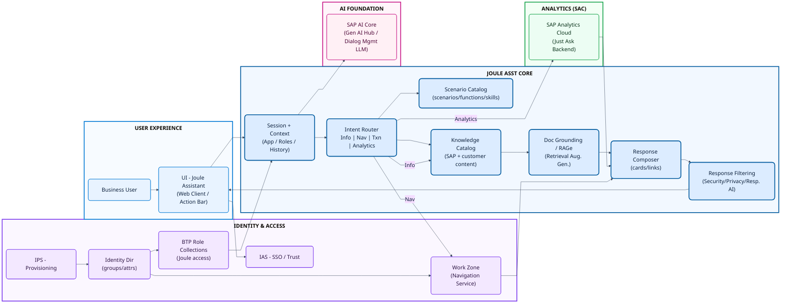
```mermaid
%%{init: {
  "theme": "base",
  "themeVariables": {
    "fontFamily": "Segoe UI, Arial",
    "fontSize": "20px",
    "lineColor": "#334155",
    "primaryTextColor": "#0B1F3A"
  },
  "flowchart": {
    "curve": "linear",
    "useMaxWidth": true,
    "nodeSpacing": 30,
    "rankSpacing": 30,
    "wrappingWidth": 160,
    "htmlLabels": true,
    "padding": 25,
    "subGraphTitleMargin": { "top": 10, "bottom": 10 }
  }
}}%%

flowchart LR

%% --- Lane A: User UI ---
subgraph A["<b>USER EXPERIENCE</b>"]
direction TB
U["Business User"]
UIJ["UI - Joule Assistant<br/>(Web Client / Action Bar)"]
end

%% --- Lane B: Identity & Access ---
subgraph B["<b>IDENTITY & ACCESS</b>"]
direction TB
IAS["IAS - SSO / Trust"]
IPS["IPS - Provisioning"]
DIR["Identity Dir<br/>(groups/attrs)"]
BTPRBAC["BTP Role Collections<br/>(Joule access)"]
WZ["Work Zone<br/>(Navigation Service)"]
end

%% --- Lane C: Joule Assistant Core (BTP) ---
subgraph C["<b>JOULE ASST CORE</b>"]
direction TB
JS["Session + Context<br/>(App / Roles / History)"]
IR["Intent Router<br/>Info | Nav | Txn | Analytics"]
SC["Scenario Catalog<br/>(scenarios/functions/skills)"]
KC["Knowledge Catalog<br/>(SAP + customer content)"]
DG["Doc Grounding / RAGe<br/>(Retrieval Aug. Gen.)"]
RC["Response Composer<br/>(cards/links)"]
RF["Response Filtering<br/>(Security/Privacy/Resp. AI)"]
end

%% --- Lane D: AI Foundation ---
subgraph D["<b>AI FOUNDATION</b>"]
direction TB
AICORE["SAP AI Core<br/>(Gen AI Hub / Dialog Mgmt LLM)"]
end

%% --- Lane E: Analytics Source (SAC) ---
subgraph E["<b>ANALYTICS (SAC)</b>"]
direction TB
SAC["SAP Analytics Cloud<br/>(Just Ask Backend)"]
end

%% --- Flows ---
U --> UIJ --> JS
UIJ --> IAS
IPS --> DIR --> BTPRBAC --> JS
DIR --> WZ

JS --> AICORE
JS --> IR
IR --> SC
IR --> KC
IR -->|Info| KC --> DG --> RC --> RF --> UIJ
IR -->|Analytics| SAC --> RC
IR -->|Nav| WZ --> RC

%% --- Styling: lane colors with bold borders ---
style A fill:#F7FBFF,stroke:#0078D4,stroke-width:3px
style B fill:#FBF7FF,stroke:#7C3AED,stroke-width:3px
style C fill:#F2F8FF,stroke:#005A9E,stroke-width:3px
style D fill:#FFF5FA,stroke:#C71585,stroke-width:3px
style E fill:#F2FFF5,stroke:#16A34A,stroke-width:3px

%% --- Node colors (light) ---
classDef ui fill:#E8F3FF,stroke:#0078D4,stroke-width:2px,rx:8,ry:8,color:#0B1F3A;
classDef identity fill:#F3E8FF,stroke:#7C3AED,stroke-width:2px,rx:8,ry:8,color:#2A1240;
classDef joule fill:#DCECFF,stroke:#005A9E,stroke-width:3px,rx:10,ry:10,color:#0B1F3A;
classDef aicore fill:#FFF0F5,stroke:#C71585,stroke-width:2px,rx:8,ry:8,color:#4A0033;
classDef cloud fill:#ECFDF3,stroke:#16A34A,stroke-width:2px,rx:8,ry:8,color:#052E16;

class U,UIJ ui;
class IAS,IPS,DIR,BTPRBAC,WZ identity;
class JS,IR,SC,KC,DG,RC,RF joule;
class AICORE aicore;
class SAC cloud;
```

</div>

<div style="page-break-after: always;"></div>

**Key Activities:**
- Deploy Joule Assistant web client and action bar (via **SAP Build Work Zone** as entry point)
- Configure Intent Router for informational, navigation, and analytics queries
- **Populate Scenario Catalog** with metadata of available scenarios, functions, and skills across SAP cloud applications
- **Configure Knowledge Catalog** with SAP-owned content (SAP Help Pages) and customer-owned enterprise content
- Implement **Document Grounding with RAGe** (Retrieval Augmented Generation for enterprise) against Knowledge Catalog
- Configure Response Composer for cards, links, and confirmations
- **Implement Response Filtering** for enterprise security, data privacy, and responsible AI guardrails
- **Configure Dialog Management LLM** via SAP AI Core (Generative AI Hub) with partner LLM ecosystem
- **Integrate SAC Just Ask** for analytical insights (Joule SAC processes in backdrop)
- **Enable Work Zone Navigation Service** for cross-application navigation

**L2 Deliverables (25%):**
- Joule Assistant Core deployment architecture
- Intent routing configuration
- **Scenario Catalog population plan**
- **Knowledge Catalog content strategy** (SAP-owned + customer-owned sources)
- **RAGe / Document Grounding configuration**
- **Response Filtering and Responsible AI policy specifications**
- **SAC Just Ask integration specifications**
- **Work Zone navigation service configuration**
- **AI Core / Dialog Management LLM connection documentation**

<div style="page-break-after: always;"></div>

## Phase 3 – Embedded Agents Activation

**Purpose:** Activate SAP-delivered embedded agents within Line of Business applications.

<div style="page-break-inside: avoid;">

### *Phase 3 – Embedded Agents Features & Architecture*

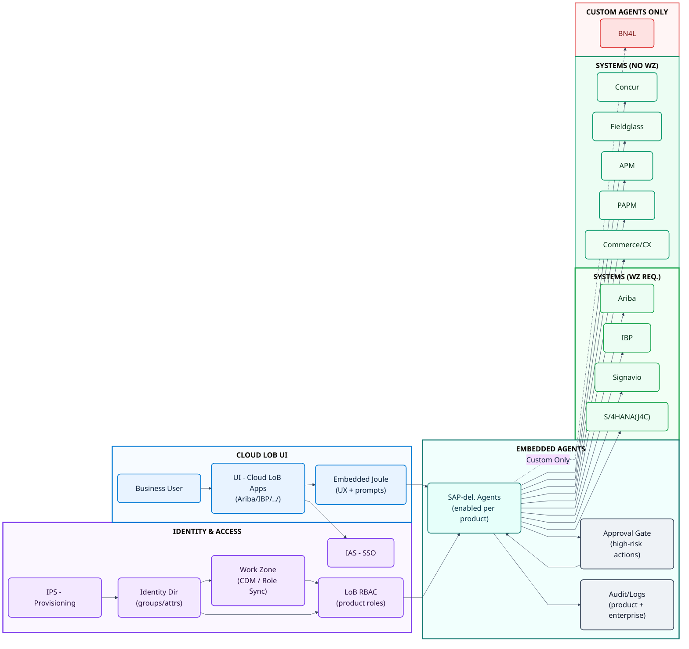
```mermaid
%%{init: {
  "theme": "base",
  "themeVariables": {
    "fontFamily": "Segoe UI, Arial",
    "fontSize": "20px",
    "lineColor": "#334155",
    "primaryTextColor": "#0B1F3A"
  },
  "flowchart": {
    "curve": "linear",
    "useMaxWidth": true,
    "nodeSpacing": 30,
    "rankSpacing": 30,
    "wrappingWidth": 160,
    "htmlLabels": true,
    "padding": 25,
    "subGraphTitleMargin": { "top": 10, "bottom": 10 }
  }
}}%%

flowchart LR

%% --- Lane A: User UI (LoB) ---
subgraph A["<b>CLOUD LOB UI</b>"]
direction TB
U["Business User"]
UIL["UI - Cloud LoB Apps<br/>(Ariba/IBP/../)"]
EMB["Embedded Joule<br/>(UX + prompts)"]
end

%% --- Lane B: Identity & Access ---
subgraph B["<b>IDENTITY & ACCESS</b>"]
direction TB
IAS["IAS - SSO"]
IPS["IPS - Provisioning"]
DIR["Identity Dir<br/>(groups/attrs)"]
WZ["Work Zone<br/>(CDM / Role Sync)"]
LOBRBAC["LoB RBAC<br/>(product roles)"]
end

%% --- Lane C: Embedded Agents/Features ---
subgraph C["<b>EMBEDDED AGENTS</b>"]
direction TB
AG["SAP-del. Agents<br/>(enabled per product)"]
HIL["Approval Gate<br/>(high-risk actions)"]
AUD["Audit/Logs<br/>(product + enterprise)"]
end

%% --- Lane D: Cloud Systems (Work Zone Required) ---
subgraph D["<b>SYSTEMS (WZ REQ.)</b>"]
direction TB
ARIBA["Ariba"]
IBP["IBP"]
SIGNAVIO["Signavio"]
J4C["S/4HANA(J4C)"]
end

%% --- Lane E: Cloud Systems (No Work Zone) ---
subgraph E["<b>SYSTEMS (NO WZ)</b>"]
direction TB
CONCUR["Concur"]
FG["Fieldglass"]
APM["APM"]
PAPM["PAPM"]
CX["Commerce/CX"]
end

%% --- Lane F: Custom Agents Only ---
subgraph F["<b>CUSTOM AGENTS ONLY</b>"]
direction TB
BN4L["BN4L"]
end

%% --- Flows ---
U --> UIL --> EMB --> AG
UIL --> IAS
IPS --> DIR
DIR --> WZ --> LOBRBAC
DIR --> LOBRBAC
LOBRBAC --> AG

AG --> ARIBA
AG --> IBP
AG --> SIGNAVIO
AG --> J4C
AG --> CONCUR
AG --> FG
AG --> APM
AG --> PAPM
AG --> CX
AG -.->|"Custom Only"| BN4L

AG --> HIL --> AG
AG --> AUD

%% --- Styling: lane colors with bold borders ---
style A fill:#F7FBFF,stroke:#0078D4,stroke-width:3px
style B fill:#FBF7FF,stroke:#7C3AED,stroke-width:3px
style C fill:#F1FFFD,stroke:#0F766E,stroke-width:3px
style D fill:#F2FFF5,stroke:#16A34A,stroke-width:3px
style E fill:#ECFDF3,stroke:#059669,stroke-width:2px
style F fill:#FFF5F5,stroke:#DC2626,stroke-width:2px

%% --- Node colors ---
classDef ui fill:#E8F3FF,stroke:#0078D4,stroke-width:2px,rx:8,ry:8,color:#0B1F3A;
classDef identity fill:#F3E8FF,stroke:#7C3AED,stroke-width:2px,rx:8,ry:8,color:#2A1240;
classDef embedded fill:#E6FFFA,stroke:#0F766E,stroke-width:2px,rx:8,ry:8,color:#083344;
classDef gov fill:#EEF2F6,stroke:#334155,stroke-width:2px,rx:8,ry:8,color:#0F172A;
classDef cloud fill:#ECFDF3,stroke:#16A34A,stroke-width:2px,rx:8,ry:8,color:#052E16;
classDef cloudnowz fill:#F0FDF4,stroke:#059669,stroke-width:2px,rx:8,ry:8,color:#052E16;
classDef customonly fill:#FEE2E2,stroke:#DC2626,stroke-width:2px,rx:8,ry:8,color:#7F1D1D;

class U,UIL,EMB ui;
class IAS,IPS,DIR,WZ,LOBRBAC identity;
class AG embedded;
class HIL,AUD gov;
class ARIBA,IBP,SIGNAVIO,J4C cloud;
class CONCUR,FG,APM,PAPM,CX cloudnowz;
class BN4L customonly;
```

</div>

<div style="page-break-after: always;"></div>

**Key Activities:**
- Enable embedded Joule UX in each LoB application
- Activate SAP-delivered agents per product (Ariba, Concur, IBP, Fieldglass, Commerce, Signavio, APM, PAPM)
- Configure custom agents for BN4L (no SAP-delivered agents available)
- Configure LoB RBAC for product-specific roles
- **Configure Work Zone CDM content sync** for products requiring role synchronization
- Implement human-in-the-loop approval gates for high-risk actions
- Set up product and enterprise audit logging

**L2 Deliverables (25%):**
- Embedded agent activation matrix (with Work Zone requirements)
- LoB RBAC configuration
- **Work Zone CDM role sync specifications**
- Approval workflow specifications

<div style="page-break-after: always;"></div>

## Phase 4 – Custom Agent Development

**Purpose:** Enable custom agent development via Joule Studio for S/4HANA on-prem integration and cross-system orchestration. **Note:** Skills Library is mandatory for Joule Studio orchestration; optional when using MCP/external tools.

<div style="page-break-inside: avoid;">

### *Phase 4 – Custom Agent Development Architecture*

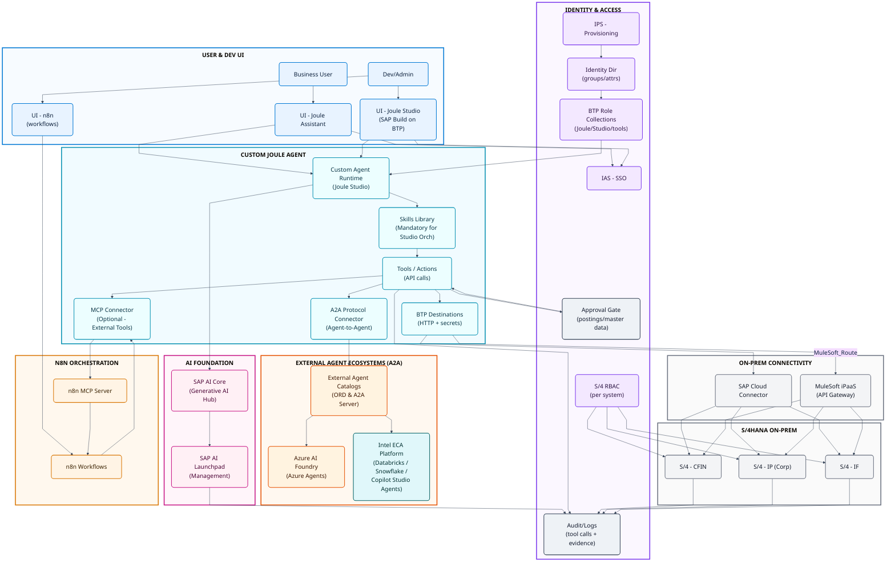
```mermaid
%%{init: {
  "theme": "base",
  "themeVariables": {
    "fontFamily": "Segoe UI, Arial",
    "fontSize": "20px",
    "lineColor": "#334155",
    "primaryTextColor": "#0B1F3A"
  },
  "flowchart": {
    "curve": "linear",
    "useMaxWidth": true,
    "nodeSpacing": 30,
    "rankSpacing": 30,
    "wrappingWidth": 160,
    "htmlLabels": true,
    "padding": 25,
    "subGraphTitleMargin": { "top": 10, "bottom": 10 }
  }
}}%%

flowchart TB

%% --- Lane A: User + Dev UI ---
subgraph A["<b>USER & DEV UI</b>"]
direction TB
U["Business User"]
D["Dev/Admin"]
UIJ["UI - Joule Assistant"]
UIJS["UI - Joule Studio<br/>(SAP Build on BTP)"]
UIN8["UI - n8n<br/>(workflows)"]
end

%% --- Lane B: Identity & Access ---
subgraph B["<b>IDENTITY & ACCESS</b>"]
direction TB
IAS["IAS - SSO"]
IPS["IPS - Provisioning"]
DIR["Identity Dir<br/>(groups/attrs)"]
BTPRBAC["BTP Role Collections<br/>(Joule/Studio/tools)"]
S4RBAC["S/4 RBAC<br/>(per system)"]
HIL["Approval Gate<br/>(postings/master data)"]
AUD["Audit/Logs<br/>(tool calls + evidence)"]
end

%% --- Lane C: AI Foundation ---
subgraph CA["<b>AI FOUNDATION</b>"]
direction TB
AICORE["SAP AI Core<br/>(Generative AI Hub)"]
AILAUNCH["SAP AI Launchpad<br/>(Management)"]
end

%% --- Lane D: Custom Agent Runtime (BTP) ---
subgraph C["<b>CUSTOM JOULE AGENT</b>"]
direction TB
AG["Custom Agent Runtime<br/>(Joule Studio)"]
SKILLS["Skills Library<br/>(Mandatory for Studio Orch)"]
TOOLS["Tools / Actions<br/>(API calls)"]
DEST["BTP Destinations<br/>(HTTP + secrets)"]
MCP["MCP Connector<br/>(Optional - External Tools)"]
A2A_CONN["A2A Protocol Connector<br/>(Agent-to-Agent)"]
end

%% --- Lane H: External Agent Ecosystems (A2A) ---
subgraph H["<b>EXTERNAL AGENT ECOSYSTEMS (A2A)</b>"]
direction TB
EXT_CAT["External Agent Catalogs<br/>(ORD & A2A Server)"]
AZUREAI["Azure AI Foundry<br/>(Azure Agents)"]
ECA_AG["Intel ECA Platform<br/>(Databricks / Snowflake /<br/>Copilot Studio Agents)"]
end

%% --- Lane E: On-Prem Connectivity ---
subgraph DD["<b>ON-PREM CONNECTIVITY</b>"]
direction TB
CC["SAP Cloud Connector"]
MULE["MuleSoft iPaaS<br/>(API Gateway)"]
end

%% --- Lane F: S/4 On-Prem Systems ---
subgraph E["<b>S/4HANA ON-PREM</b>"]
direction TB
CFIN["S/4 - CFIN"]
IP["S/4 - IP (Corp)"]
IF["S/4 - IF"]
end

%% --- Lane G: n8n Orchestration (optional) ---
subgraph F["<b>N8N ORCHESTRATION</b>"]
direction TB
N8M["n8n MCP Server"]
N8W["n8n Workflows"]
end

%% --- Flows ---
U --> UIJ --> AG
D --> UIJS --> AG
D --> UIN8 --> N8W

UIJ --> IAS
UIJS --> IAS

IPS --> DIR --> BTPRBAC --> AG
S4RBAC --> CFIN
S4RBAC --> IP
S4RBAC --> IF

%% AI Core connections
AG --> AICORE
AICORE --> AILAUNCH
AILAUNCH --> AUD

AG --> SKILLS --> TOOLS --> DEST --> CC
CC --> CFIN
CC --> IP
CC --> IF

%% Alternative on-prem connectivity via MuleSoft iPaaS
DEST -->|MuleSoft_Route| MULE
MULE --> CFIN
MULE --> IP
MULE --> IF

TOOLS --> HIL --> TOOLS
TOOLS --> AUD

%% Optional MCP to n8n tool (Skills optional when using MCP)
TOOLS --> MCP --> N8M --> N8W --> MCP

%% A2A Agent-to-Agent Interoperability
TOOLS --> A2A_CONN --> EXT_CAT
EXT_CAT --> AZUREAI
EXT_CAT --> ECA_AG

%% CRUD note (implemented via exposed APIs + RBAC)
CFIN --> AUD
IP --> AUD
IF --> AUD

%% --- Styling: lane colors with bold borders ---
style A fill:#F7FBFF,stroke:#0078D4,stroke-width:3px
style B fill:#FBF7FF,stroke:#7C3AED,stroke-width:3px
style CA fill:#FFF5FA,stroke:#C71585,stroke-width:3px
style C fill:#F1FBFF,stroke:#0891B2,stroke-width:3px
style DD fill:#FAFAFA,stroke:#6B7280,stroke-width:3px
style E fill:#FAFAFA,stroke:#6B7280,stroke-width:3px
style F fill:#FFF8EE,stroke:#D97706,stroke-width:3px
style H fill:#FFF8F0,stroke:#E65100,stroke-width:3px

%% --- Node colors ---
classDef ui fill:#E8F3FF,stroke:#0078D4,stroke-width:2px,rx:8,ry:8,color:#0B1F3A;
classDef identity fill:#F3E8FF,stroke:#7C3AED,stroke-width:2px,rx:8,ry:8,color:#2A1240;
classDef aicore fill:#FFF0F5,stroke:#C71585,stroke-width:2px,rx:8,ry:8,color:#4A0033;
classDef custom fill:#ECFEFF,stroke:#0891B2,stroke-width:2px,rx:8,ry:8,color:#083344;
classDef gov fill:#EEF2F6,stroke:#334155,stroke-width:2px,rx:8,ry:8,color:#0F172A;
classDef onprem fill:#F3F4F6,stroke:#6B7280,stroke-width:2px,rx:8,ry:8,color:#111827;
classDef orch fill:#FFF4E5,stroke:#D97706,stroke-width:2px,rx:8,ry:8,color:#3A2200;
classDef a2a fill:#FFF3E0,stroke:#E65100,stroke-width:2px,rx:8,ry:8,color:#3A1500;
classDef eca fill:#E0F7FA,stroke:#006064,stroke-width:2px,rx:8,ry:8,color:#002F2F;

class U,D,UIJ,UIJS,UIN8 ui;
class IAS,IPS,DIR,BTPRBAC,S4RBAC identity;
class AICORE,AILAUNCH aicore;
class AG,SKILLS,TOOLS,DEST,MCP,A2A_CONN custom;
class HIL,AUD gov;
class EXT_CAT,AZUREAI a2a;
class ECA_AG eca;
class CC,MULE,CFIN,IP,IF onprem;
class N8M,N8W orch;
```

</div>

**Key Activities:**
- Deploy Joule Studio (SAP Build on BTP) and **AI Agent** runtime
- Develop custom agent runtime with tools library
- **Configure SAP-delivered Skills** (pre-built Joule skills from SAP)
- **Develop Custom Skills** (customer-built skills for specific business processes)
- **Configure Skills Library** (mandatory for Studio orchestration)
- **Integrate SAP AI Core** for LLM processing and Generative AI Hub
- **Configure SAP Build Process Automation** for SAP-native workflow and process automation
- Configure **SAP Destination Service** with HTTP connections and secrets
- Set up **SAP Connectivity Service** (BTP-side connectivity proxy) and **SAP Cloud Connector** (on-prem agent) for on-prem connectivity
- Configure **MuleSoft iPaaS** as alternative on-prem connectivity option (API Gateway approach alongside SAP Cloud Connector)
- Implement MCP Tools Connector for optional external tools (Skills optional when using MCP)
- Configure **A2A Protocol Connector** for agent-to-agent interoperability with Intel ECA Platform agents (Databricks / Snowflake / Azure Copilot Studio) and Azure AI Foundry
- Configure n8n orchestration for workflow automation (optional / Intel-specific)
- Implement approval gates for postings and master data changes

**L2 Deliverables (25%):**
- Custom agent development standards
- **SAP-delivered Skills vs Custom Skills** inventory and configuration
- **Skills Library configuration** (Joule Studio flows)
- **AI Core integration specifications**
- **SAP Build Process Automation** workflow specifications
- SAP Destination Service configuration
- SAP Connectivity Service + Cloud Connector setup specifications
- **MuleSoft iPaaS** integration specifications (alternative on-prem connectivity)
- **A2A Protocol** configuration for ECA Platform agent interoperability
- **MCP connector documentation** (for external tool integration)

<div style="page-break-after: always;"></div>

## Phase 5 – Governance & Operations

**Purpose:** Establish ongoing governance, monitoring, and operational excellence for the Joule implementation.

**Key Activities:**
- Implement comprehensive audit and telemetry collection
- Define human-in-the-loop approval policies for high-risk actions
- Establish agent lifecycle management processes
- Configure monitoring dashboards and alerting (via AI Launchpad)
- **Monitor Response Filtering and Responsible AI** compliance metrics
- Define incident response procedures
- Implement continuous improvement processes
- **Monitor AI Core usage** and LLM token consumption
- **Track Scenario Catalog and Knowledge Catalog** utilisation and coverage

**L2 Deliverables (25%):**
- Governance framework documentation
- Monitoring and alerting specifications (AI Launchpad integration)
- **Responsible AI compliance monitoring procedures**
- Operational runbooks
- **AI consumption tracking procedures**
- **Catalog coverage and utilisation reports**

<div style="page-break-after: always;"></div>

<div style="page-break-inside: avoid; font-size: 11px;">

# 6. Joule Capability Matrix

> **How to read:** "Joule Assistant" = embedded conversational UX; "SAP‑delivered Agents" = packaged LoB capabilities; "Skills" = **Required** (Studio) / **Optional** (MCP); "Custom Agents" = developer-built. **WZ Req** = Work Zone required for navigation/CDM role sync (not for custom agents alone).

| Product | Joule Asst | SAP Agents | Skills | Custom Agents | WZ Req⁴ | Dependencies |
|---|:---:|:---:|:---:|:---:|:---:|---|
| S/4HANA Cloud (J4C) | Yes | Yes | N/A | **No**¹ | Yes | Booster, IAS/IPS, WZ |
| SAP Analytics Cloud | Yes | Yes | Req/Opt | Yes | Yes | Work Zone, OAuth |
| SAP Ariba | Yes | Yes | Req/Opt | Yes | Yes | IAS, IPS → WZ |
| SAP Concur | Yes | Yes | Req/Opt | Yes | No | IAS, IPS |
| SAP IBP | Yes | Yes | Req/Opt | Yes | Yes | IAS, IPS → WZ |
| SAP Fieldglass | Yes | Yes | Req/Opt | Yes | Yes⁵ | IAS, IPS, WZ |
| SAP Signavio | Yes | Yes | Req/Opt | Yes | Yes | IAS, IPS, Dest |
| SAP APM | Yes | Yes | Req/Opt | Yes | No | IAS, IPS |
| SAP PAPM | Yes | Yes | Req/Opt | Yes | No | IAS, IPS |
| SAP BN4L | No | **No**² | Req/Opt | **Yes**² | No | IAS, IPS, Custom Dev |
| S/4 On-Prem (CFIN/IF/IP) | No³ | No | Req/Opt | **Yes** | No | CC, BTP Dest, S/4 RBAC |
| Commerce Cloud / CX | Yes | Partial | Req/Opt | Yes | No | IAS, IPS |
| SAP Build Code (J4D) | Yes | N/A | Required | Yes | No | Build Code, AI Core |
| Other Cloud Products | Varies | Varies | Req/Opt | Optional | Varies | IAS/IPS |

**Notes:** ¹J4C is SAP-managed; use Side-by-Side extensions. ²BN4L requires custom development (no SAP agents). ³S/4 On-Prem uses custom agents via Cloud Connector. ⁴**WZ Req** = Work Zone required for Joule Assistant navigation & CDM role sync; custom agent development alone does NOT require Work Zone. ⁵Fieldglass requires WZ per SAP docs. **Skills:** Req=Required for Joule Studio; Opt=Optional for MCP/n8n. **PCE:** S/4HANA Private Cloud Edition (PCE) follows a similar pattern to J4C; consult SAP for PCE-specific Joule activation. **Other SAP Products:** SAP SuccessFactors, SAP Datasphere, SAP LeanIX, and SAP DSC are Joule-enabled in the SAP reference architecture but are not in current Intel scope.

</div>

<div style="page-break-after: always;"></div>

# 7. Product Capabilities

## S/4HANA Cloud (J4C) – Joule Capabilities

<div style="page-break-inside: avoid;">

> **Note:** J4C is a SAP-managed offering. Custom agents cannot be built directly on J4C; use Side-by-Side extensions on BTP if custom development is needed.

| Capability | Status | Dependencies |
|---|---|---|
| Joule Assistant | Yes | Booster, IAS/IPS, Work Zone |
| SAP-delivered Joule Agents | Yes | Booster, IAS/IPS, Work Zone |
| Skills (for Custom Agents) | N/A (no custom agents) | SAP-managed |
| Custom Joule Agents | **No** (Side-by-Side on BTP) | SAP Build / Studio |

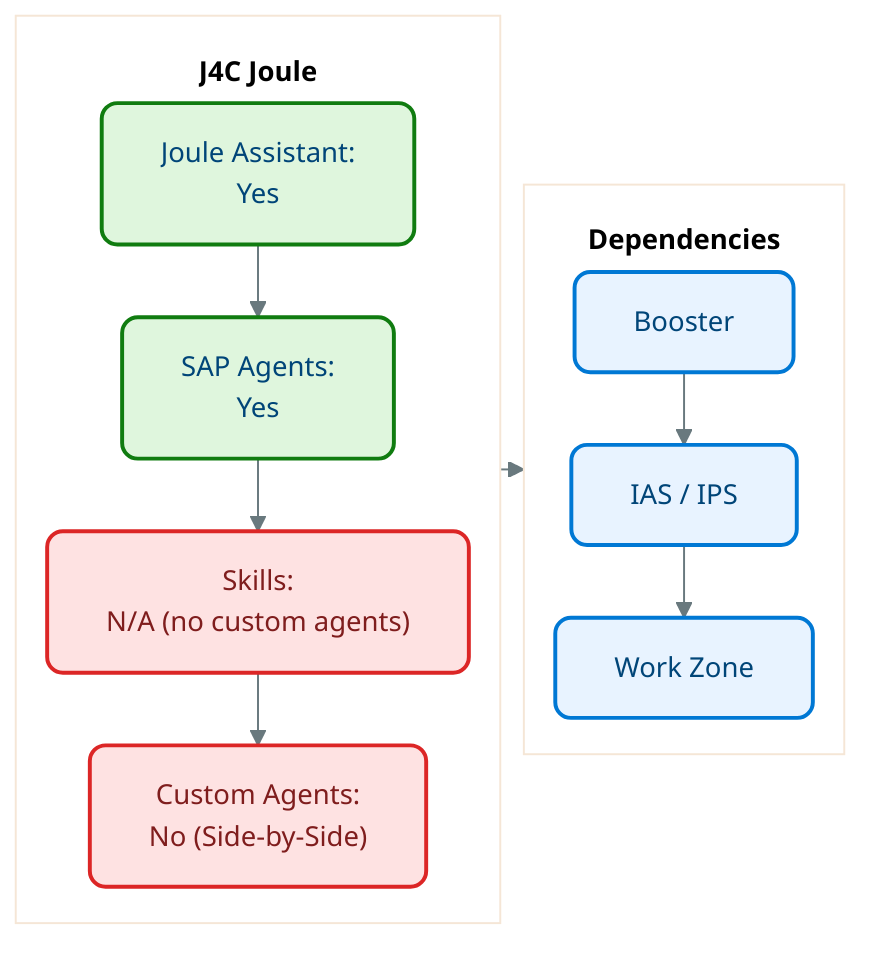
```mermaid
%%{init: {
  "theme": "base",
  "themeVariables": {
    "fontFamily": "Segoe UI, Arial",
    "fontSize": "14px",
    "primaryColor": "#E8F3FF",
    "primaryBorderColor": "#0078D4",
    "primaryTextColor": "#004578",
    "lineColor": "#69797E"
  },
  "flowchart": { "curve": "linear", "nodeSpacing": 12, "rankSpacing": 12, "padding": 15, "subGraphTitleMargin": { "top": 18, "bottom": 8 } }
}}%%

flowchart LR

subgraph A["<b>J4C Joule</b>"]
direction TB
ASST["Joule Assistant:<br/>Yes"]:::enabled
AG["SAP Agents:<br/>Yes"]:::enabled
SK["Skills:<br/>N/A (no custom agents)"]:::disabled
CUST["Custom Agents:<br/>No (Side-by-Side)"]:::disabled
end

subgraph B["<b>Dependencies</b>"]
direction TB
DEP1["Booster"]:::dep
DEP2["IAS / IPS"]:::dep
DEP3["Work Zone"]:::dep
end

A --> B
ASST --> AG --> SK --> CUST
DEP1 --> DEP2 --> DEP3

classDef enabled fill:#DFF6DD,stroke:#107C10,stroke-width:2px,color:#004578,rx:8,ry:8;
classDef disabled fill:#FEE2E2,stroke:#DC2626,stroke-width:2px,color:#7F1D1D,rx:8,ry:8;
classDef optional fill:#FFF4CE,stroke:#D83B01,stroke-width:2px,color:#3A2200,rx:8,ry:8;
classDef dep fill:#E8F3FF,stroke:#0078D4,stroke-width:2px,color:#004578,rx:8,ry:8;
```

</div>

## SAP Analytics Cloud (SAC) – Joule Capabilities

<div style="page-break-inside: avoid;">

| Capability | Status | Dependencies |
|---|---|---|
| Joule Assistant | Yes (Analytical Insights) | Work Zone, OAuth clients |
| SAP-delivered Joule Agents | Yes | Work Zone, OAuth clients |
| Skills (for Custom Agents) | **Required** (Studio) / Optional (MCP) | SAP Build / Studio |
| Custom Joule Agents | Yes | SAP Build / Studio |

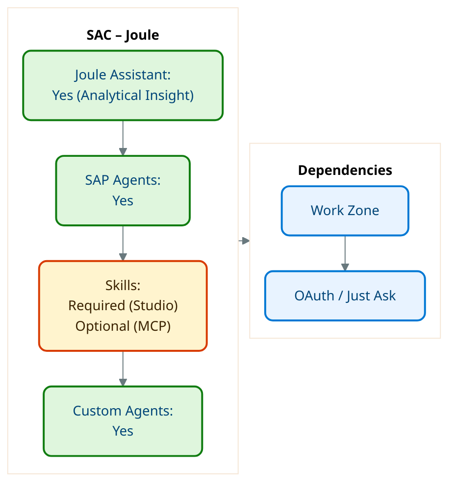
```mermaid
%%{init: {
  "theme": "base",
  "themeVariables": {
    "fontFamily": "Segoe UI, Arial",
    "fontSize": "14px",
    "primaryColor": "#E8F3FF",
    "primaryBorderColor": "#0078D4",
    "primaryTextColor": "#004578",
    "lineColor": "#69797E"
  },
  "flowchart": { "curve": "linear", "nodeSpacing": 12, "rankSpacing": 12, "padding": 15, "subGraphTitleMargin": { "top": 18, "bottom": 8 } }
}}%%

flowchart LR

subgraph A["<b>SAC – Joule</b>"]
direction TB
ASST["Joule Assistant:<br/>Yes (Analytical Insight)"]:::enabled
AG["SAP Agents:<br/>Yes"]:::enabled
SK["Skills:<br/>Required (Studio)<br/>Optional (MCP)"]:::optional
CUST["Custom Agents:<br/>Yes"]:::enabled
end

subgraph B["<b>Dependencies</b>"]
direction TB
DEP1["Work Zone"]:::dep
DEP2["OAuth / Just Ask"]:::dep
end

A --> B
ASST --> AG --> SK --> CUST
DEP1 --> DEP2

classDef enabled fill:#DFF6DD,stroke:#107C10,stroke-width:2px,color:#004578,rx:8,ry:8;
classDef optional fill:#FFF4CE,stroke:#D83B01,stroke-width:2px,color:#3A2200,rx:8,ry:8;
classDef dep fill:#E8F3FF,stroke:#0078D4,stroke-width:2px,color:#004578,rx:8,ry:8;
```

</div>

## Ariba – Joule Capabilities

<div style="page-break-inside: avoid;">

| Capability | Status | Dependencies |
|---|---|---|
| Joule Assistant | Yes | IAS, IPS, Work Zone (as needed) |
| SAP-delivered Joule Agents | Yes | IAS, IPS |
| Skills (for Custom Agents) | **Required** (Studio) / Optional (MCP) | SAP Build / Studio |
| Custom Joule Agents | Yes | SAP Build / Studio |

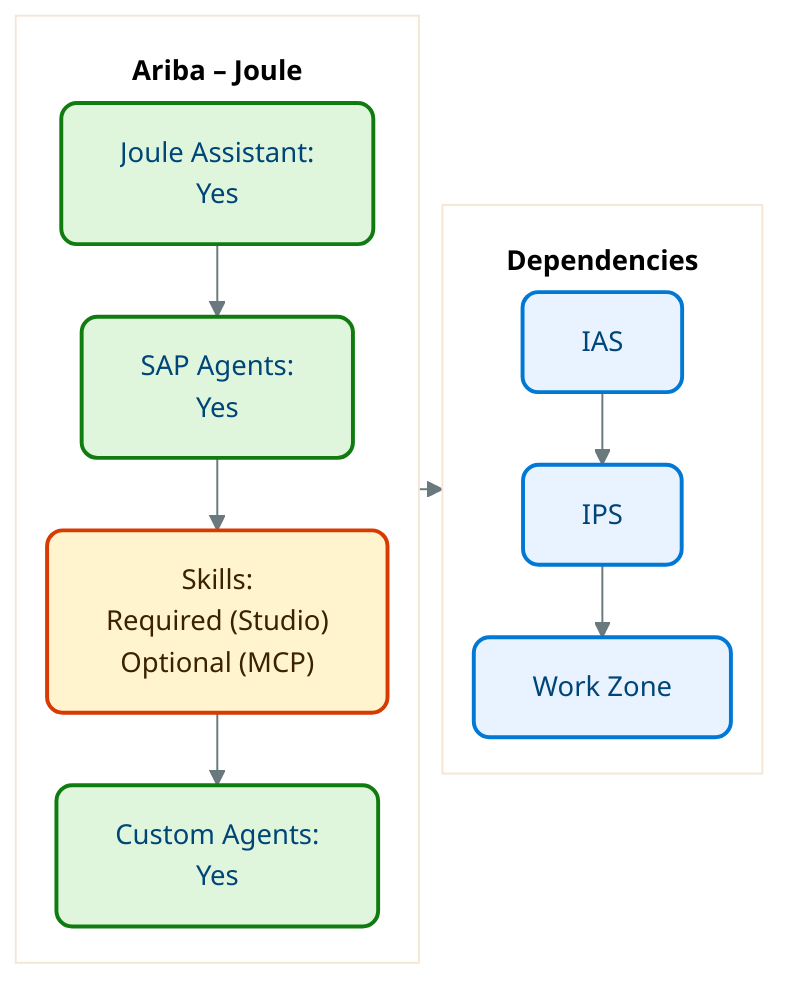
```mermaid
%%{init: {
  "theme": "base",
  "themeVariables": {
    "fontFamily": "Segoe UI, Arial",
    "fontSize": "14px",
    "primaryColor": "#E8F3FF",
    "primaryBorderColor": "#0078D4",
    "primaryTextColor": "#004578",
    "lineColor": "#69797E"
  },
  "flowchart": { "curve": "linear", "nodeSpacing": 12, "rankSpacing": 12, "padding": 15, "subGraphTitleMargin": { "top": 18, "bottom": 8 } }
}}%%

flowchart LR

subgraph A["<b>Ariba – Joule</b>"]
direction TB
ASST["Joule Assistant:<br/>Yes"]:::enabled
AG["SAP Agents:<br/>Yes"]:::enabled
SK["Skills:<br/>Required (Studio)<br/>Optional (MCP)"]:::optional
CUST["Custom Agents:<br/>Yes"]:::enabled
end

subgraph B["<b>Dependencies</b>"]
direction TB
DEP1["IAS"]:::dep
DEP2["IPS"]:::dep
DEP3["Work Zone"]:::dep
end

A --> B
ASST --> AG --> SK --> CUST
DEP1 --> DEP2 --> DEP3

classDef enabled fill:#DFF6DD,stroke:#107C10,stroke-width:2px,color:#004578,rx:8,ry:8;
classDef optional fill:#FFF4CE,stroke:#D83B01,stroke-width:2px,color:#3A2200,rx:8,ry:8;
classDef dep fill:#E8F3FF,stroke:#0078D4,stroke-width:2px,color:#004578,rx:8,ry:8;
```

</div>

## Concur – Joule Capabilities

<div style="page-break-inside: avoid;">

| Capability | Status | Dependencies |
|---|---|---|
| Joule Assistant | Yes | IAS, IPS |
| SAP-delivered Joule Agents | Yes | IAS, IPS |
| Skills (for Custom Agents) | **Required** (Studio) / Optional (MCP) | SAP Build / Studio |
| Custom Joule Agents | Yes | SAP Build / Studio |

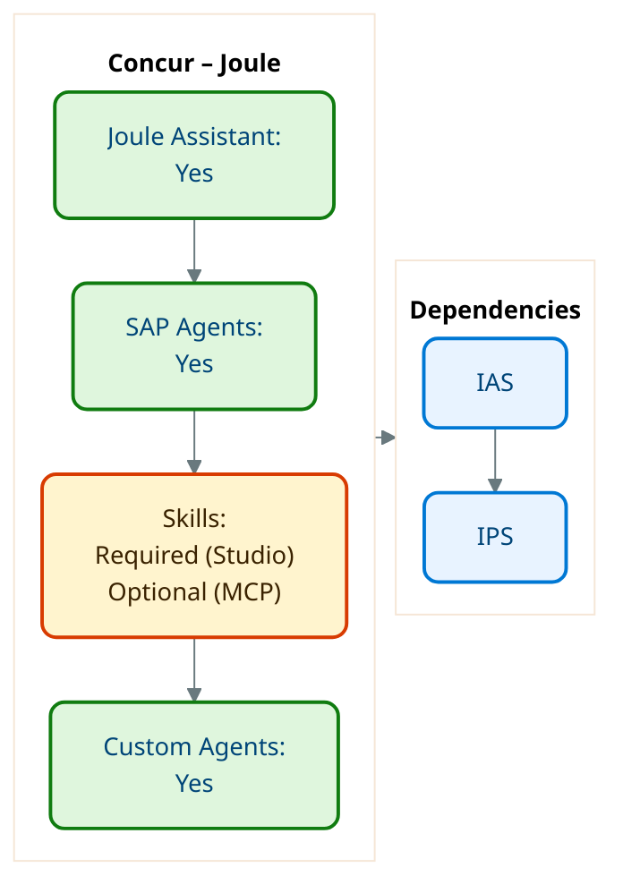
```mermaid
%%{init: {
  "theme": "base",
  "themeVariables": {
    "fontFamily": "Segoe UI, Arial",
    "fontSize": "14px",
    "primaryColor": "#E8F3FF",
    "primaryBorderColor": "#0078D4",
    "primaryTextColor": "#004578",
    "lineColor": "#69797E"
  },
  "flowchart": { "curve": "linear", "nodeSpacing": 12, "rankSpacing": 12, "padding": 15, "subGraphTitleMargin": { "top": 18, "bottom": 8 } }
}}%%

flowchart LR

subgraph A["<b>Concur – Joule</b>"]
direction TB
ASST["Joule Assistant:<br/>Yes"]:::enabled
AG["SAP Agents:<br/>Yes"]:::enabled
SK["Skills:<br/>Required (Studio)<br/>Optional (MCP)"]:::optional
CUST["Custom Agents:<br/>Yes"]:::enabled
end

subgraph B["<b>Dependencies</b>"]
direction TB
DEP1["IAS"]:::dep
DEP2["IPS"]:::dep
end

A --> B
ASST --> AG --> SK --> CUST
DEP1 --> DEP2

classDef enabled fill:#DFF6DD,stroke:#107C10,stroke-width:2px,color:#004578,rx:8,ry:8;
classDef optional fill:#FFF4CE,stroke:#D83B01,stroke-width:2px,color:#3A2200,rx:8,ry:8;
classDef dep fill:#E8F3FF,stroke:#0078D4,stroke-width:2px,color:#004578,rx:8,ry:8;
```

</div>

## IBP – Joule Capabilities

<div style="page-break-inside: avoid;">

| Capability | Status | Dependencies |
|---|---|---|
| Joule Assistant | Yes | IAS, IPS, Work Zone |
| SAP-delivered Joule Agents | Yes | IAS, IPS |
| Skills (for Custom Agents) | **Required** (Studio) / Optional (MCP) | SAP Build / Studio |
| Custom Joule Agents | Yes | SAP Build / Studio |

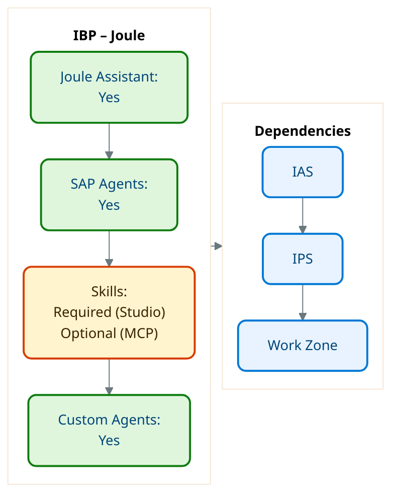
```mermaid
%%{init: {
  "theme": "base",
  "themeVariables": {
    "fontFamily": "Segoe UI, Arial",
    "fontSize": "14px",
    "primaryColor": "#E8F3FF",
    "primaryBorderColor": "#0078D4",
    "primaryTextColor": "#004578",
    "lineColor": "#69797E"
  },
  "flowchart": { "curve": "linear", "nodeSpacing": 12, "rankSpacing": 12, "padding": 15, "subGraphTitleMargin": { "top": 18, "bottom": 8 } }
}}%%

flowchart LR

subgraph A["<b>IBP – Joule</b>"]
direction TB
ASST["Joule Assistant:<br/>Yes"]:::enabled
AG["SAP Agents:<br/>Yes"]:::enabled
SK["Skills:<br/>Required (Studio)<br/>Optional (MCP)"]:::optional
CUST["Custom Agents:<br/>Yes"]:::enabled
end

subgraph B["<b>Dependencies</b>"]
direction TB
DEP1["IAS"]:::dep
DEP2["IPS"]:::dep
DEP3["Work Zone"]:::dep
end

A --> B
ASST --> AG --> SK --> CUST
DEP1 --> DEP2 --> DEP3

classDef enabled fill:#DFF6DD,stroke:#107C10,stroke-width:2px,color:#004578,rx:8,ry:8;
classDef optional fill:#FFF4CE,stroke:#D83B01,stroke-width:2px,color:#3A2200,rx:8,ry:8;
classDef dep fill:#E8F3FF,stroke:#0078D4,stroke-width:2px,color:#004578,rx:8,ry:8;
```

</div>

## Fieldglass – Joule Capabilities

<div style="page-break-inside: avoid;">

> **Note:** Fieldglass requires SAP Build Work Zone subscription per SAP documentation.

| Capability | Status | Dependencies |
|---|---|---|
| Joule Assistant | Yes | IAS, IPS, Work Zone |
| SAP-delivered Joule Agents | Yes | IAS, IPS |
| Skills (for Custom Agents) | **Required** (Studio) / Optional (MCP) | SAP Build / Studio |
| Custom Joule Agents | Yes | SAP Build / Studio |

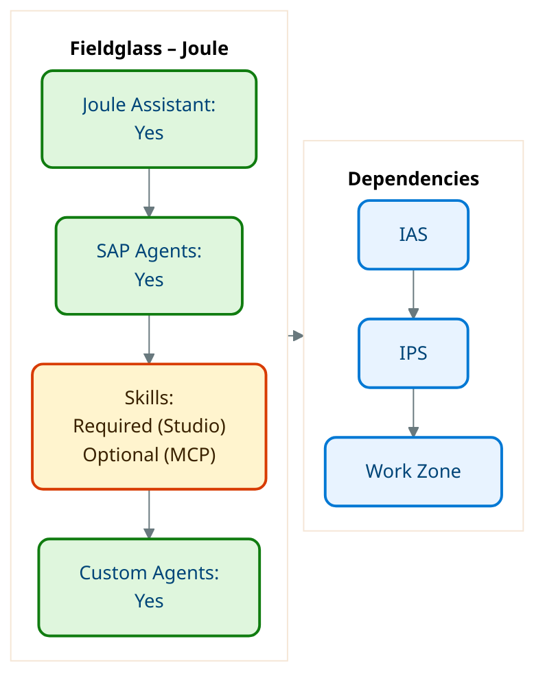
```mermaid
%%{init: {
  "theme": "base",
  "themeVariables": {
    "fontFamily": "Segoe UI, Arial",
    "fontSize": "14px",
    "primaryColor": "#E8F3FF",
    "primaryBorderColor": "#0078D4",
    "primaryTextColor": "#004578",
    "lineColor": "#69797E"
  },
  "flowchart": { "curve": "linear", "nodeSpacing": 12, "rankSpacing": 12, "padding": 15, "subGraphTitleMargin": { "top": 18, "bottom": 8 } }
}}%%

flowchart LR

subgraph A["<b>Fieldglass – Joule</b>"]
direction TB
ASST["Joule Assistant:<br/>Yes"]:::enabled
AG["SAP Agents:<br/>Yes"]:::enabled
SK["Skills:<br/>Required (Studio)<br/>Optional (MCP)"]:::optional
CUST["Custom Agents:<br/>Yes"]:::enabled
end

subgraph B["<b>Dependencies</b>"]
direction TB
DEP1["IAS"]:::dep
DEP2["IPS"]:::dep
DEP3["Work Zone"]:::dep
end

A --> B
ASST --> AG --> SK --> CUST
DEP1 --> DEP2 --> DEP3

classDef enabled fill:#DFF6DD,stroke:#107C10,stroke-width:2px,color:#004578,rx:8,ry:8;
classDef optional fill:#FFF4CE,stroke:#D83B01,stroke-width:2px,color:#3A2200,rx:8,ry:8;
classDef dep fill:#E8F3FF,stroke:#0078D4,stroke-width:2px,color:#004578,rx:8,ry:8;
```

</div>

## Commerce Cloud (CX) – Joule Capabilities

<div style="page-break-inside: avoid;">

| Capability | Status | Dependencies |
|---|---|---|
| Joule Assistant | Yes | IAS, IPS |
| SAP-delivered Joule Agents | Partial | IAS, IPS |
| Skills (for Custom Agents) | **Required** (Studio) / Optional (MCP) | SAP Build / Studio |
| Custom Joule Agents | Yes | SAP Build / Studio |

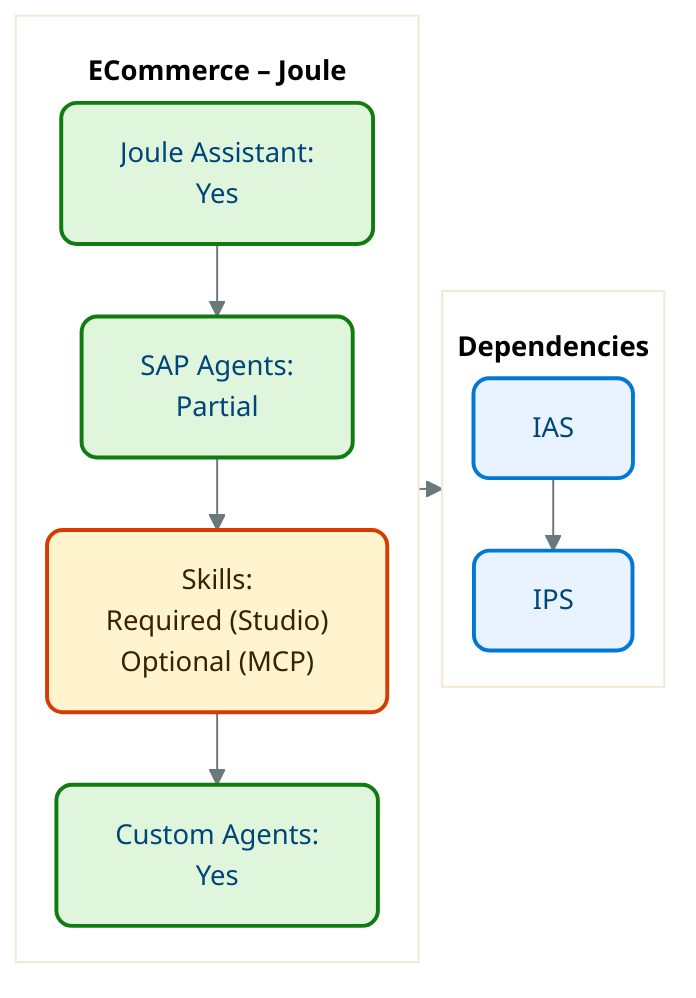
```mermaid
%%{init: {
  "theme": "base",
  "themeVariables": {
    "fontFamily": "Segoe UI, Arial",
    "fontSize": "14px",
    "primaryColor": "#E8F3FF",
    "primaryBorderColor": "#0078D4",
    "primaryTextColor": "#004578",
    "lineColor": "#69797E"
  },
  "flowchart": { "curve": "linear", "nodeSpacing": 12, "rankSpacing": 12, "padding": 15, "subGraphTitleMargin": { "top": 18, "bottom": 8 } }
}}%%

flowchart LR

subgraph A["<b>ECommerce – Joule</b>"]
direction TB
ASST["Joule Assistant:<br/>Yes"]:::enabled
AG["SAP Agents:<br/>Partial"]:::enabled
SK["Skills:<br/>Required (Studio)<br/>Optional (MCP)"]:::optional
CUST["Custom Agents:<br/>Yes"]:::enabled
end

subgraph B["<b>Dependencies</b>"]
direction TB
DEP1["IAS"]:::dep
DEP2["IPS"]:::dep
end

A --> B
ASST --> AG --> SK --> CUST
DEP1 --> DEP2

classDef enabled fill:#DFF6DD,stroke:#107C10,stroke-width:2px,color:#004578,rx:8,ry:8;
classDef optional fill:#FFF4CE,stroke:#D83B01,stroke-width:2px,color:#3A2200,rx:8,ry:8;
classDef dep fill:#E8F3FF,stroke:#0078D4,stroke-width:2px,color:#004578,rx:8,ry:8;
```

</div>

## Signavio – Joule Capabilities

<div style="page-break-inside: avoid;">

| Capability | Status | Dependencies |
|---|---|---|
| Joule Assistant | Yes | IAS, IPS, Work Zone |
| SAP-delivered Joule Agents | Yes | IAS, IPS |
| Skills (for Custom Agents) | **Required** (Studio) / Optional (MCP) | SAP Build / Studio |
| Custom Joule Agents | Yes | SAP Build / Studio |

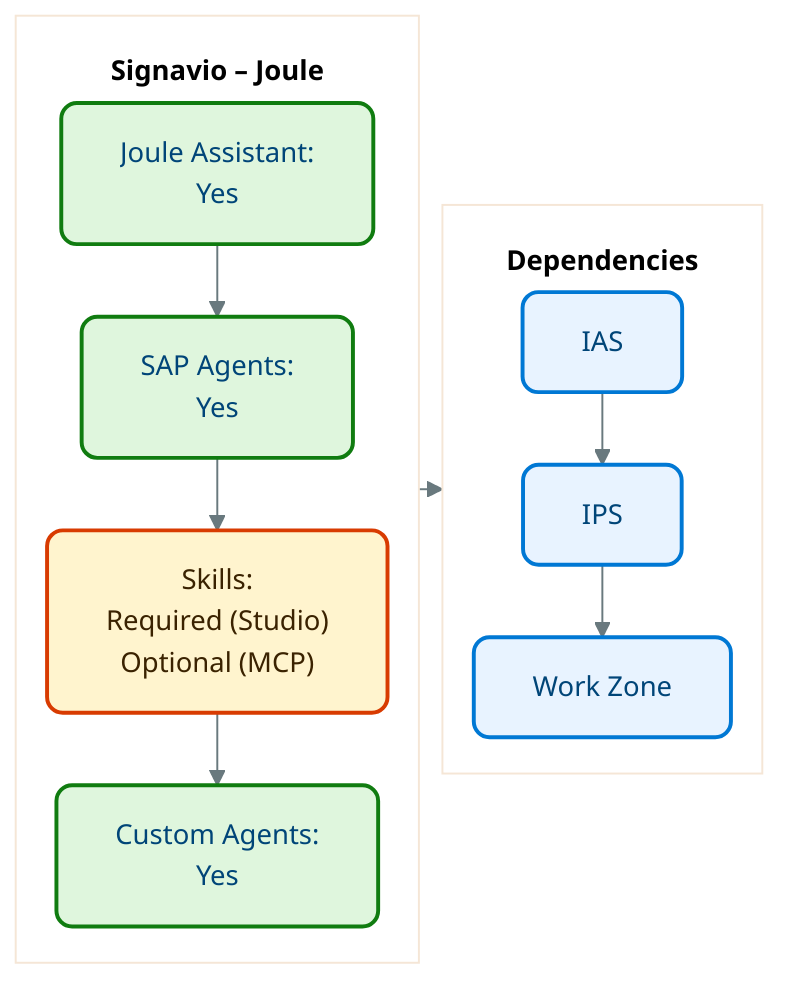
```mermaid
%%{init: {
  "theme": "base",
  "themeVariables": {
    "fontFamily": "Segoe UI, Arial",
    "fontSize": "14px",
    "primaryColor": "#E8F3FF",
    "primaryBorderColor": "#0078D4",
    "primaryTextColor": "#004578",
    "lineColor": "#69797E"
  },
  "flowchart": { "curve": "linear", "nodeSpacing": 12, "rankSpacing": 12, "padding": 15, "subGraphTitleMargin": { "top": 18, "bottom": 8 } }
}}%%

flowchart LR

subgraph A["<b>Signavio – Joule</b>"]
direction TB
ASST["Joule Assistant:<br/>Yes"]:::enabled
AG["SAP Agents:<br/>Yes"]:::enabled
SK["Skills:<br/>Required (Studio)<br/>Optional (MCP)"]:::optional
CUST["Custom Agents:<br/>Yes"]:::enabled
end

subgraph B["<b>Dependencies</b>"]
direction TB
DEP1["IAS"]:::dep
DEP2["IPS"]:::dep
DEP3["Work Zone"]:::dep
end

A --> B
ASST --> AG --> SK --> CUST
DEP1 --> DEP2 --> DEP3

classDef enabled fill:#DFF6DD,stroke:#107C10,stroke-width:2px,color:#004578,rx:8,ry:8;
classDef optional fill:#FFF4CE,stroke:#D83B01,stroke-width:2px,color:#3A2200,rx:8,ry:8;
classDef dep fill:#E8F3FF,stroke:#0078D4,stroke-width:2px,color:#004578,rx:8,ry:8;
```

</div>

## APM (Asset Performance Management) – Joule Capabilities

<div style="page-break-inside: avoid;">

| Capability | Status | Dependencies |
|---|---|---|
| Joule Assistant | Yes | IAS, IPS |
| SAP-delivered Joule Agents | Yes | IAS, IPS |
| Skills (for Custom Agents) | **Required** (Studio) / Optional (MCP) | SAP Build / Studio |
| Custom Joule Agents | Yes | SAP Build / Studio |

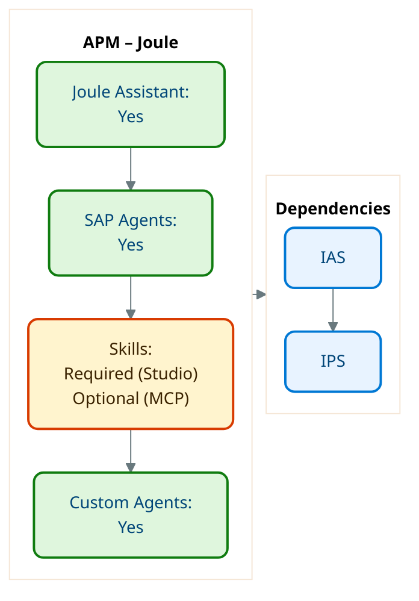
```mermaid
%%{init: {
  "theme": "base",
  "themeVariables": {
    "fontFamily": "Segoe UI, Arial",
    "fontSize": "14px",
    "primaryColor": "#E8F3FF",
    "primaryBorderColor": "#0078D4",
    "primaryTextColor": "#004578",
    "lineColor": "#69797E"
  },
  "flowchart": { "curve": "linear", "nodeSpacing": 12, "rankSpacing": 12, "padding": 15, "subGraphTitleMargin": { "top": 18, "bottom": 8 } }
}}%%

flowchart LR

subgraph A["<b>APM – Joule</b>"]
direction TB
ASST["Joule Assistant:<br/>Yes"]:::enabled
AG["SAP Agents:<br/>Yes"]:::enabled
SK["Skills:<br/>Required (Studio)<br/>Optional (MCP)"]:::optional
CUST["Custom Agents:<br/>Yes"]:::enabled
end

subgraph B["<b>Dependencies</b>"]
direction TB
DEP1["IAS"]:::dep
DEP2["IPS"]:::dep
end

A --> B
ASST --> AG --> SK --> CUST
DEP1 --> DEP2

classDef enabled fill:#DFF6DD,stroke:#107C10,stroke-width:2px,color:#004578,rx:8,ry:8;
classDef optional fill:#FFF4CE,stroke:#D83B01,stroke-width:2px,color:#3A2200,rx:8,ry:8;
classDef dep fill:#E8F3FF,stroke:#0078D4,stroke-width:2px,color:#004578,rx:8,ry:8;
```

</div>

## PAPM (Profitability & Performance Mgmt) – Joule Capabilities

<div style="page-break-inside: avoid;">

| Capability | Status | Dependencies |
|---|---|---|
| Joule Assistant | Yes | IAS, IPS |
| SAP-delivered Joule Agents | Yes | IAS, IPS |
| Skills (for Custom Agents) | **Required** (Studio) / Optional (MCP) | SAP Build / Studio |
| Custom Joule Agents | Yes | SAP Build / Studio |


```mermaid
%%{init: {
  "theme": "base",
  "themeVariables": {
    "fontFamily": "Segoe UI, Arial",
    "fontSize": "14px",
    "primaryColor": "#E8F3FF",
    "primaryBorderColor": "#0078D4",
    "primaryTextColor": "#004578",
    "lineColor": "#69797E"
  },
  "flowchart": { "curve": "linear", "nodeSpacing": 12, "rankSpacing": 12, "padding": 15, "subGraphTitleMargin": { "top": 18, "bottom": 8 } }
}}%%

flowchart LR

subgraph A["<b>PAPM – Joule</b>"]
direction TB
ASST["Joule Assistant:<br/>Yes"]:::enabled
AG["SAP Agents:<br/>Yes"]:::enabled
SK["Skills:<br/>Required (Studio)<br/>Optional (MCP)"]:::optional
CUST["Custom Agents:<br/>Yes"]:::enabled
end

subgraph B["<b>Dependencies</b>"]
direction TB
DEP1["IAS"]:::dep
DEP2["IPS"]:::dep
end

A --> B
ASST --> AG --> SK --> CUST
DEP1 --> DEP2

classDef enabled fill:#DFF6DD,stroke:#107C10,stroke-width:2px,color:#004578,rx:8,ry:8;
classDef optional fill:#FFF4CE,stroke:#D83B01,stroke-width:2px,color:#3A2200,rx:8,ry:8;
classDef dep fill:#E8F3FF,stroke:#0078D4,stroke-width:2px,color:#004578,rx:8,ry:8;
```

</div>

## BN4L (Business Network for Logistics) – Joule Capabilities

<div style="page-break-inside: avoid;">

> **Important:** BN4L does not support SAP-delivered agents or embedded Joule Assistant. Only custom agents can be built via Joule Studio.

| Capability | Status | Dependencies |
|---|---|---|
| Joule Assistant | No | N/A |
| SAP-delivered Joule Agents | **No** | N/A |
| Skills (for Custom Agents) | **Required** (Studio) / Optional (MCP) | SAP Build / Studio |
| Custom Joule Agents | **Yes** | SAP Build / Studio, Custom Development |

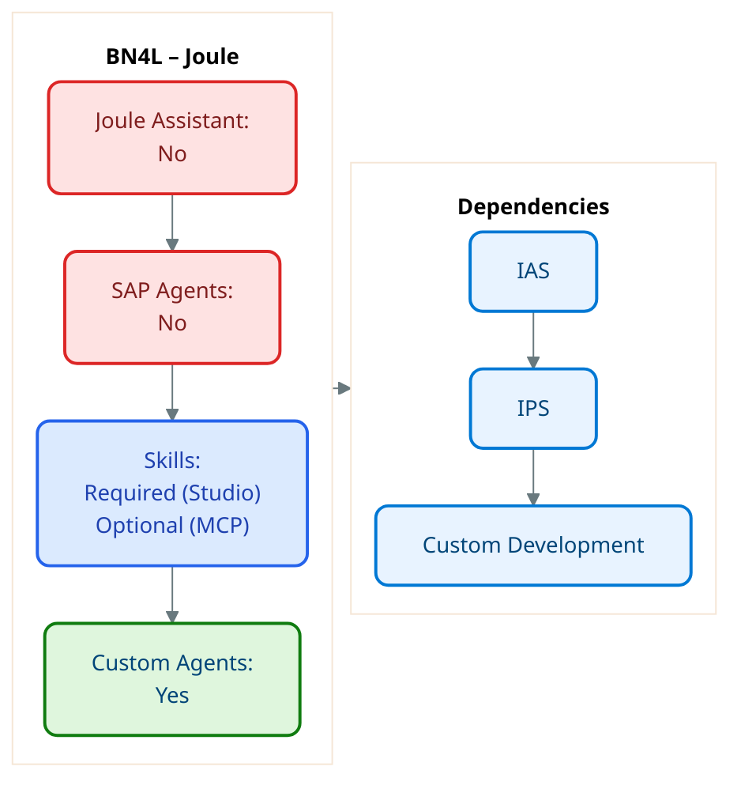
```mermaid
%%{init: {
  "theme": "base",
  "themeVariables": {
    "fontFamily": "Segoe UI, Arial",
    "fontSize": "14px",
    "primaryColor": "#E8F3FF",
    "primaryBorderColor": "#0078D4",
    "primaryTextColor": "#004578",
    "lineColor": "#69797E"
  },
  "flowchart": { "curve": "linear", "nodeSpacing": 12, "rankSpacing": 12, "padding": 15, "subGraphTitleMargin": { "top": 18, "bottom": 8 } }
}}%%

flowchart LR

subgraph A["<b>BN4L – Joule</b>"]
direction TB
ASST["Joule Assistant:<br/>No"]:::disabled
AG["SAP Agents:<br/>No"]:::disabled
SK["Skills:<br/>Required (Studio)<br/>Optional (MCP)"]:::required
CUST["Custom Agents:<br/>Yes"]:::enabled
end

subgraph B["<b>Dependencies</b>"]
direction TB
DEP1["IAS"]:::dep
DEP2["IPS"]:::dep
DEP3["Custom Development"]:::dep
end

A --> B
ASST --> AG --> SK --> CUST
DEP1 --> DEP2 --> DEP3

classDef enabled fill:#DFF6DD,stroke:#107C10,stroke-width:2px,color:#004578,rx:8,ry:8;
classDef disabled fill:#FEE2E2,stroke:#DC2626,stroke-width:2px,color:#7F1D1D,rx:8,ry:8;
classDef required fill:#DBEAFE,stroke:#2563EB,stroke-width:2px,color:#1E40AF,rx:8,ry:8;
classDef dep fill:#E8F3FF,stroke:#0078D4,stroke-width:2px,color:#004578,rx:8,ry:8;
```

</div>

## S/4HANA On-Premise – Joule Capabilities

> **Context:** Intel operates S/4HANA on-premise systems for Central Finance (CFIN), Intel Foundry (IF), and Intel Products / Corp (IP / Corp). These systems connect to SAP BTP via Cloud Connector for custom agent development.

| Capability | Status | Dependencies |
|---|---|---|
| Joule Assistant | No (embedded) | Cloud Connector, BTP |
| SAP-delivered Joule Agents | No | N/A |
| Skills (for Custom Agents) | **Required** (Studio) / Optional (MCP) | SAP Build / Studio, BTP Destinations |
| Custom Joule Agents | **Yes** | Cloud Connector, S/4 RBAC, BTP |

### Architecture Pattern: S/4HANA On-Premise to Joule

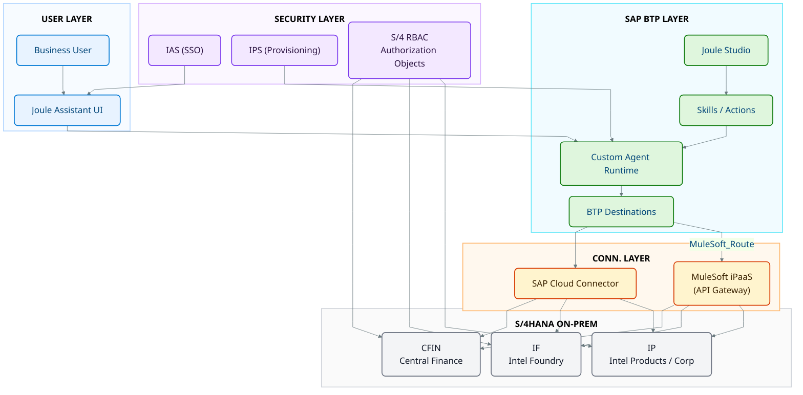
```mermaid
%%{init: {
  "theme": "base",
  "themeVariables": {
    "fontFamily": "Segoe UI, Arial",
    "fontSize": "20px",
    "primaryColor": "#E8F3FF",
    "primaryBorderColor": "#0078D4",
    "primaryTextColor": "#004578",
    "lineColor": "#69797E"
  },
  "flowchart": { 
    "curve": "linear", 
    "nodeSpacing": 25, 
    "rankSpacing": 25, 
    "padding": 20,
    "subGraphTitleMargin": { "top": 20, "bottom": 10 }
  }
}}%%

flowchart TB

subgraph USER["<b>USER LAYER</b>"]
direction LR
U["Business User"]
UIJ["Joule Assistant UI"]
end

subgraph BTP["<b>SAP BTP LAYER</b>"]
direction TB
STUDIO["Joule Studio"]
AGENT["Custom Agent Runtime"]
SKILLS["Skills / Actions"]
DEST["BTP Destinations"]
end

subgraph CONN["<b>CONN. LAYER</b>"]
direction TB
CC["SAP Cloud Connector"]
MULE["MuleSoft iPaaS<br/>(API Gateway)"]
end

subgraph S4["<b>S/4HANA ON-PREM</b>"]
direction TB
subgraph S4SYS[" "]
direction LR
CFIN["CFIN<br/>Central Finance"]
IF["IF<br/>Intel Foundry"]
IP["IP<br/>Intel Products / Corp"]
end
end

subgraph SEC["<b>SECURITY LAYER</b>"]
direction TB
IAS["IAS (SSO)"]
IPS["IPS (Provisioning)"]
S4RBAC["S/4 RBAC<br/>Authorization Objects"]
end

U --> UIJ --> AGENT
STUDIO --> SKILLS --> AGENT
AGENT --> DEST --> CC

CC --> CFIN
CC --> IF
CC --> IP

%% Alternative on-prem connectivity via MuleSoft iPaaS
DEST -->|MuleSoft_Route| MULE
MULE --> CFIN
MULE --> IF
MULE --> IP

IAS --> UIJ
IPS --> AGENT
S4RBAC --> CFIN
S4RBAC --> IF
S4RBAC --> IP

classDef user fill:#E8F3FF,stroke:#0078D4,stroke-width:2px,rx:8,ry:8,color:#004578;
classDef btp fill:#DFF6DD,stroke:#107C10,stroke-width:2px,rx:8,ry:8,color:#004578;
classDef conn fill:#FFF4CE,stroke:#D83B01,stroke-width:2px,rx:8,ry:8,color:#3A2200;
classDef s4 fill:#F3F4F6,stroke:#6B7280,stroke-width:2px,rx:8,ry:8,color:#111827;
classDef sec fill:#F3E8FF,stroke:#7C3AED,stroke-width:2px,rx:8,ry:8,color:#2A1240;

class U,UIJ user;
class STUDIO,AGENT,SKILLS,DEST btp;
class CC,MULE conn;
class CFIN,IF,IP s4;
class IAS,IPS,S4RBAC sec;

style USER fill:#F7FBFF,stroke:#B6D7FF,stroke-width:2px
style BTP fill:#F1FBFF,stroke:#67E8F9,stroke-width:2px
style CONN fill:#FFF8EE,stroke:#FDBA74,stroke-width:2px
style S4 fill:#FAFAFA,stroke:#D1D5DB,stroke-width:2px
style S4SYS fill:none,stroke:none
style SEC fill:#FBF7FF,stroke:#D8B4FE,stroke-width:2px
```

<div style="page-break-after: always;"></div>

### Process Flow: Custom Agent Accessing S/4HANA On-Premise

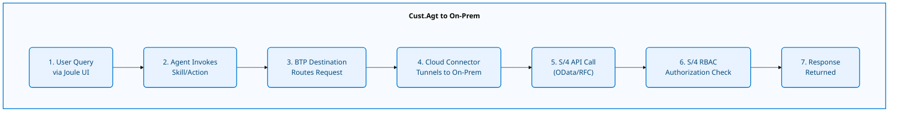
```mermaid
%%{init: {
  "theme": "base",
  "themeVariables": {
    "fontFamily": "Segoe UI, Arial",
    "fontSize": "18px",
    "primaryTextColor": "#0B1F3A"
  },
  "flowchart": { 
    "curve": "linear", 
    "nodeSpacing": 35, 
    "rankSpacing": 30, 
    "padding": 25,
    "subGraphTitleMargin": { "top": 20, "bottom": 10 }
  }
}}%%

flowchart LR

subgraph FLOW["<b>Cust.Agt to On-Prem</b>"]
direction LR
subgraph FLOW_inner[" "]
direction LR
A["1. User Query<br/>via Joule UI"]:::step
B["2. Agent Invokes<br/>Skill/Action"]:::step
C["3. BTP Destination<br/>Routes Request"]:::step
D["4. Cloud Connector<br/>Tunnels to On-Prem"]:::step
E["5. S/4 API Call<br/>(OData/RFC)"]:::step
F["6. S/4 RBAC<br/>Authorization Check"]:::step
G["7. Response<br/>Returned"]:::step
end
end

A --> B --> C --> D --> E --> F --> G

classDef step fill:#E8F3FF,stroke:#0078D4,stroke-width:2px,rx:8,ry:8,color:#004578;

style FLOW fill:#F7FBFF,stroke:#0078D4,stroke-width:2px
style FLOW_inner fill:none,stroke:none
```

### Key Implementation Requirements

| Requirement | Description |
|---|---|
| **Cloud Connector** | Deploy and configure SAP Cloud Connector for secure on-premise connectivity |
| **BTP Destinations** | Create HTTP destinations pointing to S/4HANA systems (CFIN, IF, IP) |
| **S/4 RBAC** | Configure authorization objects for API access (e.g., BAPI, OData services) |
| **Skills Definition** | Define Skills in Joule Studio that map to S/4HANA API endpoints |
| **Principal Propagation** | Optional: Enable SSO from BTP to S/4 via principal propagation |

</div>

## SAP Build Code / ABAP Cloud (J4D) – Joule Capabilities

> **Note:** SAP Build Code includes Joule as an embedded AI Assistant for code generation, data models, services, and sample data. Joule in Build Code assists developers with CAP, Fiori, SAPUI5, and mobile development.

| Capability | Status | Dependencies |
|---|---|---|
| Joule Assistant | **Yes** (in Build Code) | SAP Build Code |
| SAP-delivered Joule Agents | N/A | N/A |
| Skills (for Custom Agents) | **Required** (Studio) / Optional (MCP) | SAP Build / Studio |
| Custom Joule Agents | Yes | SAP Build / Studio, AI Core (optional) |

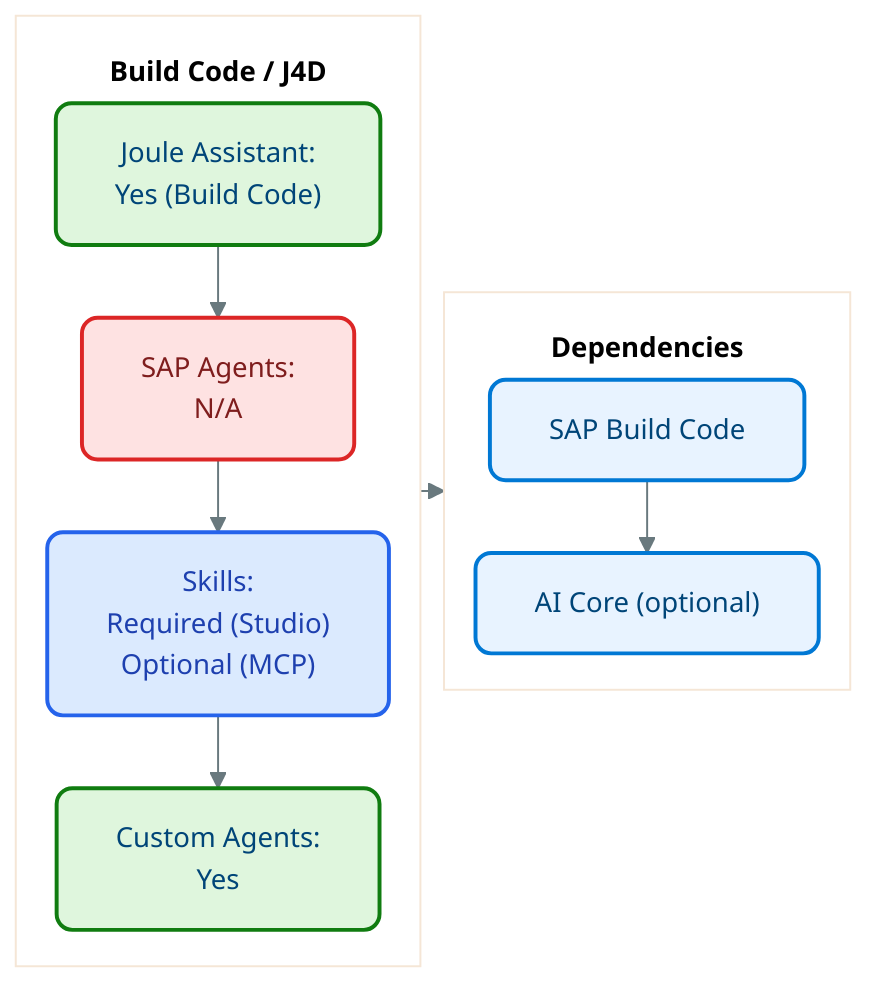
```mermaid
%%{init: {
  "theme": "base",
  "themeVariables": {
    "fontFamily": "Segoe UI, Arial",
    "fontSize": "14px",
    "primaryColor": "#E8F3FF",
    "primaryBorderColor": "#0078D4",
    "primaryTextColor": "#004578",
    "lineColor": "#69797E"
  },
  "flowchart": { "curve": "linear", "nodeSpacing": 12, "rankSpacing": 12, "padding": 15, "subGraphTitleMargin": { "top": 18, "bottom": 8 } }
}}%%

flowchart LR

subgraph A["<b>Build Code / J4D</b>"]
direction TB
ASST["Joule Assistant:<br/>Yes (Build Code)"]:::enabled
AG["SAP Agents:<br/>N/A"]:::disabled
SK["Skills:<br/>Required (Studio)<br/>Optional (MCP)"]:::required
CUST["Custom Agents:<br/>Yes"]:::enabled
end

subgraph B["<b>Dependencies</b>"]
direction TB
DEP1["SAP Build Code"]:::dep
DEP2["AI Core (optional)"]:::dep
end

A --> B
ASST --> AG --> SK --> CUST
DEP1 --> DEP2

classDef enabled fill:#DFF6DD,stroke:#107C10,stroke-width:2px,color:#004578,rx:8,ry:8;
classDef disabled fill:#FEE2E2,stroke:#DC2626,stroke-width:2px,color:#7F1D1D,rx:8,ry:8;
classDef required fill:#DBEAFE,stroke:#2563EB,stroke-width:2px,color:#1E40AF,rx:8,ry:8;
classDef optional fill:#FFF4CE,stroke:#D83B01,stroke-width:2px,color:#3A2200,rx:8,ry:8;
classDef dep fill:#E8F3FF,stroke:#0078D4,stroke-width:2px,color:#004578,rx:8,ry:8;
```

</div>

## Other Cloud Products – Joule Capabilities

<div style="page-break-inside: avoid;">

| Capability | Status | Dependencies |
|---|---|---|
| Joule Assistant | Varies | IAS/IPS as applicable |
| SAP-delivered Joule Agents | Varies | IAS/IPS as applicable |
| Skills (for Custom Agents) | **Required** (Studio) / Optional (MCP) | SAP Build / Studio |
| Custom Joule Agents | Optional | SAP Build / Studio |

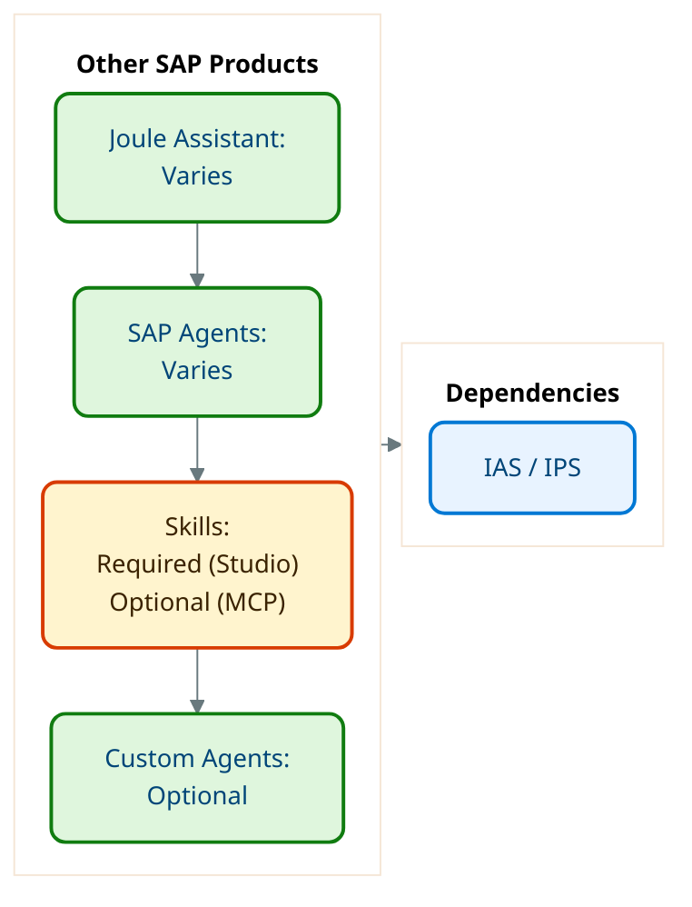
```mermaid
%%{init: {
  "theme": "base",
  "themeVariables": {
    "fontFamily": "Segoe UI, Arial",
    "fontSize": "14px",
    "primaryColor": "#E8F3FF",
    "primaryBorderColor": "#0078D4",
    "primaryTextColor": "#004578",
    "lineColor": "#69797E"
  },
  "flowchart": { "curve": "linear", "nodeSpacing": 12, "rankSpacing": 12, "padding": 15, "subGraphTitleMargin": { "top": 18, "bottom": 8 } }
}}%%

flowchart LR

subgraph A["<b>Other SAP Products</b>"]
direction TB
ASST["Joule Assistant:<br/>Varies"]:::enabled
AG["SAP Agents:<br/>Varies"]:::enabled
SK["Skills:<br/>Required (Studio)<br/>Optional (MCP)"]:::optional
CUST["Custom Agents:<br/>Optional"]:::enabled
end

subgraph B["<b>Dependencies</b>"]
direction TB
DEP1["IAS / IPS"]:::dep
end

A --> B
ASST --> AG --> SK --> CUST
DEP1

classDef enabled fill:#DFF6DD,stroke:#107C10,stroke-width:2px,color:#004578,rx:8,ry:8;
classDef optional fill:#FFF4CE,stroke:#D83B01,stroke-width:2px,color:#3A2200,rx:8,ry:8;
classDef dep fill:#E8F3FF,stroke:#0078D4,stroke-width:2px,color:#004578,rx:8,ry:8;
```

</div>

<div style="page-break-after: always;"></div>

## Skills Architecture: Joule Studio vs MCP

<div style="page-break-inside: avoid;">

> **Purpose:** This section explains when Skills are **Required** vs **Optional** based on the orchestration architecture chosen for building custom Joule agents.

### Understanding Skills in Joule Architecture

**Skills** are reusable action definitions that enable Joule agents to perform specific tasks (API calls, data retrieval, business actions). The requirement for Skills depends on your orchestration approach:

| Orchestration Approach | Skills Requirement | When to Use |
|---|---|---|
| **Joule Studio** | **Required** | Building agents entirely within SAP ecosystem using Studio visual tools |
| **MCP (Model Context Protocol)** | **Optional** | Using external orchestration tools (n8n, LangChain) that expose tools via MCP |
| **Hybrid** | **Partial** | Some actions via Studio Skills, others via MCP external tools |

### Architecture Decision: Joule Studio vs MCP


```mermaid
%%{init: {
  "theme": "base",
  "themeVariables": {
    "fontFamily": "Segoe UI, Arial",
    "fontSize": "18px",
    "primaryTextColor": "#0B1F3A"
  },
  "flowchart": { 
    "curve": "linear", 
    "nodeSpacing": 25, 
    "rankSpacing": 30, 
    "padding": 20,
    "subGraphTitleMargin": { "top": 20, "bottom": 10 }
  }
}}%%

flowchart TB

subgraph DECISION["<b>ARCH DECISION POINT</b>"]
direction TB
subgraph DECISION_inner[" "]
direction TB
Q["Custom Agent<br/>Requirement"]
end
end

subgraph STUDIO["<b>OPTION A: Joule Studio</b>"]
direction TB
subgraph STUDIO_inner[" "]
direction TB
S1["Skills Definition"]
S2["Actions Configuration"]
S3["Subagents Composition"]
S4["Agent Deployment"]
end
end

subgraph MCP["<b>OPTION B: MCP External</b>"]
direction TB
subgraph MCP_inner[" "]
direction TB
M1["n8n Workflow Design"]
M2["MCP Server Exposure"]
M3["Tool Registration"]
M4["Agent Integration"]
end
end

subgraph HYBRID["<b>OPTION C: Hybrid</b>"]
direction TB
subgraph HYBRID_inner[" "]
direction TB
H1["Studio Skills<br/>for SAP APIs"]
H2["MCP Tools for External"]
H3["Combined Agent Runtime"]
end
end

Q -->|SAP-native| STUDIO
Q -->|External tools| MCP
Q -->|Mixed requirements| HYBRID

classDef decision fill:#E8F3FF,stroke:#0078D4,stroke-width:2px,rx:8,ry:8,color:#004578;
classDef studio fill:#DFF6DD,stroke:#107C10,stroke-width:2px,rx:8,ry:8,color:#004578;
classDef mcp fill:#FFF4CE,stroke:#D83B01,stroke-width:2px,rx:8,ry:8,color:#3A2200;
classDef hybrid fill:#F3E8FF,stroke:#7C3AED,stroke-width:2px,rx:8,ry:8,color:#2A1240;

class Q decision;
class S1,S2,S3,S4 studio;
class M1,M2,M3,M4 mcp;
class H1,H2,H3 hybrid;

style DECISION fill:#F7FBFF,stroke:#B6D7FF,stroke-width:2px
style DECISION_inner fill:none,stroke:none
style STUDIO fill:#F1FFF1,stroke:#22C55E,stroke-width:2px
style STUDIO_inner fill:none,stroke:none
style MCP fill:#FFFBF0,stroke:#F59E0B,stroke-width:2px
style MCP_inner fill:none,stroke:none
style HYBRID fill:#FBF7FF,stroke:#D8B4FE,stroke-width:2px
style HYBRID_inner fill:none,stroke:none
```

### When to Choose Each Approach

| Approach | Best For | Considerations |
|---|---|---|
| **Joule Studio** | SAP-centric processes, standard LoB integrations | Full SAP governance, native monitoring, simplified deployment |
| **MCP with n8n** | Complex workflows, non-SAP integrations, retry logic | Requires MCP server setup, external tool management |
| **Hybrid** | Mixed SAP and external systems | Combines benefits, requires coordination between tools |

### Skills Requirement by Product

| Product | Default Approach | Skills Status | Notes |
|---|---|---|---|
| S/4HANA On-Prem (CFIN, IF, IP) | Studio | **Required** | Skills define S/4 API calls via BTP Destinations |
| SAP Build Code / J4D | Studio | **Required** | Developer builds Skills for custom agents |
| Ariba, Concur, IBP, Fieldglass | Studio or MCP | **Required (Studio) / Optional (MCP)** | Choice depends on integration complexity |
| SAC | MCP preferred | **Optional** | Just Ask backend handles most queries |
| APM, PAPM | MCP preferred | **Optional** | Standard analytics-focused interactions |
| BN4L | Studio | **Required** | No SAP-delivered agents; custom only |

### Process Flow: Skills-Based Agent Execution

```mermaid
%%{init: {
  "theme": "base",
  "themeVariables": {
    "fontFamily": "Segoe UI, Arial",
    "fontSize": "20px",
    "primaryTextColor": "#0B1F3A"
  },
  "flowchart": { "curve": "linear", "nodeSpacing": 30, "rankSpacing": 25, "padding": 25 }
}}%%

flowchart LR

subgraph SKILLS_FLOW["<b>JOULE SDO. SKILLS</b>"]
direction LR
A["User Query"]:::step
B["Agent Runtime"]:::step
C["Skill Selection"]:::step
D["Action Execution"]:::step
E["API Call<br/>(BTP Destination)"]:::step
F["Response"]:::step
end

A --> B --> C --> D --> E --> F

classDef step fill:#DFF6DD,stroke:#107C10,stroke-width:2px,rx:8,ry:8,color:#004578;
```

```mermaid
%%{init: {
  "theme": "base",
  "themeVariables": {
    "fontFamily": "Segoe UI, Arial",
    "fontSize": "20px",
    "primaryTextColor": "#0B1F3A"
  },
  "flowchart": { "curve": "linear", "nodeSpacing": 30, "rankSpacing": 25, "padding": 25 }
}}%%

flowchart LR

subgraph MCP_FLOW["<b>MCP EXT. TOOLS</b>"]
direction LR
A2["User Query"]:::step2
B2["Agent Runtime"]:::step2
C2["MCP Tool<br/>Discovery"]:::step2
D2["n8n Workflow<br/>Invocation"]:::step2
E2["External API<br/>Call"]:::step2
F2["Response"]:::step2
end

A2 --> B2 --> C2 --> D2 --> E2 --> F2

classDef step2 fill:#FFF4CE,stroke:#D83B01,stroke-width:2px,rx:8,ry:8,color:#3A2200;
```

</div>

<div style="page-break-after: always;"></div>

# 8. Platform Stage Lanes

## Platform Stage Lanes – Simplified View

This simplified lane view provides an executive-friendly overview of the Joule deployment stages across the SAP landscape.

| Stage | Components | Responsibility | SLA |
|-------|------------|----------------|-----|
| **Identity Foundation** | IAS, IPS, Identity Directory, Work Zone | SAP Basis / Identity Team | 99.9% availability |
| **AI Infrastructure** | SAP AI Core, AI Launchpad, Generative AI Hub | AI Platform Team | 99.5% availability |
| **Joule Assistant Core** | Scenario Catalog, Knowledge Catalog, RAGe, Response Filtering | SAP Application Team | 99.5% availability |
| **Embedded Agents** | LoB-specific agents (Ariba, Concur, IBP, etc.) | LoB Application Teams | 99.5% availability |
| **Custom Agents** | Joule Studio, Skills Library, Tools, BTP Destinations | Custom Development Team | 99.0% availability |
| **Connectivity** | Cloud Connector, Connectivity Service, Destination Service, MuleSoft | Integration Team | 99.5% availability |
| **Governance** | Audit logging, HITL approval gates, AI Launchpad monitoring | Governance / Compliance | 99.9% audit capture |

## Deployment Progression

```
Stage 1 [==========] Complete – Identity Foundation (IAS/IPS/Work Zone)
Stage 2 [========  ] 80% – AI Infrastructure (AI Core/Launchpad)
Stage 3 [======    ] 60% – Joule Assistant Core (Scenario/Knowledge Catalogs)
Stage 4 [====      ] 40% – Embedded Agents (LoB Activation)
Stage 5 [==        ] 20% – Custom Agents (Joule Studio/Skills)
Stage 6 [=         ] 10% – Governance & Operations
```

<div style="page-break-after: always;"></div>

# 9. TOGAF BDAT Crosswalk

## TOGAF BDAT Crosswalk – Conceptual Mapping

This conceptual mapping aligns the SAP Joule architecture to TOGAF Business, Data, Application, and Technology (BDAT) domains, supporting enterprise architecture governance.

### Business Architecture (B)

| Capability | Description | Value Delivered |
|------------|-------------|-----------------|
| SAP Transaction Acceleration | Natural language interaction with SAP business processes | Reduced task completion time |
| Cross-LoB Agent Assistance | Embedded agents across Ariba, Concur, IBP, and more | Consistent AI experience across SAP portfolio |
| Knowledge-Driven Decisions | RAGe-powered enterprise knowledge retrieval | Faster, informed decision-making |
| Analytics Self-Service | SAC Just Ask for natural language business insights | Democratized analytics access |

### Data Architecture (D)

| Layer | Purpose | Quality Standard |
|-------|---------|------------------|
| Knowledge Catalog | SAP-owned and customer-owned knowledge base | Curated, version-controlled |
| Scenario Catalog | Metadata registry of Joule scenarios and skills | Registered, governed |
| Document Grounding | RAGe-powered retrieval for informational queries | Chunked, embedded, indexed |
| Identity Directory | User attributes, groups, team memberships | Authoritative, SCIM-synced |

### Application Architecture (A)

| Application | Role | Integration Pattern |
|-------------|------|---------------------|
| SAP Build Work Zone | Entry point, navigation, CDM role sync | IPS SCIM provisioning |
| SAP AI Core | LLM runtime, Generative AI Hub | Dialog Management LLM |
| Joule Studio | Custom agent development | Skills + MCP + A2A |
| Scenario Catalog | Scenario/skill registry | REST API lookup |
| Knowledge Catalog | Knowledge base for RAGe | Document grounding |
| SAP Cloud Connector | On-prem connectivity | Secure tunnel to S/4HANA |
| SAP Destination Service | Route management | HTTP + credential management |

### Technology Architecture (T)

| Technology | Purpose | Provider |
|------------|---------|----------|
| SAP BTP | Cloud platform for extensions | SAP |
| SAP AI Core | AI/ML runtime | SAP |
| SAP Cloud Identity Services | Identity management | SAP |
| SAP Cloud Connector | On-prem tunnel | SAP |
| MuleSoft iPaaS | Alternative on-prem API gateway | MuleSoft / Salesforce |
| n8n | Workflow automation | n8n (open source) |

<div style="page-break-after: always;"></div>

# 10. Ownership & Operating Model

## Ownership / Operating Model

This view maps Joule platform components to responsible teams, supporting RACI discussions and operational governance.

## RACI Matrix

| Component | SAP Basis | Identity Team | LoB App Teams | Custom Dev Team | AI Platform | Governance |
|-----------|-----------|---------------|---------------|-----------------|-------------|------------|
| IAS / IPS / Identity Directory | C | **R/A** | I | I | I | I |
| SAP Build Work Zone | **R/A** | C | I | I | I | I |
| SAP AI Core / AI Launchpad | C | I | I | C | **R/A** | I |
| Scenario Catalog | C | I | **R/A** | C | C | I |
| Knowledge Catalog | I | I | **R/A** | C | C | I |
| SAP-delivered Agents (LoB) | I | I | **R/A** | I | C | I |
| Custom Agents (Joule Studio) | I | I | C | **R/A** | C | I |
| Skills Library | I | I | C | **R/A** | C | I |
| Cloud Connector / Connectivity | **R/A** | I | I | C | I | I |
| BTP Destinations | **R/A** | I | I | C | I | I |
| Response Filtering / Responsible AI | I | I | I | I | C | **R/A** |
| Audit Logging / Telemetry | I | I | I | I | C | **R/A** |
| HITL Approval Gates | I | I | C | C | I | **R/A** |

**RACI Legend**:
| Code | Role | Definition |
|------|------|------------|
| **R/A** | Responsible & Accountable | Owns delivery and final decision authority |
| **C** | Consulted | Provides input before decisions are made |
| **I** | Informed | Notified after decisions are made |

## Support Model

| Tier | Scope | Team | SLA |
|------|-------|------|-----|
| L1 | User issues, Joule access requests | Service Desk | 4 hours |
| L2 | LoB agent issues, Scenario Catalog gaps | LoB Application Teams | 8 hours |
| L3 | AI Core issues, custom agent failures | AI Platform / Custom Dev | 24 hours |
| L4 | Architecture, design decisions, governance | Enterprise Architecture | 5 days |

<div style="page-break-after: always;"></div>

# 11. L2 Architecture Deliverables

<div style="page-break-inside: avoid;">

## Identity & Access Architecture
- Configure **SAP Cloud Identity Services** (IAS + IPS + Identity Directory) as unified identity foundation with common instance (prod + non-prod) using single domain URL (`cloud.sap.com`)
- Configure IAS as central identity provider with SSO via **SAML2/OIDC** trust relationships across all SAP applications
- Optionally integrate **3rd-party Identity Providers** via SAML trust with SAP Cloud Identity Services
- Implement IPS for automated **SCIM-based** user provisioning, group synchronization, and attribute mapping
- Establish Identity Directory as authoritative source for user attributes, groups, and team memberships
- Define BTP Role Collections for Joule Core and Joule Studio access control
- Configure LoB-specific RBAC policies for Ariba, Concur, IBP, BN4L, Fieldglass, Commerce Cloud, Signavio, APM, and PAPM
- Implement S/4 RBAC for CFIN, IP, and IF systems with appropriate authorization objects
- **Document BTP subaccount topology** (Joule Subaccount + Connectivity Subaccount)

## Integration Architecture
- Configure **SAP Destination Service** for route management with secure credential management
- Configure **SAP Connectivity Service** (BTP connectivity proxy) for hybrid landscape routing
- Implement **SAP Cloud Connector** (on-prem agent) for secure on-premises connectivity to S/4HANA systems
- **Register systems in SAP BTP System Landscape** (auto-discovered if same contract; manually added otherwise)
- Define API gateway patterns for external system integration
- Establish MCP Tools Connector configuration for optional external tool integration
- **Configure SAP Build Process Automation** for SAP-native workflow orchestration
- Configure n8n orchestration patterns for workflow automation (optional / Intel-specific)
- Implement event-driven integration patterns where applicable

## Security Architecture
- Implement human-in-the-loop approval gates for high-risk actions (postings, master data changes)
- **Configure Response Filtering** for enterprise security, data privacy, and responsible AI compliance before response delivery
- **Define Responsible AI policies** aligned with SAP AI ethics policy and UNESCO's 10 guiding principles on Ethics of AI
- Configure comprehensive audit logging and telemetry collection across all Joule interactions
- Define data classification and handling policies for AI-processed information
- Establish secure credential management via SAP Destination Service and secrets
- Implement network security controls for Cloud Connector / Connectivity Service communications
- Define incident response procedures for AI-related security events

</div>

<div style="page-break-after: always;"></div>

# 11. L2 Architecture Deliverables...continued

<div style="page-break-inside: avoid;">

## Agent Architecture
- Define custom agent development standards and best practices for Joule Studio and **AI Agent** runtime
- Establish tools library structure with **SAP-delivered Skills, Custom Skills**, actions, and subagent definitions
- **Document Scenario Catalog** population strategy and Knowledge Catalog content curation processes
- Configure agent lifecycle management processes (development, testing, deployment, retirement)
- Implement agent versioning and rollback capabilities
- Define agent monitoring and performance metrics
- Establish agent governance policies and approval workflows

</div>

<div style="page-break-after: always;"></div>

# 12. Governance & Operations

## Governance Framework

### AI Governance

| Domain | Owner | Controls |
|--------|-------|----------|
| Model Approval | AI Platform Team | SAP AI Core model registry, Generative AI Hub |
| Prompt Safety | AI Platform Team | Response Filtering, Responsible AI guardrails |
| Action Approval | Business Owners | HITL for high-risk actions (postings, master data changes) |
| Audit & Evidence | Compliance | Comprehensive logging via AI Launchpad telemetry |
| Responsible AI | Governance | Aligned with SAP AI ethics policy and UNESCO's 10 guiding principles |

### Data Governance

| Domain | Owner | Controls |
|--------|-------|----------|
| Knowledge Catalog | LoB Application Teams | Content curation, version control, freshness SLAs |
| Scenario Catalog | LoB Application Teams | Scenario registration, skill governance |
| Identity Data | Identity Team | SCIM provisioning, group sync, attribute management |
| Data Classification | Governance | Classification-based access controls for AI-processed data |

## Operational Procedures

### Monitoring & Alerting

| Metric | Threshold | Action |
|--------|-----------|--------|
| Joule response error rate | > 2% | Alert AI Platform Team |
| AI Core LLM latency P95 | > 5 sec | Investigate model performance |
| Agent approval backlog | > 25 pending | Escalate to business owners |
| Response Filtering blocks | > 5% of requests | Review Responsible AI policies |
| Token consumption | > 80% budget | Alert for capacity planning |

### Incident Management

| Severity | Definition | Response Time | Resolution Time |
|----------|------------|---------------|-----------------|
| P1 | Joule platform outage | 15 min | 4 hours |
| P2 | LoB agent failure (production) | 1 hour | 8 hours |
| P3 | Custom agent issue | 4 hours | 24 hours |
| P4 | Enhancement request | 1 week | Sprint planning |

### Change Management

| Change Type | Approval | Lead Time |
|-------------|----------|-----------|
| LoB agent activation | LoB Application Team | 5 days |
| Custom agent deployment | AI Platform + Governance | 10 days |
| Skills Library update | Custom Dev Team | 3 days |
| Emergency (security) | Emergency CAB | 2 hours |

<div style="page-break-after: always;"></div>

# 13. Architectural Flows

## Identity & Access Flow (Foundation)
```
User → SAP Cloud Identity Services:
  IAS (SSO via SAML2/OIDC) → [Optional: 3rd-Party IdP (SAML Trust)] →
  IPS (SCIM Provisioning) → Identity Directory (Groups/Attributes) →
  Work Zone (CDM/Role Sync) → LoB RBAC (Product-Specific Roles)

Note: SAP recommends a common IAS instance (prod + non-prod) with 
single domain URL (cloud.sap.com). BTP uses two subaccounts:
Joule Subaccount and Connectivity Subaccount.
```

## Informational Flow
```
User → Joule Assistant UI → IAS (SSO) → Work Zone (Entry Point) → 
Joule Session → Intent Router (Info) → Knowledge Catalog → 
Document Grounding / RAGe (Retrieval Augmented Generation) → 
Dialog Management LLM (AI Core) → Response Composer → 
Response Filtering (Security/Privacy/Responsible AI) → User

Note: Knowledge Catalog contains SAP-owned content (SAP Help Pages) 
and customer-owned content. RAGe grounds LLM responses on 
retrieved enterprise documents.
```

## Analytics Flow (SAC Just Ask)
```
User → Joule Assistant UI → IAS (SSO) → Joule Session → 
Intent Router (Analytics) → Scenario Catalog → 
SAP AI Core (Dialog Management LLM) → 
SAC Just Ask (Backend Processing) → Response Composer → 
Response Filtering (Security/Privacy/Responsible AI) → User

Note: SAC Just Ask is the backend engine; Joule operates in the backdrop
processing natural language analytical queries.
```

## Navigation Flow
```
User → Joule Assistant UI → Intent Router (Navigation) → 
Scenario Catalog → Work Zone (Navigation Service) → 
Target Application → User
```

## Embedded Transaction Flow (Work Zone Required Systems)
```
User → LoB UI (Ariba/IBP/Signavio/J4C/PCE) → IAS (SSO) → 
IPS → Work Zone (Role Sync) → Embedded Joule → 
Scenario Catalog → SAP-delivered Agent → LoB RBAC → System of Record → 
Approval Gate (if required) → Response Filtering → Audit Log → User
```

## Embedded Transaction Flow (No Work Zone)
```
User → LoB UI (Concur/Fieldglass/APM/PAPM/CX) → IAS (SSO) → 
Direct LoB RBAC → Embedded Joule → Scenario Catalog → 
SAP-delivered Agent → System of Record → 
Approval Gate (if required) → Response Filtering → Audit Log → User
```

## Custom Transaction Flow (Joule Studio – Skills Required)
```
User → Joule Assistant UI → IAS (SSO) → Joule Session → 
Intent Router → Scenario Catalog → Custom Agent Runtime → 
SAP-delivered Skills + Custom Skills → Tools Library → 
SAP AI Core (Dialog Management LLM) → 
SAP Destination Service → SAP Connectivity Service → 
Cloud Connector → S/4HANA On-Prem → 
Approval Gate (if required) → Response Filtering → Audit Log → User
```

## Custom Transaction Flow (MCP/External Tools – Skills Optional)
```
User → Joule Assistant UI → IAS (SSO) → Custom Agent Runtime → 
MCP Connector → External Tools (n8n/3rd Party) → SAP AI Core (LLM) → 
SAP Destination Service → Target Systems → 
Approval Gate (if required) → Response Filtering → Audit Log → User

Note: Skills Library is optional when using MCP/external orchestration (n8n, etc.).
```

## BN4L Custom Agent Flow
```
User → Joule Assistant UI → IAS (SSO) → Custom Agent Runtime → 
Custom Skills (Required) → Tools Library → SAP AI Core (LLM) → 
SAP Destination Service → BN4L → 
Approval Gate (if required) → Response Filtering → Audit Log → User

Note: BN4L only supports custom agents; no SAP-delivered agents available.
```

<div style="page-break-after: always;"></div>

# 14. Related Architecture Patterns

SAP Joule is one of **three complementary AI architecture patterns** at Intel. Each pattern is purpose-built for a distinct class of use cases and maintains its own runtime, identity model, and governance boundaries.

| Pattern | Scope | Entry Point |
|---------|-------|-------------|
| **SAP Joule** (this document) | SAP transactions, navigation, analytics, SAP knowledge | Joule Assistant bar in SAP apps |
| **ECA / Azure Copilot Studio** | Enterprise data analytics, agentic workflows, non-SAP integrations | Copilot Agent UX (Teams / MS365) |
| **iGPT Platform** | General-purpose chat, custom assistants, marketplace, document Q&A | igpt.intel.com/chat |

## High-Level Integration Points

- **Joule → ECA/Azure**: SAP data replicated via SLT/CIF is queryable in ECA through governed MCP tools. Hybrid use cases (e.g., SAP approval followed by ECA analytics) leverage MCP bridge and A2A protocol.
- **Joule → iGPT**: No direct integration. General-purpose AI needs are served by iGPT as a standalone platform.
- **BDC Connect**: SAP Business Data Cloud enables zero-copy data sharing between Joule and ECA/Azure runtimes.

## Selection Guidance

For detailed use case routing, decision frameworks, and guidance on choosing between the three patterns, refer to:

> **📄 AI Architecture Selection Guide** — `AI-Architecture-Selection-Guide.md`

## Related Documents

| Document | Location |
|----------|----------|
| ECA & AI Enablement Architecture | `ECA_AI_Enablement_Architecture_DocumentV1.md` |
| iGPT Architecture Overview | `Current AI Architecture Options/iGPT-Architecture-Overview.md` |
| AI Architecture Selection Guide | `AI-Architecture-Selection-Guide.md` |

<div style="page-break-after: always;"></div>

<div style="page-break-inside: avoid; font-size: 10px;">

<h1 style="margin-bottom:4px;">Appendix A: Component Glossary</h1>

<table style="font-size:9pt; line-height:1.15; border-collapse:collapse; width:100%;">
<tr><th style="padding:2px 4px; border:1px solid #ccc;">Abbr.</th><th style="padding:2px 4px; border:1px solid #ccc;">Full Name</th><th style="padding:2px 4px; border:1px solid #ccc;">Description</th></tr>
<tr><td style="padding:2px 4px; border:1px solid #ddd;"><b>ABAP</b></td><td style="padding:2px 4px; border:1px solid #ddd;">Advanced Business Application Programming</td><td style="padding:2px 4px; border:1px solid #ddd;">SAP proprietary programming language</td></tr>
<tr><td style="padding:2px 4px; border:1px solid #ddd;"><b>APM</b></td><td style="padding:2px 4px; border:1px solid #ddd;">Asset Performance Management</td><td style="padding:2px 4px; border:1px solid #ddd;">Asset lifecycle management solution</td></tr>
<tr><td style="padding:2px 4px; border:1px solid #ddd;"><b>BN4L</b></td><td style="padding:2px 4px; border:1px solid #ddd;">Business Network for Logistics</td><td style="padding:2px 4px; border:1px solid #ddd;">SAP logistics network solution</td></tr>
<tr><td style="padding:2px 4px; border:1px solid #ddd;"><b>BTP</b></td><td style="padding:2px 4px; border:1px solid #ddd;">Business Technology Platform</td><td style="padding:2px 4px; border:1px solid #ddd;">Cloud platform for extensions & integrations</td></tr>
<tr><td style="padding:2px 4px; border:1px solid #ddd;"><b>CDM</b></td><td style="padding:2px 4px; border:1px solid #ddd;">Content Deployment Manager</td><td style="padding:2px 4px; border:1px solid #ddd;">Work Zone content sync service</td></tr>
<tr><td style="padding:2px 4px; border:1px solid #ddd;"><b>CFIN</b></td><td style="padding:2px 4px; border:1px solid #ddd;">Central Finance</td><td style="padding:2px 4px; border:1px solid #ddd;">S/4HANA central finance solution</td></tr>
<tr><td style="padding:2px 4px; border:1px solid #ddd;"><b>CX</b></td><td style="padding:2px 4px; border:1px solid #ddd;">Customer Experience</td><td style="padding:2px 4px; border:1px solid #ddd;">SAP Commerce Cloud suite</td></tr>
<tr><td style="padding:2px 4px; border:1px solid #ddd;"><b>FG</b></td><td style="padding:2px 4px; border:1px solid #ddd;">Fieldglass</td><td style="padding:2px 4px; border:1px solid #ddd;">Vendor management system</td></tr>
<tr><td style="padding:2px 4px; border:1px solid #ddd;"><b>HITL</b></td><td style="padding:2px 4px; border:1px solid #ddd;">Human-in-the-Loop</td><td style="padding:2px 4px; border:1px solid #ddd;">Approval requiring human intervention</td></tr>
<tr><td style="padding:2px 4px; border:1px solid #ddd;"><b>IAS</b></td><td style="padding:2px 4px; border:1px solid #ddd;">Identity Authentication Service</td><td style="padding:2px 4px; border:1px solid #ddd;">Cloud identity auth (SAML2/OIDC)</td></tr>
<tr><td style="padding:2px 4px; border:1px solid #ddd;"><b>IBP</b></td><td style="padding:2px 4px; border:1px solid #ddd;">Integrated Business Planning</td><td style="padding:2px 4px; border:1px solid #ddd;">Supply chain planning solution</td></tr>
<tr><td style="padding:2px 4px; border:1px solid #ddd;"><b>IF</b></td><td style="padding:2px 4px; border:1px solid #ddd;">Intel Foundry</td><td style="padding:2px 4px; border:1px solid #ddd;">S/4HANA on-prem (Foundry ops)</td></tr>
<tr><td style="padding:2px 4px; border:1px solid #ddd;"><b>IP</b></td><td style="padding:2px 4px; border:1px solid #ddd;">Intel Corp / Products</td><td style="padding:2px 4px; border:1px solid #ddd;">S/4HANA on-prem (Corp/Products ops)</td></tr>
<tr><td style="padding:2px 4px; border:1px solid #ddd;"><b>IPS</b></td><td style="padding:2px 4px; border:1px solid #ddd;">Identity Provisioning Service</td><td style="padding:2px 4px; border:1px solid #ddd;">Identity sync service (SCIM-based)</td></tr>
<tr><td style="padding:2px 4px; border:1px solid #ddd;"><b>J4C</b></td><td style="padding:2px 4px; border:1px solid #ddd;">Joule for Consultants</td><td style="padding:2px 4px; border:1px solid #ddd;">Joule capabilities for S/4HANA Cloud</td></tr>
<tr><td style="padding:2px 4px; border:1px solid #ddd;"><b>J4D</b></td><td style="padding:2px 4px; border:1px solid #ddd;">Joule for Developers</td><td style="padding:2px 4px; border:1px solid #ddd;">Joule for Build Code / ABAP Cloud</td></tr>
<tr><td style="padding:2px 4px; border:1px solid #ddd;"><b>Knowledge Catalog</b></td><td style="padding:2px 4px; border:1px solid #ddd;">Knowledge Catalog</td><td style="padding:2px 4px; border:1px solid #ddd;">Knowledge registry for RAGe grounding</td></tr>
<tr><td style="padding:2px 4px; border:1px solid #ddd;"><b>LoB</b></td><td style="padding:2px 4px; border:1px solid #ddd;">Line of Business</td><td style="padding:2px 4px; border:1px solid #ddd;">SAP business application category</td></tr>
<tr><td style="padding:2px 4px; border:1px solid #ddd;"><b>MCP</b></td><td style="padding:2px 4px; border:1px solid #ddd;">Model Context Protocol</td><td style="padding:2px 4px; border:1px solid #ddd;">Standard for tool/workflow integration</td></tr>
<tr><td style="padding:2px 4px; border:1px solid #ddd;"><b>n8n</b></td><td style="padding:2px 4px; border:1px solid #ddd;">n8n</td><td style="padding:2px 4px; border:1px solid #ddd;">Open-source workflow automation platform</td></tr>
<tr><td style="padding:2px 4px; border:1px solid #ddd;"><b>OIDC</b></td><td style="padding:2px 4px; border:1px solid #ddd;">OpenID Connect</td><td style="padding:2px 4px; border:1px solid #ddd;">Auth protocol for Joule ↔ Cloud Identity</td></tr>
<tr><td style="padding:2px 4px; border:1px solid #ddd;"><b>PAPM</b></td><td style="padding:2px 4px; border:1px solid #ddd;">Profitability & Performance Mgmt</td><td style="padding:2px 4px; border:1px solid #ddd;">SAP analytics solution</td></tr>
<tr><td style="padding:2px 4px; border:1px solid #ddd;"><b>PCE</b></td><td style="padding:2px 4px; border:1px solid #ddd;">Private Cloud Edition</td><td style="padding:2px 4px; border:1px solid #ddd;">S/4HANA Private Cloud deployment</td></tr>
<tr><td style="padding:2px 4px; border:1px solid #ddd;"><b>RAGe</b></td><td style="padding:2px 4px; border:1px solid #ddd;">Retrieval Augmented Generation (enterprise)</td><td style="padding:2px 4px; border:1px solid #ddd;">Enterprise RAG for grounding LLM responses</td></tr>
<tr><td style="padding:2px 4px; border:1px solid #ddd;"><b>RBAC</b></td><td style="padding:2px 4px; border:1px solid #ddd;">Role-Based Access Control</td><td style="padding:2px 4px; border:1px solid #ddd;">Permission management by role</td></tr>
<tr><td style="padding:2px 4px; border:1px solid #ddd;"><b>SAC</b></td><td style="padding:2px 4px; border:1px solid #ddd;">SAP Analytics Cloud</td><td style="padding:2px 4px; border:1px solid #ddd;">Cloud analytics platform</td></tr>
<tr><td style="padding:2px 4px; border:1px solid #ddd;"><b>SAML2</b></td><td style="padding:2px 4px; border:1px solid #ddd;">Security Assertion Markup Language 2.0</td><td style="padding:2px 4px; border:1px solid #ddd;">SSO protocol for BTP ↔ identity providers</td></tr>
<tr><td style="padding:2px 4px; border:1px solid #ddd;"><b>Scenario Catalog</b></td><td style="padding:2px 4px; border:1px solid #ddd;">Scenario Catalog</td><td style="padding:2px 4px; border:1px solid #ddd;">Registry of Joule scenarios & skills</td></tr>
<tr><td style="padding:2px 4px; border:1px solid #ddd;"><b>SCIM</b></td><td style="padding:2px 4px; border:1px solid #ddd;">System for Cross-domain Identity Mgmt</td><td style="padding:2px 4px; border:1px solid #ddd;">Automated identity provisioning protocol</td></tr>
<tr><td style="padding:2px 4px; border:1px solid #ddd;"><b>Signavio</b></td><td style="padding:2px 4px; border:1px solid #ddd;">SAP Signavio</td><td style="padding:2px 4px; border:1px solid #ddd;">Process management & mining solution</td></tr>
<tr><td style="padding:2px 4px; border:1px solid #ddd;"><b>SoD</b></td><td style="padding:2px 4px; border:1px solid #ddd;">Segregation of Duties</td><td style="padding:2px 4px; border:1px solid #ddd;">Control preventing conflict of interest</td></tr>
<tr><td style="padding:2px 4px; border:1px solid #ddd;"><b>SSO</b></td><td style="padding:2px 4px; border:1px solid #ddd;">Single Sign-On</td><td style="padding:2px 4px; border:1px solid #ddd;">Unified authentication mechanism</td></tr>
</table>

</div>

<div style="page-break-after: always;"></div>

# Document Control

| Version | Date | Author | Changes |
|---------|------|--------|---------|
| 1.0 | January 2026 | Sajiv Francis, Don Meyers | Initial release |
| 1.1 | February 2026 | Sajiv Francis | Aligned with SAP Reference Architecture (Scenario Catalog, Knowledge Catalog, RAGe, Response Filtering, Dialog Mgmt LLM, BTP subaccount topology, SAP Build Process Automation, SAP Connectivity Service, SAP-delivered vs Custom Skills, 3rd-party IdP, S/4HANA PCE, Capability Patterns, Characteristics) |
| 1.2 | March 2026 | Sajiv Francis | Added Related Architecture Patterns section (three-pattern model: Joule, ECA/Azure, iGPT); cross-references to Selection Guide |

**Classification**: Internal Use  
**Review Cycle**: Quarterly  
**Next Review**: June 2026

<style>
@media print {
  @page {
    size: A4;
    margin: 0.75in 0.6in 0.9in 0.6in;
    @bottom-left {
      content: counter(page);
      font-size: 9pt;
      color: #666;
    }
    @bottom-right {
      content: "SAP Joule AI Architecture Overview";
      font-size: 9pt;
      color: #0071c5;
      font-weight: bold;
    }
  }
  @page:first {
    @bottom-left { content: ""; }
    @bottom-right { content: ""; }
  }
  /* Title page: force single-page fit */
  .title-page {
    page-break-inside: avoid;
    page-break-after: always;
    max-height: 100vh;
    overflow: hidden;
  }
  .title-page img {
    max-height: 340px;
    object-fit: contain;
  }
  .title-page h1 { font-size: 20pt; margin: 0.3em 0 0.1em; }
  .title-page h3 { font-size: 12pt; margin: 0.1em 0; }
  .title-page h4 { font-size: 11pt; margin: 0.1em 0 0.5em; }
  .title-page p  { margin: 0.2em 0; }
  body { font-size: 10pt; line-height: 1.4; }
  h1 { font-size: 18pt; page-break-after: avoid; margin-top: 0.5em; }
  h2 { font-size: 14pt; page-break-after: avoid; margin-top: 0.4em; }
  h3 { font-size: 12pt; page-break-after: avoid; margin-top: 0.3em; }
  table { page-break-inside: avoid; font-size: 9pt; width: 100%; }
  figure, .mermaid { page-break-inside: avoid; }
  pre { page-break-inside: avoid; font-size: 8pt; }
  p { margin: 0.3em 0; }
  ul, ol { margin: 0.2em 0; }
}
</style>
