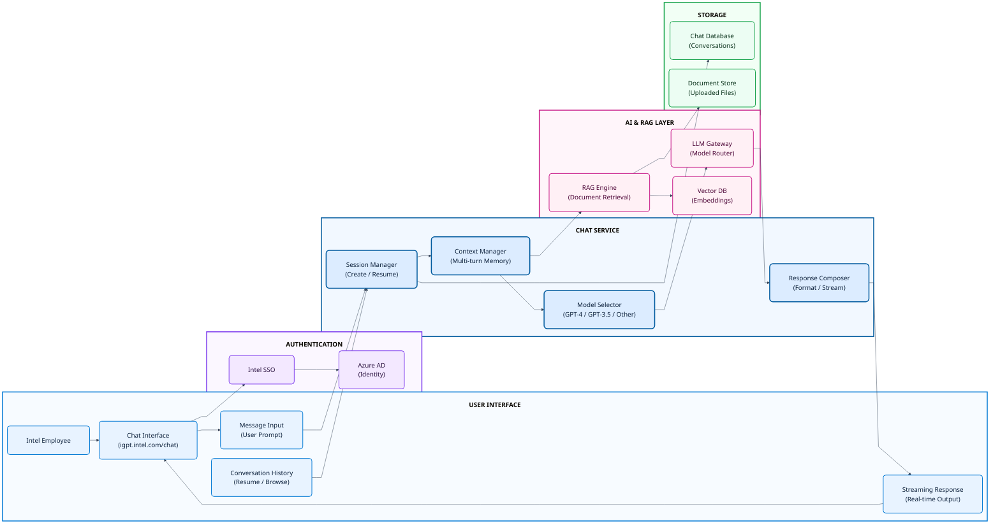
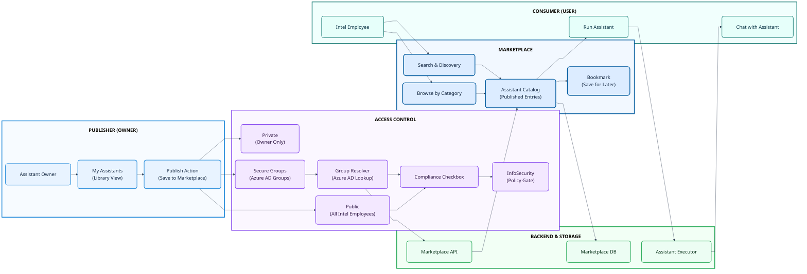

<!-- ============================= -->
<!--        TITLE PAGE START       -->
<!-- ============================= -->

  <strong>INTEL CORPORATION</strong>

  

<h1 align="center" style="margin: 0.3em 0 0.1em;"><strong>iGPT</strong></h1>
<h1 align="center" style="margin: 0.1em 0;"><strong>Architecture Overview</strong></h1>
<h3 align="center" style="margin: 0.1em 0;">Intel Generative Pre-trained Transformer Platform</h3>

  <strong>Version:</strong> 1.0 
  <strong>Date:</strong> March 2026 
  <strong>Prepared by:</strong> Sajiv Francis 
  <strong>Classification:</strong> Internal Use

  <em>This document contains confidential information proprietary to Intel Corporation.</em>

<!-- ============================= -->
<!--         TITLE PAGE END        -->
<!-- ============================= -->

---

# Table of Contents

1. [Executive Summary](#executive-summary)
2. [iGPT Key Capability Patterns](#igpt-key-capability-patterns)
3. [iGPT Platform Characteristics](#igpt-platform-characteristics)
4. [Architecture Overview](#architecture-overview)
5. [Sub-Architecture: Chat & Conversation Flow](#sub-architecture-chat--conversation-flow)
6. [Sub-Architecture: Assistant Builder & Lifecycle](#sub-architecture-assistant-builder--lifecycle)
7. [Sub-Architecture: Data Management & RAG](#sub-architecture-data-management--rag)
8. [Sub-Architecture: Marketplace & Sharing](#sub-architecture-marketplace--sharing)
9. [Module Capabilities](#module-capabilities)
   - [Chat Interface](#chat-interface) · [Assistant Builder](#assistant-builder) · [My Assistants](#my-assistants) · [Data Management](#data-management)
   - [Trainer](#trainer) · [Sharing & Publishing](#sharing--publishing) · [Marketplace](#marketplace) · [Learn & Resources](#learn--resources)
   - [Model Management](#model-management) · [Setup & Configuration](#setup--configuration)
10. [Security & Governance](#security--governance)
11. [External Integrations](#external-integrations)
12. [Related Architecture Patterns](#related-architecture-patterns)
13. [Appendix A: Component Glossary](#appendix-a-component-glossary)

# Executive Summary

iGPT is Intel's internal enterprise Generative AI platform that provides employees with conversational AI capabilities, custom assistant creation, and a marketplace ecosystem for sharing AI solutions across the organisation.

- **Chat Interface** – Central conversational AI for multi-turn interactions with enterprise LLMs (GPT-4, GPT-3.5, and other models)
- **Assistant Builder** – No-code wizard for creating, configuring, and publishing custom AI assistants with model selection, system prompts, temperature control, and live testing
- **Marketplace** – Enterprise-wide assistant store for discovering, sharing, and reusing AI assistants across Intel

**Key Architectural Components:**
- **iGPT Web Application** – Primary entry point at igpt.intel.com/chat; responsive SPA with sidebar navigation, chat workspace, and builder panels
- **LLM Gateway** – Model routing layer supporting GPT-4, GPT-3.5, and other enterprise LLMs with temperature and parameter controls
- **RAG Engine** – Retrieval Augmented Generation for document-grounded responses using uploaded files and data pipelines
- **Intel SSO / Azure AD** – Enterprise authentication via Single Sign-On with Azure Active Directory integration
- **AGS Entitlements** – Fine-grained access control for Secure Group sharing of assistants
- **Marketplace Service** – Discovery, publishing, and catalog management for shared assistants

The architecture ensures secure, governed AI assistance while maintaining enterprise identity management and InfoSecurity compliance.

> **InfoSecurity Restriction:** Assistants with attached files can only be published as Private. This is a directive from InfoSecurity, not a technical limitation.

# iGPT Key Capability Patterns

The iGPT platform supports four primary interaction patterns:

| Pattern | Description |
|---|---|
| **Conversational** | Multi-turn chat with enterprise LLMs. Users interact via natural language to get answers, generate content, analyse data, and complete tasks. Supports model selection and streaming responses. |
| **Assistive** | Custom AI assistants with specialised system prompts, configured models, and domain-specific instructions. Built via the no-code Assistant Builder with live testing. |
| **Collaborative** | Share assistants across Intel via the Marketplace. Publish as Public (all employees), Secure Groups (Azure AD groups), or keep Private (owner-only). |
| **Knowledge-Augmented** | RAG-powered responses grounded in uploaded documents (PDF, DOCX, TXT) and automated data pipelines. Enables context-aware AI within enterprise data. |

# iGPT Platform Characteristics

| Characteristic | Description |
|---|---|
| **Enterprise Chat AI** | Production-ready conversational interface with multiple LLM backends, streaming responses, and conversation history. |
| **No-Code Assistant Creation** | Step-by-step wizard for building AI assistants without programming – name, model, temperature, system prompt, test, publish. |
| **Marketplace Ecosystem** | Central store for browsing, searching, bookmarking, and running shared assistants across Intel. |
| **Data-Augmented Intelligence** | Document upload and pipeline integration enabling RAG-based retrieval for grounded, enterprise-specific responses. |
| **Security by Default** | SSO authentication, Azure AD group access, private-by-default assistants, and InfoSecurity compliance enforcement. |
| **Model Flexibility** | Multiple LLM options (GPT-4, GPT-3.5, others) with per-session model selection and temperature control via API gateway. |

# Architecture Overview

### *Architecture Overview – iGPT Platform Component Architecture Diagram*

```mermaid
%%{init: {
  "theme": "base",
  "themeVariables": {
    "fontFamily": "Segoe UI, Arial",
    "fontSize": "20px",
    "lineColor": "#334155",
    "primaryTextColor": "#0B1F3A"
  },
  "flowchart": {
    "curve": "linear",
    "useMaxWidth": true,
    "nodeSpacing": 40,
    "rankSpacing": 40,
    "wrappingWidth": 280,
    "htmlLabels": true,
    "padding": 35,
    "subGraphTitleMargin": { "top": 40, "bottom": 12 }
  }
}}%%

flowchart TB

%% =========================
%% Lane 0 - Users & Entry Points
%% =========================
subgraph L0["<b>USERS&nbsp;&amp;&nbsp;ENTRY&nbsp;POINTS</b>"]
direction TB
subgraph L0_inner[" "]
direction TB
U_EMP["Intel Employee<br/>(All Business Units)"]
U_ADMIN["Platform Admin<br/>(AI Team)"]
UI_CHAT["UI - Chat Interface<br/>(igpt.intel.com/chat)"]
UI_BUILDER["UI - Assistant Builder<br/>(No-Code Wizard)"]
UI_MKT["UI - Marketplace<br/>(Browse & Discover)"]
UI_LEARN["UI - Learn Hub<br/>(Guides & Training)"]
end
end

%% =========================
%% Lane 1 - Authentication & Access Control
%% =========================
subgraph L1["<b>AUTHENTICATION&nbsp;&amp;&nbsp;ACCESS&nbsp;CONTROL</b>"]
direction TB
subgraph L1_inner[" "]
direction TB
SSO["Intel SSO<br/>(Single Sign-On)"]
AZURE_AD["Azure Active Directory<br/>(Identity Provider)"]
AGS["AGS Entitlements<br/>(Access Groups)"]
ACCESS_CTRL["Access Control Service<br/>(Private / Public / Secure)"]
INFOSEC["InfoSecurity<br/>(Policy Enforcement)"]
end
end

%% =========================
%% Lane 2 - iGPT Application Core
%% =========================
subgraph L2["<b>iGPT&nbsp;APPLICATION&nbsp;CORE</b>"]
direction TB
subgraph L2_inner[" "]
direction TB
CHAT_SVC["Chat Service<br/>(Session / Context / History)"]
ASST_SVC["Assistant Service<br/>(CRUD / Builder / Executor)"]
MKT_SVC["Marketplace Service<br/>(Discovery / Publishing)"]
SHARE_SVC["Sharing Service<br/>(Access Resolution)"]
TRAIN_SVC["Trainer Service<br/>(Config / Live Test)"]
RESP_STREAM["Response Streaming<br/>(Real-time Output)"]
end
end

%% =========================
%% Lane 3 - AI Model Layer
%% =========================
subgraph L3["<b>AI&nbsp;MODEL&nbsp;LAYER</b>"]
direction TB
subgraph L3_inner[" "]
direction TB
LLM_GW["LLM Gateway<br/>(Model Router)"]
GPT4["GPT-4"]
GPT35["GPT-3.5"]
OTHER_LLM["Other Enterprise LLMs"]
MODEL_API["Model APIs<br/>(Programmatic Access)"]
end
end

%% =========================
%% Lane 4 - Data & RAG Layer
%% =========================
subgraph L4["<b>DATA&nbsp;&amp;&nbsp;RAG&nbsp;LAYER</b>"]
direction TB
subgraph L4_inner[" "]
direction TB
RAG_ENGINE["RAG Engine<br/>(Retrieval Augmented Generation)"]
VECTOR_DB["Vector Database<br/>(Embeddings Store)"]
DOC_STORE["Document Store<br/>(PDF / DOCX / TXT)"]
PIPELINE_SVC["Pipeline Service<br/>(Automated Ingestion)"]
end
end

%% =========================
%% Lane 5 - Persistence Layer
%% =========================
subgraph L5["<b>PERSISTENCE&nbsp;LAYER</b>"]
direction TB
subgraph L5_inner[" "]
direction TB
CHAT_DB["Chat Database<br/>(Conversations / History)"]
ASST_DB["Assistant Database<br/>(Configs / Metadata)"]
MKT_DB["Marketplace Catalog<br/>(Published Assistants)"]
USER_DB["User Profiles<br/>(Preferences / Bookmarks)"]
end
end

%% =========================
%% Lane 6 - External Integrations
%% =========================
subgraph L6["<b>EXTERNAL&nbsp;INTEGRATIONS</b>"]
direction TB
subgraph L6_inner[" "]
direction TB
CONFLUENCE["Confluence Wiki<br/>(Documentation / Guides)"]
DATA_PIPES["Data Pipeline Sources<br/>(Enterprise Data)"]
AUDIT["Audit / Logs<br/>(Telemetry)"]
end
end

%% =========================
%% User Entry Flows
%% =========================
U_EMP --> UI_CHAT --> SSO
U_EMP --> UI_BUILDER --> SSO
U_EMP --> UI_MKT --> SSO
U_EMP --> UI_LEARN
U_ADMIN --> UI_CHAT
U_ADMIN --> UI_BUILDER

%% =========================
%% Auth Flows
%% =========================
SSO --> AZURE_AD --> AGS
AZURE_AD --> ACCESS_CTRL
ACCESS_CTRL --> INFOSEC

%% =========================
%% Auth to Core
%% =========================
SSO --> CHAT_SVC
SSO --> ASST_SVC
ACCESS_CTRL --> SHARE_SVC

%% =========================
%% Core Service Flows
%% =========================
CHAT_SVC --> LLM_GW
ASST_SVC --> LLM_GW
TRAIN_SVC --> LLM_GW

CHAT_SVC --> RAG_ENGINE
CHAT_SVC --> RESP_STREAM
ASST_SVC --> MKT_SVC
ASST_SVC --> SHARE_SVC
SHARE_SVC --> AZURE_AD

%% =========================
%% AI Model Routing
%% =========================
LLM_GW --> GPT4
LLM_GW --> GPT35
LLM_GW --> OTHER_LLM
LLM_GW --> MODEL_API
LLM_GW --> RESP_STREAM

%% =========================
%% Data & RAG Flows
%% =========================
RAG_ENGINE --> VECTOR_DB
RAG_ENGINE --> DOC_STORE
PIPELINE_SVC --> DOC_STORE
PIPELINE_SVC --> DATA_PIPES

%% =========================
%% Persistence Flows
%% =========================
CHAT_SVC --> CHAT_DB
ASST_SVC --> ASST_DB
MKT_SVC --> MKT_DB
SHARE_SVC --> ASST_DB

%% =========================
%% External
%% =========================
UI_LEARN --> CONFLUENCE
CHAT_SVC --> AUDIT
ASST_SVC --> AUDIT

%% =========================================================
%% Node Color Coding (Azure-style)
%% =========================================================

classDef ui fill:#E8F3FF,stroke:#0078D4,stroke-width:2px,color:#0B1F3A,rx:8,ry:8;
classDef identity fill:#F3E8FF,stroke:#7C3AED,stroke-width:2px,color:#2A1240,rx:8,ry:8;
classDef governance fill:#EEF2F6,stroke:#334155,stroke-width:2px,color:#0F172A,rx:8,ry:8;

classDef core fill:#DCECFF,stroke:#005A9E,stroke-width:3px,color:#0B1F3A,rx:10,ry:10;

classDef aimodel fill:#FFF0F5,stroke:#C71585,stroke-width:2px,color:#4A0033,rx:8,ry:8;

classDef data fill:#E6FFFA,stroke:#0F766E,stroke-width:2px,color:#083344,rx:8,ry:8;

classDef persist fill:#ECFDF3,stroke:#16A34A,stroke-width:2px,color:#052E16,rx:8,ry:8;

classDef external fill:#FFF4E5,stroke:#D97706,stroke-width:2px,color:#3A2200,rx:8,ry:8;

class U_EMP,U_ADMIN,UI_CHAT,UI_BUILDER,UI_MKT,UI_LEARN ui;

class SSO,AZURE_AD,AGS identity;
class ACCESS_CTRL,INFOSEC governance;

class CHAT_SVC,ASST_SVC,MKT_SVC,SHARE_SVC,TRAIN_SVC,RESP_STREAM core;

class LLM_GW,GPT4,GPT35,OTHER_LLM,MODEL_API aimodel;

class RAG_ENGINE,VECTOR_DB,DOC_STORE,PIPELINE_SVC data;

class CHAT_DB,ASST_DB,MKT_DB,USER_DB persist;

class CONFLUENCE,DATA_PIPES,AUDIT external;

%% =========================================================
%% Lane Container Colors
%% =========================================================
style L0 fill:#F7FBFF,stroke:#0078D4,stroke-width:3px
style L0_inner fill:none,stroke:none
style L1 fill:#FBF7FF,stroke:#7C3AED,stroke-width:3px
style L1_inner fill:none,stroke:none
style L2 fill:#F2F8FF,stroke:#005A9E,stroke-width:3px
style L2_inner fill:none,stroke:none
style L3 fill:#FFF5FA,stroke:#C71585,stroke-width:3px
style L3_inner fill:none,stroke:none
style L4 fill:#F1FFFD,stroke:#0F766E,stroke-width:3px
style L4_inner fill:none,stroke:none
style L5 fill:#F2FFF5,stroke:#16A34A,stroke-width:3px
style L5_inner fill:none,stroke:none
style L6 fill:#FFF8EE,stroke:#D97706,stroke-width:3px
style L6_inner fill:none,stroke:none
```

# Sub-Architecture: Chat & Conversation Flow

**Purpose:** Detail the end-to-end conversational flow from user input through LLM processing to streaming response delivery.

### *Chat & Conversation Flow Architecture*

**Key Components:**
- **Session Manager** – Creates and resumes chat sessions; maintains session state across multiple interactions
- **Context Manager** – Preserves multi-turn conversation memory; passes relevant history to LLM for contextual responses
- **Model Selector** – Per-session model choice (GPT-4, GPT-3.5, others); configurable temperature and parameters
- **RAG Engine** – Retrieves relevant document chunks from Vector DB when assistant has attached data
- **Response Composer** – Formats LLM output and streams tokens in real-time back to the UI

# Sub-Architecture: Assistant Builder & Lifecycle

**Purpose:** Detail the 5-tab assistant creation workflow: Setup, Add Data, Trainer, Thumbnail, and Sharing.

### *Assistant Builder & Lifecycle Architecture*

```mermaid
%%{init: {
  "theme": "base",
  "themeVariables": {
    "fontFamily": "Segoe UI, Arial",
    "fontSize": "20px",
    "lineColor": "#334155",
    "primaryTextColor": "#0B1F3A"
  },
  "flowchart": {
    "curve": "linear",
    "useMaxWidth": true,
    "nodeSpacing": 30,
    "rankSpacing": 30,
    "wrappingWidth": 240,
    "htmlLabels": true,
    "padding": 30,
    "subGraphTitleMargin": { "top": 25, "bottom": 10 }
  }
}}%%

flowchart LR

%% --- Lane A: Tab 1 - Setup ---
subgraph A["<b>1&nbsp;&mdash;&nbsp;SETUP</b>"]
direction TB
CREATOR["Creator<br/>(Intel Employee)"]
NAME["Assistant Name"]
DESC["Description"]
end

%% --- Lane B: Tab 2 - Add Data ---
subgraph B["<b>2&nbsp;&mdash;&nbsp;ADD&nbsp;DATA</b>"]
direction TB
NO_DATA["No Data<br/>(Skip)"]
LOCAL["Add Local Files<br/>(PDF / DOCX / TXT)"]
PIPELINE["Add Pipeline<br/>(Automated Ingestion)"]
end

%% --- Lane C: Tab 3 - Trainer ---
subgraph C["<b>3&nbsp;&mdash;&nbsp;TRAINER</b>"]
direction TB
MODEL["Select Model<br/>(GPT-4 / GPT-3.5 / Other)"]
TEMP["Set Temperature<br/>(Creativity Level)"]
TEMPLATE["Prompt Templates<br/>(Apply Presets)"]
SYS_PROMPT["System Prompt<br/>(Custom Instructions)"]
EMAIL["Enable Email Access"]
START_CHAT["Start Chatting<br/>(Live Test)"]
end

%% --- Lane D: Tab 4 - Thumbnail ---
subgraph D["<b>4&nbsp;&mdash;&nbsp;THUMBNAIL</b>"]
direction TB
THUMB_GEN["Generate<br/>(AI Prompt-to-Image)"]
THUMB_UP["Upload<br/>(Custom Image)"]
THUMB_DEF["Default<br/>(Platform Icon)"]
THUMB_SEL["Select Thumbnail"]
end

%% --- Lane E: Tab 5 - Sharing ---
subgraph E["<b>5&nbsp;&mdash;&nbsp;SHARING</b>"]
direction TB
PRIVATE["Private<br/>(Owner Only)"]
PUBLIC["Public<br/>(All Intel)"]
SECURE["Secure Groups<br/>(Azure AD Groups)"]
OVERVIEW["Assistant Overview<br/>(Summary &amp; Status)"]
COMPLY["Compliance Check<br/>(InfoSecurity)"]
end

%% --- Tab Flow ---
CREATOR --> NAME --> DESC
DESC --> NO_DATA
DESC --> LOCAL
DESC --> PIPELINE
NO_DATA --> MODEL
LOCAL --> MODEL
PIPELINE --> MODEL
MODEL --> TEMP --> TEMPLATE --> SYS_PROMPT --> EMAIL --> START_CHAT
START_CHAT --> THUMB_GEN
START_CHAT --> THUMB_UP
START_CHAT --> THUMB_DEF
THUMB_GEN --> THUMB_SEL
THUMB_UP --> THUMB_SEL
THUMB_DEF --> THUMB_SEL
THUMB_SEL --> OVERVIEW
OVERVIEW --> PRIVATE
OVERVIEW --> PUBLIC
OVERVIEW --> SECURE
PUBLIC --> COMPLY
SECURE --> COMPLY

%% --- Styling ---
style A fill:#F7FBFF,stroke:#0078D4,stroke-width:3px
style B fill:#F1FFFD,stroke:#0F766E,stroke-width:3px
style C fill:#F2F8FF,stroke:#005A9E,stroke-width:3px
style D fill:#FFF5FA,stroke:#C71585,stroke-width:3px
style E fill:#FBF7FF,stroke:#7C3AED,stroke-width:3px

classDef setup fill:#E8F3FF,stroke:#0078D4,stroke-width:2px,rx:8,ry:8,color:#0B1F3A;
classDef data fill:#E6FFFA,stroke:#0F766E,stroke-width:2px,rx:8,ry:8,color:#083344;
classDef trainer fill:#DCECFF,stroke:#005A9E,stroke-width:3px,rx:10,ry:10,color:#0B1F3A;
classDef thumbnail fill:#FFF0F5,stroke:#C71585,stroke-width:2px,rx:8,ry:8,color:#4A0033;
classDef sharing fill:#F3E8FF,stroke:#7C3AED,stroke-width:2px,rx:8,ry:8,color:#2A1240;

class CREATOR,NAME,DESC setup;
class NO_DATA,LOCAL,PIPELINE data;
class MODEL,TEMP,TEMPLATE,SYS_PROMPT,EMAIL,START_CHAT trainer;
class THUMB_GEN,THUMB_UP,THUMB_DEF,THUMB_SEL thumbnail;
class PRIVATE,PUBLIC,SECURE,OVERVIEW,COMPLY sharing;
```

**Workflow (5-Tab Builder):**
> **Setup** (Name & Description) → **Add Data** (None / Local Files / Pipeline) → **Trainer** (Model Selection, Temperature, Prompt Templates, System Prompt, Email Access, Start Chatting) → **Thumbnail** (Generate / Upload / Default → Select) → **Sharing** (Assistant Overview → Private / Public / Secure Groups)

**Key Design Decisions:**
- **Private by Default** – All new assistants default to Private (owner-only) access
- **Compliance Gate** – Public and Secure Group publishing requires a compliance checkbox
- **File Restriction** – Assistants with attached files must remain Private (InfoSecurity directive)
- **Live Testing** – "Start Chatting" in the Trainer tab provides real-time testing against the configured LLM
- **AI Thumbnails** – Users can write a prompt to generate a thumbnail image, upload a custom image, or use the platform default

# Sub-Architecture: Data Management & RAG

**Purpose:** Detail the data ingestion, document processing, and Retrieval Augmented Generation pipeline.

### *Data Management & RAG Architecture*

```mermaid
%%{init: {
  "theme": "base",
  "themeVariables": {
    "fontFamily": "Segoe UI, Arial",
    "fontSize": "20px",
    "lineColor": "#334155",
    "primaryTextColor": "#0B1F3A"
  },
  "flowchart": {
    "curve": "linear",
    "useMaxWidth": true,
    "nodeSpacing": 30,
    "rankSpacing": 30,
    "wrappingWidth": 240,
    "htmlLabels": true,
    "padding": 30,
    "subGraphTitleMargin": { "top": 25, "bottom": 10 }
  }
}}%%

flowchart LR

%% --- Lane A: Data Sources ---
subgraph A["<b>DATA&nbsp;SOURCES</b>"]
direction TB
FILES["Local File Upload<br/>(PDF / DOCX / TXT)"]
PIPE["Data Pipeline<br/>(Automated Ingestion)"]
EXT["Enterprise Data Sources"]
end

%% --- Lane B: Ingestion & Processing ---
subgraph B["<b>INGESTION&nbsp;&amp;&nbsp;PROCESSING</b>"]
direction TB
UPLOAD["File Upload API"]
PARSE["Document Parser<br/>(Extract / Chunk)"]
EMBED["Embedding Generator<br/>(Vectorise Text)"]
PIPE_SVC["Pipeline Service<br/>(Schedule / Monitor)"]
end

%% --- Lane C: Storage ---
subgraph C["<b>STORAGE</b>"]
direction TB
DOCSTORE["Document Store<br/>(Raw Files)"]
VECDB["Vector Database<br/>(Embeddings)"]
end

%% --- Lane D: RAG Retrieval ---
subgraph D["<b>RAG&nbsp;RETRIEVAL</b>"]
direction TB
RAG["RAG Engine<br/>(Semantic Search)"]
RERANK["Context Reranking<br/>(Relevance Scoring)"]
INJECT["Context Injection<br/>(Prompt Augmentation)"]
end

%% --- Lane E: LLM Processing ---
subgraph E["<b>LLM&nbsp;PROCESSING</b>"]
direction TB
LLM["LLM Gateway"]
RESP["Grounded Response<br/>(Document-Backed)"]
end

%% --- Flows ---
FILES --> UPLOAD --> PARSE --> EMBED --> VECDB
UPLOAD --> DOCSTORE
PIPE --> PIPE_SVC --> PARSE
EXT --> PIPE_SVC

RAG --> VECDB
RAG --> RERANK --> INJECT --> LLM --> RESP

%% --- Styling ---
style A fill:#FFF8EE,stroke:#D97706,stroke-width:3px
style B fill:#F2F8FF,stroke:#005A9E,stroke-width:3px
style C fill:#F2FFF5,stroke:#16A34A,stroke-width:3px
style D fill:#F1FFFD,stroke:#0F766E,stroke-width:3px
style E fill:#FFF5FA,stroke:#C71585,stroke-width:3px

classDef source fill:#FFF4E5,stroke:#D97706,stroke-width:2px,rx:8,ry:8,color:#3A2200;
classDef ingest fill:#DCECFF,stroke:#005A9E,stroke-width:3px,rx:10,ry:10,color:#0B1F3A;
classDef storage fill:#ECFDF3,stroke:#16A34A,stroke-width:2px,rx:8,ry:8,color:#052E16;
classDef rag fill:#E6FFFA,stroke:#0F766E,stroke-width:2px,rx:8,ry:8,color:#083344;
classDef aimodel fill:#FFF0F5,stroke:#C71585,stroke-width:2px,rx:8,ry:8,color:#4A0033;

class FILES,PIPE,EXT source;
class UPLOAD,PARSE,EMBED,PIPE_SVC ingest;
class DOCSTORE,VECDB storage;
class RAG,RERANK,INJECT rag;
class LLM,RESP aimodel;
```

**Key Components:**
- **File Upload API** – Accepts PDF, DOCX, TXT; validates format and size constraints
- **Document Parser** – Extracts text content and chunks documents into retrieval-sized segments
- **Embedding Generator** – Converts text chunks into vector embeddings for semantic search
- **RAG Engine** – Performs semantic similarity search against Vector DB at query time
- **Context Injection** – Augments the user prompt with retrieved document context before LLM processing

**Data Restriction:** File-attached assistants remain Private per InfoSecurity directive.

# Sub-Architecture: Marketplace & Sharing

**Purpose:** Detail the marketplace ecosystem and access control model for assistant sharing.

### *Marketplace & Sharing Architecture*

**Access Control Hierarchy:**
> **Private** (Owner Only) → **Secure Groups** (Azure AD Groups via AGS) → **Public** (All Intel Employees)

**Key Design Decisions:**
- **Owner Visibility** – Owners see sharing status icons in My Assistants but do not see their own assistants in the Marketplace view
- **Azure AD Groups** – Secure Group sharing resolves membership against Azure AD; only Azure AD groups are visible in the iGPT interface
- **Compliance Gate** – Both Public and Secure Group sharing require an explicit compliance checkbox before publishing

# Module Capabilities

## Chat Interface

| Capability | Description |
|---|---|
| Create Chat | Start new conversation sessions with selected models |
| Multi-turn Conversations | Maintain context across multiple exchanges |
| Model Selection | Choose LLM per session (GPT-4, GPT-3.5, others) |
| Conversation History | Browse, resume, and manage past conversations |
| Streaming Responses | Real-time token streaming from LLM to UI |
| Chat with Assistants | Use custom or marketplace assistants in conversation |

## Assistant Builder

The Assistant Builder follows a 5-tab workflow: **Setup → Add Data → Trainer → Thumbnail → Sharing**.

### Tab 1: Setup

| Capability | Description |
|---|---|
| Assistant Name | Define a unique name for the assistant |
| Description | Provide a summary of the assistant's purpose and capabilities |

### Tab 2: Add Data

| Capability | Description |
|---|---|
| No Data | Skip data attachment; assistant relies solely on LLM knowledge |
| Add Local Files | Upload PDF, DOCX, TXT files for RAG-based retrieval |
| Add Pipeline | Configure automated data ingestion from enterprise data sources |

### Tab 3: Trainer

| Capability | Description |
|---|---|
| Select Model | Choose LLM for the assistant (GPT-4, GPT-3.5, or other enterprise models) |
| Set Temperature | Adjust creativity level (low = deterministic, high = creative) |
| Prompt Templates | Apply pre-built prompt templates to guide assistant behaviour |
| System Prompt | Write custom instructions defining the assistant's persona and rules |
| Enable Email Access | Grant the assistant access to email context for responses |
| Start Chatting | Live test the assistant against the configured LLM before saving |

### Tab 4: Thumbnail

| Capability | Description |
|---|---|
| Generate | Write a prompt to AI-generate a thumbnail image for the assistant |
| Upload | Upload a custom image as the assistant thumbnail |
| Default | Use the platform default icon |
| Select Thumbnail | Preview and select the final thumbnail from generated/uploaded options |

### Tab 5: Sharing

| Capability | Description |
|---|---|
| Private (default) | Owner-only access; assistant is not visible to others |
| Public | All Intel employees can discover and run the assistant |
| Secure Groups | Restrict access to specific Azure AD / AGS entitlement groups |
| Assistant Overview | Review summary, configuration, and sharing status before publishing |
| Compliance Check | Required checkbox for Public and Secure Group publishing (InfoSecurity) |

## My Assistants

| Capability | Description |
|---|---|
| Owned Assistants | View all assistants created by the user |
| Bookmarked | Access assistants saved from Marketplace |
| Edit / Delete | Manage owned assistant configurations |
| Chat | Start conversation with any owned assistant |
| Status Icons | Visual indicators: Public / Secure / Private / Bookmarked / Owned |

## Data Management

| Capability | Description |
|---|---|
| No Data | Skip data attachment; rely on base LLM knowledge only |
| Add Local Files | Upload PDF, DOCX, TXT for RAG-powered retrieval within the assistant |
| Add Pipeline | Configure automated data ingestion pipelines from enterprise sources |
| File Formats | PDF, DOCX, TXT, and other document types |
| File Privacy | Assistants with attached files must remain Private (InfoSecurity directive) |

## Trainer

| Capability | Description |
|---|---|
| Select Model | Choose the LLM backend for the assistant (GPT-4, GPT-3.5, or other enterprise models) |
| Set Temperature | Adjust creativity / determinism level for the assistant's LLM responses |
| Prompt Templates | Apply pre-built prompt presets to accelerate assistant configuration |
| System Prompt | Define custom instructions, persona, rules, and behavioural guidelines |
| Enable Email Access | Grant the assistant access to email context for enriched responses |
| Start Chatting | Live-test the assistant in real-time against the configured LLM before saving |

## Thumbnail

| Capability | Description |
|---|---|
| Generate | Write a text prompt to AI-generate a visual thumbnail for the assistant |
| Upload | Upload a custom image file as the assistant thumbnail |
| Default | Use the platform's default assistant icon |
| Select Thumbnail | Preview generated / uploaded options and confirm the final selection |

## Sharing & Publishing

| Sharing Mode | Description |
|---|---|
| **Private** (default) | Owner-only access and modification rights |
| **Public** | All Intel employees can run; only owner can modify |
| **Secure Groups** | Azure AD / AGS groups can run; only owner can modify |
| **Assistant Overview** | Summary view of assistant configuration, data, and sharing status before publishing |
| **Compliance Check** | Required checkbox acknowledgment before Public or Secure Group publishing |

**Additional:** Compliance checkbox required for Public and Secure Group publishing. File-attached assistants must remain Private.

## Marketplace

| Capability | Description |
|---|---|
| Browse | Discover assistants published by other teams |
| Search & Filter | Find assistants by category and keyword |
| Bookmark | Save interesting assistants for later access |
| Run | Execute any accessible marketplace assistant |
| Publish | Share your assistants with the enterprise |

## Learn & Resources

| Resource | Type |
|---|---|
| Prompt Formula Training | Video tutorial |
| Create iGPT Assistants | Step-by-step guide (Confluence) |
| Share in Marketplace | Publishing guide (Confluence) |
| Model Licensing | Compliance and licensing information |

## Model Management

| Capability | Description |
|---|---|
| Model Catalog | Multiple LLM options with descriptions |
| Temperature Control | Per-session randomness/creativity adjustment |
| Model APIs | Programmatic access to models |
| Licensing Info | Model compliance and licensing details |

## Setup & Configuration

| Capability | Description |
|---|---|
| Setup Wizard | Guided initial configuration for new assistants |
| Configuration Flow | Multi-step setup workflow |
| Platform Settings | General platform preferences |

# Security & Governance

| Feature | Description |
|---|---|
| **Intel SSO** | Enterprise single sign-on authentication for all users |
| **Azure Active Directory** | Identity provider; user authentication and group management |
| **AGS Entitlements** | Fine-grained group-based access for Secure Group sharing |
| **Private by Default** | All new assistants default to owner-only access |
| **File Privacy** | Assistants with files remain Private (InfoSecurity directive) |
| **Compliance Gate** | Required checkbox before Public or Secure Group publishing |
| **Audit / Logs** | Telemetry and audit trail for platform operations |

> **InfoSecurity Directive:** "Assistants with Files can only be published as Private. This is not a technical restriction, but a direction from InfoSecurity."

# External Integrations

| Integration | Purpose |
|---|---|
| **Azure Active Directory** | Authentication, identity, and group management |
| **Intel SSO** | Single sign-on for all Intel employees |
| **AGS Entitlements** | Enterprise access group management |
| **Confluence Wiki** | Documentation hosting and knowledge base (Learn resources) |
| **LLM APIs** | GPT-4, GPT-3.5, and other model API endpoints |
| **Data Pipeline Sources** | Automated data ingestion from enterprise systems |
| **InfoSecurity** | Policy enforcement for publishing and data compliance |

# Related Architecture Patterns

iGPT is one of **three complementary AI architecture patterns** at Intel. Each pattern is purpose-built for a distinct class of use cases and maintains its own runtime, identity model, and governance boundaries.

| Pattern | Scope | Entry Point |
|---------|-------|-------------|
| **SAP Joule** | SAP transactions, navigation, analytics, SAP knowledge | Joule Assistant bar in SAP apps |
| **ECA / Azure Copilot Studio** | Enterprise data analytics, agentic workflows, non-SAP integrations | Copilot Agent UX (Teams / MS365) |
| **iGPT Platform** (this document) | General-purpose chat, custom assistants, marketplace, document Q&A | igpt.intel.com/chat |

## High-Level Integration Points

- **iGPT → Joule / ECA**: No direct integration today. iGPT operates as a standalone self-service platform. Users context-switch to Joule for SAP needs or Copilot Studio for ECA data queries.
- **Future Roadmap**: MCP/API integration may enable iGPT assistants to be registered as tools within ECA/Azure agentic workflows, providing a bridge between self-service AI and governed enterprise data.

## When to Use iGPT vs Other Patterns

| If you need… | Use iGPT | Use Joule or ECA Instead |
|-------------|---------|-------------------------|
| General-purpose AI chat | ✅ | — |
| Custom assistant for your team (no-code) | ✅ | — |
| Document Q&A from uploaded files | ✅ | — |
| Sharing assistants via Marketplace | ✅ | — |
| SAP transaction processing | — | ✅ SAP Joule |
| Enterprise data analytics (Snowflake/Databricks) | — | ✅ ECA / Azure |
| Multi-system agentic workflows | — | ✅ ECA / Azure |

## Selection Guidance

For detailed use case routing, decision frameworks, and guidance on choosing between the three patterns, refer to:

> **📄 AI Architecture Selection Guide** — `AI-Architecture-Selection-Guide.md`

## Related Documents

| Document | Location |
|----------|----------|
| ECA & AI Enablement Architecture | `ECA_AI_Enablement_Architecture_DocumentV1.md` |
| SAP Joule Architecture Overview | `Current AI Architecture Options/SAP-Joule-Architecture-Overview.md` |
| AI Architecture Selection Guide | `AI-Architecture-Selection-Guide.md` |

# Appendix A: Component Glossary

| Component / Abbreviation | Description |
|---|---|
| **iGPT** | Intel Generative Pre-trained Transformer – the enterprise AI platform |
| **LLM** | Large Language Model – AI models trained on large text corpora (e.g. GPT-4, GPT-3.5) |
| **RAG** | Retrieval Augmented Generation – technique that augments LLM prompts with retrieved document context for grounded responses |
| **SPA** | Single Page Application – web application architecture that loads a single HTML page and dynamically updates content without full page reloads |
| **SSO** | Single Sign-On – one-time authentication granting access to multiple enterprise systems |
| **API** | Application Programming Interface – a set of protocols enabling software components to communicate |
| **CRUD** | Create, Read, Update, Delete – the four basic operations for data management |
| **UI** | User Interface – the visual front-end through which users interact with the platform |
| **DB** | Database – structured data storage system |
| **AD** | Active Directory – Microsoft's directory service for identity and access management (see Azure AD) |
| **Azure AD** | Azure Active Directory – Microsoft cloud-based identity and access management service |
| **AGS** | Access Group Service – Intel's enterprise entitlements service for fine-grained group-based permissions |
| **LLM Gateway** | Model routing layer that directs requests to the appropriate LLM backend |
| **Vector Database** | Stores document embeddings as numerical vectors for semantic similarity search |
| **Assistant Builder** | No-code wizard for creating custom AI assistants |
| **Marketplace** | Enterprise store for browsing, sharing, and running AI assistants |
| **InfoSecurity** | Intel's information security team and policy enforcement function |
| **Confluence** | Atlassian wiki platform used for Intel documentation and knowledge bases |
| **GPT-4 / GPT-3.5** | OpenAI large language models available via the LLM Gateway |
| **PDF** | Portable Document Format – Adobe file format for fixed-layout documents |
| **DOCX** | Microsoft Word document format (Office Open XML) |
| **TXT** | Plain text file format |
| **TB / LR** | Top-to-Bottom / Left-to-Right – Mermaid flowchart direction indicators used in architecture diagrams |

---

*Generated on March 2, 2026*  
*Source: iGPT platform analysis (https://igpt.intel.com/chat)*  
*Modules: 10 | Features: 55 | Security Features: 6 | Integrations: 7*

# Document Control

| Version | Date | Author | Changes |
|---------|------|--------|--------|
| 1.0 | March 2026 | Sajiv Francis | Initial release |
| 1.1 | March 2026 | Sajiv Francis | Added Related Architecture Patterns section (three-pattern model: Joule, ECA/Azure, iGPT); cross-references to Selection Guide |

**Classification**: Internal Use  
**Review Cycle**: Quarterly  
**Next Review**: June 2026

